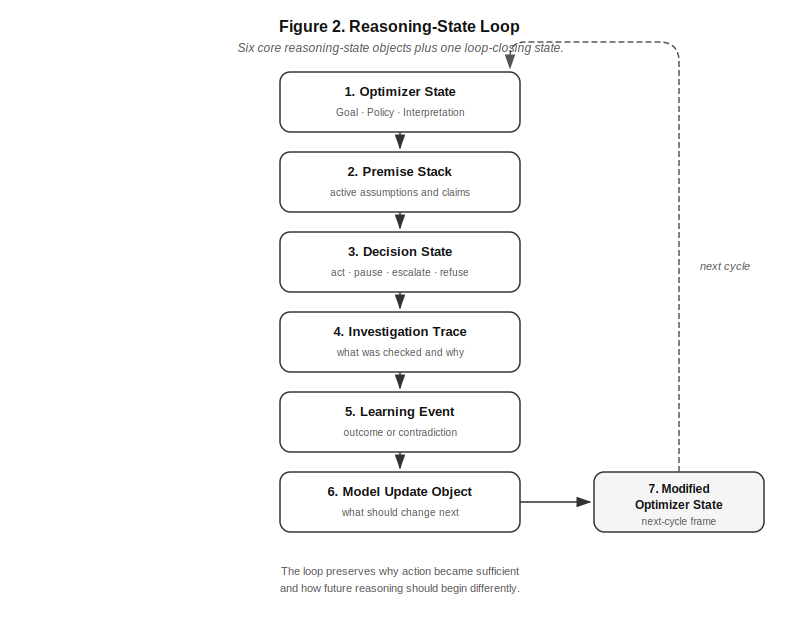
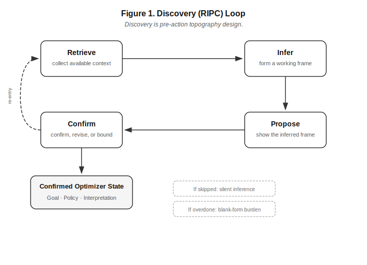

# Benet Review Excerpt — Key Sections from PAPER_ACADEMIC_v0.2.md
Sections 2-5 omitted for this review pass. Full manuscript: PAPER_ACADEMIC_v0.2.md

---

## Abstract

AI agent failures are often explained by looking at the model: its capabilities, alignment, memory, tools, or constraints. Those explanations are necessary, but incomplete. Agentic systems act from a constructed information-and-action landscape: what they can see, reach, interpret, trust, and connect at the moment action becomes sufficient. This paper develops the Perceived Topography Framework, a reasoning-state account of human-agent reliability. The framework argues that many failures emerge not simply because information is absent, but because the relevant evidence, uncertainty, policy, consequence, or human confirmation fails to become behaviorally effective before action occurs. This failure pattern is called premature sufficiency.

The paper distinguishes context from reasoning state, defines perceived topography through five diagnostic dimensions — Visibility, Accessibility, Representation, Confidence, and Connectivity — and proposes reasoning-state architecture as a way to preserve the conditions from which action becomes justified, withheld, escalated, or revised. It also introduces Discovery as an infer-confirm process for turning inferred human intent into confirmed reasoning state before that interpretation becomes durable. A constructed healthcare marketing stress test shows how two workflows with the same artifacts can diverge when one relies on context alone and the other preserves goal, policy, interpretation, evidence boundaries, sufficiency rationale, outcome, and update.

The framework is grounded in established work on bounded rationality, affordances, sensemaking, organizational learning, human-AI interaction, retrieval, memory, reflection, and AI safety. Its contribution is the synthesis: a diagnostic vocabulary for the ground beneath human-agent action. The framework does not explain every failure and should lose scope where its distinctions do not improve diagnosis, governance, reuse, or learning. Its value lies in making agent behavior more examinable: not only what the system did, but what landscape made that action appear available, justified, safe, or sufficient.

---

## Epistemic Status

This paper develops a conceptual design framework for human-agent systems. It is not an empirical study, benchmark report, field evaluation, or claim of production validation.

The argument is pre-empirical but grounded. It synthesizes established work on bounded rationality, affordances, information behavior, sensemaking, organizational learning, human-AI interaction, retrieval, memory, reflection, and AI safety. The contribution is the synthesis: a vocabulary for describing the perceived information-and-action landscape from which human-agent systems decide that action is available, justified, safe, or sufficient.

The framework's constructs — perceived topography, premature sufficiency, the five diagnostic dimensions, reasoning-state architecture, Discovery, and Model Update Objects — should be judged by whether they improve explanation, intervention, governance, reuse, and learning in human-agent workflows.

The healthcare marketing scenario is author-constructed. It is used as a stress test, not as empirical evidence. Its purpose is to make the framework examinable by holding the assignment and artifact set constant while comparing a context-only workflow with a reasoning-state workflow.

The framework does not claim that perceived topography explains every agent failure. Some failures are model failures, tool failures, domain-expertise failures, governance failures, incentive failures, or institutional failures. Nor does the framework claim that reasoning-state architecture guarantees safety, eliminates politics, replaces human judgment, or makes governance legitimate because it can be automated.

The central claim is narrower: many human-agent failures become clearer when we examine the landscape from which action became sufficient. If the framework's distinctions do not change diagnosis or design, they should lose scope. If reasoning-state preservation does not improve reuse, governance, error recovery, or learning relative to strong context-only baselines, the architectural claim should narrow. If Discovery adds friction or anchoring without improving confirmed reasoning state, it should lose importance.

The paper therefore treats perceived topography as a serious but testable synthesis: grounded enough to use, bounded enough to challenge, and incomplete enough to require stress testing.

---

## 1. Introduction: The Reliability Problem Has Moved

AI agents are increasingly evaluated as actors: systems that can pursue goals, use tools, preserve state, and move through multi-step environments. [Yao et al., 2023] When these systems fail, the failure often feels different from an ordinary model error. A static model may hallucinate a citation. An agent may hallucinate, send the message, update the record, and leave the human team to discover later that the action rested on unsupported ground. [Lynch et al., 2025]

The natural reaction is to ask what is wrong with the agent.

That question is necessary. It is also incomplete.

A model does not need inner malice to cause harm. It only needs a goal, an action space, imperfect constraints, and a path through the environment that makes the harmful action appear useful, available, or sufficient. The behavior may look strategic, deceptive, careless, or overconfident. But before we reach for psychological explanations, we should ask a more basic systems question: what landscape did we ask the agent to move through?

This paper proposes that we can describe that landscape.

A useful image is simple. When a marble rolls downhill, we do not explain its motion only by studying the marble. We look at the slope. Human-agent systems should be studied in the same way. Their behavior emerges not only from what the model can do, but from the environment of visible information, reachable tools, represented constraints, confidence signals, and connected consequences through which the system moves.

This paper calls that environment a **perceived topography**: the information-and-action landscape made available to an optimizer-like system at the moment it reasons and acts. The term "optimizer-like" is functional, not psychological. By optimizer, I do not mean a conscious entity with intentions. I mean a system that selects actions in relation to a goal, under constraints, using some interpretation of the situation.

The contribution is not the claim that system design matters. That is already well established. The contribution is a diagnostic vocabulary for the conditions under which action becomes sufficient before reasoning warrants it.

This distinction matters because many current interventions focus on containment. Permissions, approval gates, sandboxes, and monitoring all ask where the system should not go. These controls are necessary, especially when systems can act outside the conversation. But containment alone does not explain why the unsafe path became attractive, why the safer path was harder to find, or why a policy that existed somewhere failed to shape the decision.

A second response is to add context. Retrieval-augmented systems can supply documents, policies, and prior examples, and this improves many outputs. [Lewis et al., 2020] But context is not the same as reasoning state. Context may help a system answer. Reasoning state explains why the system acted as it did.

A context layer can retrieve a policy. A reasoning-state layer must make the policy matter at the moment of decision. That difference is architectural, not cosmetic. It is the difference between information that exists and information that becomes behaviorally effective.

This is the gap the Perceived Topography Framework addresses. It treats human-agent behavior as movement through a constructed landscape of information surfaces, affordances, constraints, confidence, and consequence. Information only shapes behavior when it can be noticed, reached, interpreted, trusted, and connected to the decision where it should exert force.

The framework describes this landscape through the five dimensions: **Visibility, Accessibility, Representation, Confidence, and Connectivity**. These are not offered as a complete ontology of all factors that influence agent behavior. They are a minimum viable diagnostic set. A dimension earns its place only if changing it would lead to a different diagnosis, intervention, or expected outcome.

The framework also introduces **premature sufficiency** as a recurring failure pattern. The concept extends satisficing [Simon, 1955] — the observation that agents act when a solution is good enough rather than optimal — by focusing on the conditions under which "good enough" is reached too early. Premature sufficiency occurs when a system acts before the relevant evidence, uncertainty, policy, consequence, or human confirmation has exerted enough force on the decision. The system does not merely lack information. It stops moving too soon.

This pattern can appear in different kinds of failures. In hallucination, a fluent answer may become sufficient before it is grounded. In unsafe tool use, an available action may become sufficient before risk or approval has been resolved. These failures differ in consequence and mitigation. The point is not to collapse them. The point is to notice that both can involve the same motion structure: goal pressure, weak counterpressure, misplaced confidence, and a low-friction path to action.

A human-agent system therefore needs more than better prompts, larger context windows, or stricter fences. It needs a way to preserve the reasoning state from which action became justified. The system should retain the working goal, the governing constraint, the interpretation that made action attractive, the uncertainty that remained, and the reason investigation stopped. Without that structure, the organization may keep the artifact while losing the why.

This loss is familiar in human organizations. Teams store documents but lose decisions. They remember outcomes but forget assumptions. They correct an artifact without changing the reasoning that produced the error. The next team retrieves the old material and repeats the same mistake under a new label. The organization appears to have memory but behaves as if it does not. [Walsh and Ungson, 1991; Markus, 2001]

Agentic systems can accelerate this pattern. They can retrieve more, synthesize faster, and act with less friction. But if they inherit an information landscape where policies are disconnected, evidence boundaries are weak, prior failures are hard to reuse, and uncertainty has no legitimate action path, they may become faster at reaching the wrong kind of sufficiency.

The paper makes four contributions.

It defines **perceived topography** as the constructed information-and-action landscape through which human-agent systems reason and act — a construct that helps distinguish information that merely exists from information that becomes behaviorally effective.

It draws a hard line between **context and reasoning state**. Reliable and learnable agentic behavior requires preservation of structured reasoning transitions, not only retrieval of artifacts.

It offers a diagnostic account of **premature sufficiency** — how failures emerge when goal pressure, weak grounding, misplaced confidence, and low-friction action paths allow the system to act before the right uncertainty or constraint has shaped the decision.

And it proposes a **research and design agenda** for evaluating human-agent systems through reasoning-state preservation, topography perturbation, governance salience, human confirmation, and model-update quality.

The paper is intentionally bounded: perceived topography does not replace alignment, containment, retrieval, evaluation, governance, or human oversight; it does not guarantee safe outcomes; and it does not explain every agent failure. Rather, it argues that these existing approaches remain incomplete without a way to describe and shape the perceived environment from which action becomes sufficient.

The paper proceeds from the context/reasoning-state distinction through the framework's dimensions and motion model, then into reasoning-state architecture, Discovery, a constructed healthcare stress test, boundaries, disconfirmation conditions, and a research agenda.

The practical question is therefore not only: how do we prevent agents from taking harmful actions? It is also: how do we design the landscape so that grounded, policy-aware, human-beneficial behavior becomes easier to reach than the merely fluent, available, or locally sufficient path?

---

## 6. Reasoning-State Architecture

If premature sufficiency is a failure of motion, the design response cannot be only more context. The system needs a way to preserve the reasoning condition from which action became justified, withheld, escalated, or revised.

That is the role of a reasoning-state architecture.

The word architecture is used carefully here. This section is not proposing a particular software stack, database schema, orchestration framework, or vendor implementation. It describes the reasoning objects that must survive across a human-agent workflow if the system is to be governable and learnable. Implementation may vary. The preservation problem does not.

The architectural claim follows the same bounded-design logic used throughout the framework: a useful system does not preserve everything; it preserves the state required for future action, judgment, and learning. [Simon, 1955; Lee, 1997]

A context-only system can retrieve artifacts. A reasoning-state system must preserve the movement among them: what goal was active, what constraint applied, what premise made an action attractive, what uncertainty remained, why action became sufficient, what outcome followed, and what changed afterward.

The architecture has six core reasoning-state objects and one loop-closing state:

1. Optimizer State
2. Premise Stack
3. Decision State
4. Investigation Trace
5. Learning Event
6. Model Update Object
7. Modified Optimizer State

These objects are not meant to record everything. They are a minimum viable structure for preserving the "why" behind action. Too little state leaves the system repeating mistakes with better retrieval. Too much state creates an archive no future human or agent can use.

These objects should not be confused with ordinary agent memory, reflection loops, or chain-of-thought traces. Memory can store prior material. Reflection can improve an agent's next attempt. Chain-of-thought can expose or simulate intermediate reasoning within a response. Reasoning-state objects have a different target: they preserve decision-relevant structure across cycles, across agents, and across organizational contexts. The question is not only whether this agent can improve this attempt, but whether a future human-agent workflow can inherit the goal, premise, evidence boundary, uncertainty, and update that should shape the next decision. [Park et al., 2023; Shinn et al., 2023; Madaan et al., 2023]

### 6.1 Optimizer State

The Optimizer State is the working frame from which the system begins. It contains three primitives: **Goal**, **Policy**, and **Interpretation**.

The **Goal** defines what the system is trying to accomplish. A goal may be explicit, such as "draft a campaign brief," or implicit in a workflow, metric, prompt, or tool configuration. Goal matters because it determines what can become relevant. The same artifact can be decisive under one goal and peripheral under another.

The **Policy** defines what should constrain action. Policy includes formal rules, compliance requirements, safety boundaries, brand standards, escalation conditions, privacy limits, and human-approval requirements. A policy does not govern behavior merely by existing. It must become active inside the reasoning state before action proceeds.

The **Interpretation** is the system's working understanding of the situation. It turns available signals into meaning: what the case appears to be, what the information implies, what risk exists, and what kind of action seems appropriate. Actors do not respond to raw information; they respond to the meaning they construct from it. [Weick, 1995]

Optimizer State matters because action is never selected from neutral context. It is selected from a frame. If that frame is wrong, incomplete, or unexamined, later reasoning may be coherent while still moving in the wrong direction.

### 6.2 Premise Stack

The Premise Stack contains the claims, assumptions, evidence, and interpretations that make a possible action seem reasonable.

A premise stack is not just a list of facts. It is the support structure beneath an action. In a healthcare campaign, the premise stack might include: cardiology practice administrators care about between-visit visibility; workflow burden is a relevant pain point; operational-value language is currently supportable; direct clinical-outcome language requires approved evidence.

The premise stack is where many failures become visible. A system may act from a strong goal and weak premises. It may rely on adjacent truth rather than direct support. It may treat prior campaign language as evidence when it is only precedent. It may inherit an assumption from a previous workflow without noticing that the current boundary conditions differ.

Preserving the premise stack gives future reviewers something to inspect. They can ask: which premise failed? Which premise was unsupported? Which premise was true but insufficient? Which premise should transfer to the next cycle?

Without that structure, correction becomes shallow. A reviewer may delete a claim, but the system does not learn why the claim should not have become action-ready in the first place.

### 6.3 Decision State

Optimizer State is the starting frame. Decision State is the pre-action snapshot: the point where the system records whether the current reasoning is sufficient, insufficient, or bounded.

It should answer three questions:

- What action is currently proposed?
- What alternatives were materially considered?
- Why is the current state sufficient, insufficient, or bounded?

Decision State is where sufficiency becomes explicit. The system should not only produce an answer or call a tool. It should preserve the reason it believed the current path was ready for action.

In some cases, the Decision State supports direct action. The claim is supported. The policy boundary is satisfied. The uncertainty is not material enough to change the decision.

In other cases, the Decision State should block or redirect action. The evidence is insufficient. The policy boundary is unresolved. The tool consequence is unclear. The system should ask, escalate, defer, or produce a bounded draft.

This is where "I do not know" and "I should not act yet" become architectural possibilities rather than conversational manners. They are legitimate decision states. They preserve the fact that the system had enough understanding to know that completion was not yet warranted.

### 6.4 Investigation Trace

The Investigation Trace records what uncertainty the system treated as action-relevant and what it did to reduce it.

This object exists because investigation can be performative. A system may search, retrieve, summarize, or cite material while never testing the premise that actually matters. In the healthcare campaign example, the system may retrieve more information about remote patient monitoring while failing to ask whether "reduces readmissions" is an approved claim for this product.

A useful Investigation Trace should preserve the material question, the sources or surfaces consulted, what was found, what was not found, and whether the uncertainty was resolved. It should not become a transcript of every search. The point is to preserve the investigation that could change the action.

This is close to information foraging: the value of search lies not in activity itself, but in whether the path taken reduces the uncertainty that matters for action. [Pirolli and Card, 1999]

Investigation Trace can also operate after action. If a campaign underperforms, the relevant trace may capture how the team investigated which premise failed rather than only what the agent checked before launch.

This gives future humans and agents a way to distinguish between explored uncertainty and ignored uncertainty. It also prevents a common failure: treating the presence of search activity as evidence of sufficient investigation.

### 6.5 Learning Event

A Learning Event begins when the world answers back.

An action is taken under some expectation. The result may confirm the expectation, contradict it, or reveal that the expectation was underspecified. Learning begins when that result is compared against the reasoning state that produced the action.

This matters because outcomes do not explain themselves. A campaign may receive attention but fail to produce qualified demand. A tool call may complete a task while creating downstream risk. A support response may satisfy the immediate user while teaching the wrong pattern to the knowledge base. In each case, the outcome is evidence, not learning.

The Learning Event should preserve the expectation, the observed outcome, the mismatch, and the explanation selected after investigation. This connects the architecture to organizational learning. Single-loop learning corrects action within existing assumptions. Double-loop learning changes the assumptions that govern future action. [Argyris and Schon, 1978]

A Learning Event is not a postmortem pasted into memory. It is the structured comparison between what the system expected and what reality returned.

### 6.6 Model Update Object

The Model Update Object is the piece that turns learning into changed future reasoning.

A correction changes an artifact. A Model Update Object changes the conditions under which future action should become sufficient.

The update may revise an audience interpretation, lower confidence in a premise, add an evidence boundary, change an escalation rule, alter a retrieval priority, or mark a lesson as applicable only under certain conditions. The important point is not the label. The important point is that the update must be reusable.

A useful Model Update Object should preserve:

- what changed;
- why it changed;
- what evidence supports the change;
- where the change applies;
- how confident the system should be in applying it.

A stored postmortem says what happened. A Model Update Object says how future reasoning should begin differently.

The update must also avoid overgeneralization. If workflow-burden messaging produced attention but weak qualified demand, the lesson is not "workflow burden does not matter." A better update might be: workflow burden is an attention signal, but not by itself a buying-readiness signal. A crude update can damage future reasoning as easily as no update at all.

**Table 2. Minimum Viable Reasoning Objects**

| Reasoning-state object | What it preserves | What fails without it |
|---|---|---|
| **Optimizer State** | The active goal, governing policy, and working interpretation. | The system may reason coherently from the wrong frame. |
| **Premise Stack** | The assumptions, claims, and evidence that make an action appear reasonable. | Reviewers can correct outputs but cannot identify which premise failed. |
| **Decision State** | The proposed action, material alternatives, and sufficiency status before action. | The system acts without preserving why action, pause, escalation, or refusal was warranted. |
| **Investigation Trace** | The uncertainty treated as action-relevant and the search or inquiry used to reduce it. | Search activity may be mistaken for meaningful investigation. |
| **Learning Event** | The expectation, observed outcome, mismatch, and explanation after reality responds. | Outcomes are stored as facts but do not become learning. |
| **Model Update Object** | The changed expectation, boundary, confidence level, applicability condition, or future action rule. | The same error can recur because the correction never changes future reasoning. |
| **Modified Optimizer State** | The next-cycle frame after learning has been applied. | The system appears to remember but begins the next cycle from unchanged assumptions. |

### 6.7 Modified Optimizer State

A Model Update Object matters only if it changes the next cycle.

Reasoning-state architecture succeeds only if the next Optimizer State begins from improved conditions. The active goal may be the same, but the interpretation should be different. The policy boundary may be unchanged, but it should be more visible. The prior premise may still be usable, but with lower confidence or narrower applicability.

This closes the loop:

**Optimizer State → Premise Stack → Decision State → Investigation Trace → Learning Event → Model Update Object → Modified Optimizer State**

**Figure 1.** The reasoning-state loop preserves why action became sufficient and how future reasoning should begin differently. Six core objects plus one loop-closing state.

The loop is not meant to imply a rigid linear workflow. Human-agent systems will branch, pause, revise, and operate at multiple levels of granularity. The point is simpler: if the system cannot preserve the transition from action to update, it cannot reliably learn from its own history. At the organizational level, this is the difference between stored memory and reusable memory. [Walsh and Ungson, 1991]

### 6.8 Architecture as Governance Surface

Reasoning-state architecture is also a governance surface.

Governance often fails when it remains outside the reasoning state. A rule is written, but not connected. A review step exists, but arrives after the action. A human approval requirement is present, but the system does not know which action class triggers it. A postmortem is stored, but never changes the next decision.

When governance is represented inside reasoning state, it can shape action earlier. Policies can attach to claims. Approval requirements can attach to tool calls. Evidence thresholds can attach to outcome language. Prior incidents can attach to similar premises. Human confirmation can attach to interpretations that will persist.

This does not remove the need for external controls. Some actions should still be technically blocked, sandboxed, reviewed, or logged. For high-stakes, irreversible, or externally consequential actions, external controls remain mandatory; reasoning-state governance is an additional layer, not a substitute. The point is that external controls and reasoning-state governance solve different problems. External controls constrain what the system can do. Reasoning-state governance shapes what the system treats as justified before it tries to do it. Section 9 returns to the risk that reasoning-state objects themselves can be manipulated, over-trusted, or captured by organizational politics.

### 6.9 What the Architecture Does Not Claim

This architecture does not make agents safe by default. It does not guarantee correct reasoning. It does not eliminate the need for evaluation, monitoring, human judgment, or hard permissions. It also does not require every workflow to preserve every object at the same level of detail.

The claim is more bounded: if human-agent systems are expected to act, learn, and remain governable across repeated workflows, then some version of reasoning-state preservation is required. Otherwise the system may keep retrieving more context while losing the decision logic that should have changed its future behavior.

A reasoning-state architecture is therefore not an alternative to context. It is the structure that lets context become reusable judgment. Section 10 later proposes a maturity model for evaluating how consistently these objects are preserved and reused across workflows.

---

## 7. Discovery and Human Confirmation

Reasoning-state architecture creates a new responsibility: the system must not silently convert inferred human intent into durable state.

A human-agent workflow rarely begins with full specification. The human gives a goal, a fragment of context, a desired outcome, a constraint, or a rough description of the situation. The agent has to interpret what was meant. That inference is not a bug. It is part of the work.

The danger begins when the inference hardens before the human has seen it.

Discovery is the process that sits between human intent and preserved reasoning state. It is not better intake. It is pre-action topography design.

That distinction matters. Intake collects what the human says. Discovery exposes what the system thinks the human means. Intake asks for information. Discovery proposes a frame and gives the human a chance to correct it before the frame shapes action, memory, or learning.

The basic loop is:

**Retrieve → Infer → Propose → Confirm**

**Figure 2.** Discovery is pre-action topography design. The system retrieves context, infers a working frame, proposes it for human review, and confirms before the interpretation becomes durable reasoning state.

The system retrieves what is already available. It infers a working interpretation. It proposes that interpretation back to the human in a form that can be corrected. The human confirms, rejects, revises, or bounds it. Only then should the interpretation become part of durable reasoning state.

Human intent is often underspecified in ways that matter. A marketer may ask for a healthcare campaign without naming the evidence boundary. A product manager may ask for a launch plan without stating which risk is unacceptable. A support lead may ask for automation without specifying when the system should stop and escalate. The agent can often make a plausible inference. Plausible is not confirmed.

Two bad designs sit on either side of Discovery.

One is **blank-form burden**. The system asks the human to specify everything up front: goals, audiences, constraints, success metrics, exception rules, and escalation conditions. That protects the system from guessing, but it shifts too much interpretive labor to the human. The human has to do the structuring work the agent should be helping with.

The other is **silent inference**. The system fills the gaps, chooses the frame, and proceeds. This feels efficient. It is often impressive in the first turn. But the reasoning state now rests on unconfirmed interpretation. If the system later acts from that interpretation or preserves it for reuse, guesswork has become architecture.

Discovery is the alternative to both failures.

A good Discovery process does not ask the human to build the whole frame from scratch. It also does not hide the frame. It proposes the frame.

The agent should be able to say, in substance:

> Here is what I think you are trying to accomplish.
> Here is what I think constrains the work.
> Here is the interpretation I would use unless corrected.
> Here are the uncertainties that could materially change the action.
> Confirm, revise, or bound this before I preserve it.

The wording will vary. The architectural move does not: the system makes its inferred reasoning state visible before treating it as stable.

Mixed-initiative systems already reject the false choice between full automation and full manual control. They allocate work between human and machine according to uncertainty, cost, and consequence. [Horvitz, 1999] Human-AI interaction guidelines make a similar demand: systems should make clear what they can do, support correction, show contextually relevant information, and allow users to control or override behavior. [Amershi et al., 2019]

Discovery applies that logic to reasoning state. The system does the first pass of structure-building. The human validates the parts that matter.

It also has to manage automation bias. Fluent system outputs can make an inferred frame feel more settled than it is. [Parasuraman and Riley, 1997; Lee and See, 2004] The propose step can anchor the human toward the system's interpretation. That is a real limitation of propose-then-confirm patterns. Discovery must therefore expose uncertainty, make alternatives easy to see, and make correction cheaper than passive agreement.

The object of Discovery is the Optimizer State.

Before an agent acts, the workflow needs at least a confirmed Goal, Policy, and Interpretation. The Goal establishes what the system is trying to accomplish. The Policy identifies what should constrain action. The Interpretation defines how the system understands the situation.

Discovery does not need perfect certainty on all three. It needs enough confirmed structure to prevent the system from acting inside a private interpretation of the task.

A healthcare campaign example shows the difference. A user asks:

> Draft a campaign for our remote patient monitoring product for cardiology practices.

A silent-inference system may proceed as if the goal is maximum persuasive impact, the audience is any cardiology decision-maker, and the strongest message is clinical outcome improvement. It may produce polished work that rests on unconfirmed assumptions.

A blank-form system may ask the user to define every audience segment, compliance rule, evidence threshold, funnel stage, approved claim, and success metric before producing anything. That may be safer, but it is not how real work usually moves.

A Discovery-oriented system proposes a frame:

> I understand the goal as generating qualified demo interest from cardiology practice administrators. I will treat operational workflow burden and between-visit visibility as the primary message frame. I will not use direct clinical-outcome claims such as reduced readmissions unless approved evidence or approved language is supplied. Is that the right frame?

That is not just a clarification question. It is a proposed Optimizer State. The human can correct the goal, change the audience, supply approved evidence, or confirm the boundary. Once confirmed, the frame can be preserved and reused.

Discovery should focus on material uncertainty. Not every missing detail deserves human attention. If a choice will not change the action, asking about it creates friction without improving reasoning. But deciding which uncertainties are material is itself a design problem. The system has to model which unknowns could change the goal, policy, interpretation, evidence threshold, action boundary, or future learning path, and that model will vary by domain.

The infer-confirm loop also creates a record. When the human confirms or revises the proposed frame, that confirmation becomes part of reasoning state. The system can later distinguish between what it inferred, what the human confirmed, what remained uncertain, and what was only provisionally assumed.

That distinction matters when outcomes arrive. If a campaign underperforms, the system should not simply say the human asked for the wrong campaign. It should know which frame was confirmed, which assumptions were provisional, and which uncertainty remained unresolved. Learning then has somewhere to attach.

Discovery can fail in predictable ways.

It can become performative, asking the human to confirm obvious statements while hiding the real assumptions.

It can become manipulative, steering the human toward the system's preferred interpretation.

It can become burdensome, requiring confirmation of details that do not matter.

It can become brittle, treating one human confirmation as permanent after context changes.

It can become unsafe, preserving sensitive or mistaken instructions as durable state without appropriate boundaries.

These risks return in the boundaries and objections section because Discovery can itself become a source of distortion.

Useful Discovery makes material assumptions visible, preserves human corrections, keeps uncertainty alive when unresolved, and treats confirmation as scoped rather than universal.

Confirmation should therefore have boundaries.

A human may confirm that operational workflow burden is the right campaign frame for this launch. That does not mean the frame applies to every future campaign. A compliance reviewer may confirm that a phrase is approved under one evidence package. That does not mean the system can use related phrases freely. A product lead may confirm that a capability is strategically important. That does not mean the system should treat it as a proven customer pain point.

Human confirmation is not magic. It is evidence within scope.

Discovery must preserve that scope. Who confirmed the interpretation? Under what conditions? For what workflow? With what confidence? Until when? A confirmation without scope can become a new source of premature sufficiency.

Discovery also changes the role of the user. The user is not merely a prompt writer. The user becomes a participant in constructing the system's operating landscape. That does not mean the user must specify everything. It means the system must expose the interpretations that will matter before they harden into action, memory, or learning.

The test is simple:

**Did the system make the important inference reviewable before acting from it?**

If yes, the process has done useful work.

If no, the system may still produce a good output. But it did so from an unconfirmed frame, and the organization may later preserve that frame as if it had been shared understanding.

Discovery gives architecture something worth carrying. Architecture gives Discovery somewhere durable to go.

---

## 8. Constructed Stress Test: Healthcare Marketing Campaign

The idea now has to do work.

A concept can sound plausible in abstraction and still fail when applied to a real workflow shape. The test here is modest but important: can the framework produce a different diagnosis than "add more context," "write a better prompt," or "send it to compliance later"?

The scenario is author-constructed. It is not a field study, benchmark, or empirical validation. A stress test in this context means applying the framework to a plausible workflow shape to see whether its diagnostic vocabulary produces a different and useful diagnosis. This use is closest to design-science and theory-building uses of constructed cases: not proof by example, but a way to make claims concrete enough to examine. [Hevner et al., 2004; Siggelkow, 2007]

The assignment and artifact set stay constant. The reasoning architecture changes. If the same materials produce different paths of attention, investigation, sufficiency, and action, then the framework has at least earned its diagnostic role.

The domain is healthcare marketing because the stakes are useful for the argument. Campaign work is familiar and practical, but healthcare claims bring evidence boundaries, policy constraints, and review obligations into the workflow. It is easy for a system to produce polished language. It is harder for the system to know when polished language has crossed a boundary.

### 8.1 The Assignment

A marketing team asks for campaign messaging for a remote patient monitoring product aimed at cardiology practices.

The business goal is to generate qualified demo interest.

The product supports monitoring between visits. It gives care teams a way to review patient information, identify signals that may require attention, and coordinate follow-up within clinical and operational workflows.

The audience is plausible but not fully settled. Cardiology practice administrators may care about staffing pressure, workflow burden, patient follow-up, and visibility between visits. They may also care about clinical outcomes, but clinical-outcome claims require approved evidence and approved language.

That boundary matters.

The phrase **"reduces readmissions"** appears attractive almost immediately. It is short, persuasive, and connected to a real healthcare concern. It sounds more consequential than "supports between-visit monitoring." It also rests near adjacent truth: information that is related to a claim but does not directly support that specific claim. Readmissions matter. Remote monitoring can support better visibility. Care teams need tools for follow-up.

But adjacent truth is not enough.

A direct claim that a product reduces readmissions is not the same as a statement that the product supports monitoring, visibility, or workflow coordination. The first is a clinical-outcome claim. The second is operational-value language. A safe campaign system has to know the difference before the claim becomes action-ready.

### 8.2 Common Artifact Set

Both workflows receive the same materials.

They have product descriptions, audience research, prior campaign examples, campaign-performance reports, sales notes, general compliance guidance, approved-claims material, and prior lessons from related campaigns.

Nothing in the stress test depends on hidden information. The reasoning-state workflow does not get a secret document. The context-only workflow is not starved. The difference is how the materials become behaviorally effective.

The approved-claims material supports product-capability and operational-value statements. It does not confirm a direct claim that this product reduces readmissions.

The compliance guidance says that direct clinical-outcome claims require approved evidence and approved language.

Prior campaign material contains outcome-adjacent language, but not a durable evidence boundary. Prior language can become dangerous precedent. A phrase appearing in old material does not prove it should govern the next campaign.

### 8.3 Context-Only Workflow

The context-only system receives the assignment and retrieves relevant artifacts.

It sees that remote patient monitoring supports visibility between visits. It sees that cardiology practices experience workflow pressure. It sees that readmissions matter in healthcare. It sees prior language that moves near clinical outcomes.

The materials point in a persuasive direction.

A likely working interpretation emerges:

> Cardiology practices need remote monitoring to improve patient follow-up, reduce operational burden, and support better outcomes.

That interpretation is not foolish. It is close enough to the source material to feel grounded. The danger is that it blends several different things: what the audience cares about, what the product enables, what the organization can safely claim, and what evidence has actually been approved.

The phrase "reduces readmissions" now has a strong gradient. It fits the goal. It sounds valuable. It gives the campaign a sharper hook. It turns a product capability into an outcome.

The system may investigate, but it investigates the topic rather than the decisive premise. It retrieves more material about remote monitoring, patient follow-up, operational burden, care-team visibility, and readmission pressure. That search produces more context. It does not answer the question that governs the claim:

> Is "reduces readmissions" approved and evidenced for this product?

If that question never becomes active, the system may produce copy like:

> Help cardiology teams monitor patients between visits, coordinate follow-up, and reduce preventable readmissions.

The sentence is fluent. It is plausible. It sounds like normal healthcare marketing. It may even be directionally aligned with the organization's aspirations.

But the reasoning state is not sufficient for the claim.

A context-only system could catch this failure if it included explicit compliance-review steps. The point is not that context-only workflows are incapable of review. The point is that the reasoning-state workflow makes the boundary active during generation rather than relying on post-generation correction.

The failure is not simply that the system lacked context. The system had context. The failure is that the evidence boundary did not become behaviorally effective before generation. The policy existed as information, but not as an active constraint on the sentence being produced.

A reviewer might later catch the problem. The unsupported phrase may be deleted. The campaign may be corrected.

But correction is not learning. Unless the reasoning state is preserved, the system may reproduce the same failure in softer language next time: "lowers hospitalizations," "prevents avoidable admissions," "keeps patients out of the hospital," or any other claim that feels close enough to the same unsupported outcome. [Argyris and Schon, 1978]

The artifact changed. The path that produced the artifact did not.

### 8.4 Reasoning-State Workflow

The reasoning-state workflow receives the same assignment and the same artifacts.

The attractive claim still appears. The system is not made safer by pretending "reduces readmissions" is not compelling. It is compelling. The point is to make the other forces in the landscape strong enough to matter before the claim becomes action-ready.

The workflow begins by forming an Optimizer State.

The Goal is not merely "make a strong campaign." It is to generate qualified demo interest from cardiology practice administrators and operational leaders.

The Policy is not merely "be compliant." It is that direct clinical-outcome claims require approved evidence and approved language.

The Interpretation is provisional: cardiology practice administrators likely care about workflow burden, between-visit visibility, and follow-up coordination. Clinical outcomes may matter, but the system does not yet have support for a direct outcome claim.

That frame changes the next move.

When the phrase "reduces readmissions" appears, the system does not treat it as ordinary campaign language. It treats it as a claim type with an evidence boundary. The active question becomes:

> Do we have approved evidence or approved language for this direct clinical-outcome claim?

The Investigation Trace now targets the decisive premise. The system checks approved-claims material, product evidence, compliance guidance, and any existing language that would authorize the claim. It finds support for operational-value language. It does not find confirmed support for the direct readmissions claim.

That result changes sufficiency.

The direct outcome claim is not sufficient.

The campaign itself can still proceed.

A reasoning-state system can draft within the supported boundary:

> Give care teams greater visibility between visits with remote monitoring designed around clinical and operational workflow.

Or:

> Help cardiology teams review patient information, coordinate follow-up, and manage between-visit visibility without adding unnecessary workflow burden.

The system can also preserve the unresolved question:

> Direct readmission-reduction language requires approved evidence or approved claim language before use.

The action is not refusal. It is bounded progress.

A cautious system that only blocks work becomes unusable. A useful system preserves the boundary while still helping the team move.

### 8.5 Where the Workflows Diverge

The two workflows do not diverge because one has better raw information.

They diverge because one treats context as material and the other treats reasoning state as material.

**Table 3. Where the Workflows Diverge**

| Decision point | Context-only workflow | Reasoning-state workflow |
|---|---|---|
| Goal | Produce persuasive campaign messaging. | Generate qualified demo interest within claim boundaries. |
| Claim attraction | "Reduces readmissions" becomes a strong campaign hook. | The same phrase is recognized as a direct clinical-outcome claim. |
| Policy role | Compliance guidance exists but remains general. | Evidence boundary is connected to the specific claim type. |
| Investigation | Searches related topic material. | Tests the decisive premise: approved evidence or approved language. |
| Sufficiency | Plausibility and adjacent truth make the claim feel usable. | Operational language is sufficient; direct outcome language is not. |
| Action | Generates polished but unsupported claim language. | Drafts within supported boundary and flags unresolved claim. |
| What survives | The draft, maybe a later correction. | Goal, policy, interpretation, evidence boundary, investigation result, and sufficiency rationale. |

The final row is the most important.

A context-only system may leave behind the artifact. A reasoning-state system leaves behind the conditions that shaped the artifact.

That is the difference between a reusable campaign and a reusable lesson.

### 8.6 After the Campaign

Suppose the bounded campaign runs.

It generates attention. Opens are strong. Landing-page visits are respectable. Qualified demo conversion is weaker than expected.

A conventional memory system can store the result:

> Good engagement. Weak qualified demand.

That is useful, but it is not yet learning.

The reasoning-state system can compare the outcome against the preserved expectation. The expectation was not simply "people care about remote monitoring." The more specific premise was:

> Workflow burden and between-visit visibility will generate qualified demo interest from cardiology practice administrators.

The outcome complicates that premise.

A reasonable Model Update Object might be:

> Workflow burden appears to be an attention signal, but not by itself a reliable buying-readiness signal. Future campaigns should preserve operational-value positioning while adding stronger readiness filters, such as active RPM evaluation, staffing constraints tied to monitoring workload, or explicit interest in between-visit visibility.

The clinical-claim boundary remains unchanged:

> Do not use direct readmission-reduction language unless approved evidence or approved claim language is supplied.

Now the next campaign starts differently. Not because the system remembers the old copy, but because it inherits the changed reasoning state.

The learning claim is illustrated here in shape, not proven. The scenario shows what it would mean for a future workflow to inherit a changed reasoning state rather than only a prior artifact.

### 8.7 What the Stress Test Shows

The stress test does not prove that reasoning-state architecture will outperform context-only systems in production. It does not prove that the five topography dimensions are complete. It does not prove that every healthcare marketing workflow should use this exact structure.

It shows something narrower.

The framework produces a different diagnosis. The unsupported claim is not merely a hallucination, a compliance miss, or a retrieval failure. It is a premature-sufficiency failure caused by weak connectivity between claim generation and the evidence boundary.

The framework produces a different intervention. The answer is not only "retrieve the compliance document." The intervention is to make the evidence boundary active at claim-generation time and preserve the sufficiency rationale.

The framework produces a different memory object. The useful residue is not only the final campaign or postmortem. It is the reasoning transition: goal, policy, interpretation, premise, investigation, decision, outcome, and update.

The framework preserves useful motion. The system does not freeze when a claim is unsupported. It moves through a better path: draft within the supported boundary, flag the unresolved claim, and preserve what would be needed to use stronger language later.

The goal is not validation. It is examinability. The scenario makes the framework's claims visible enough to challenge. A reviewer can ask whether the evidence boundary really should have been active, whether the claim distinction is too conservative, whether the same diagnosis could be produced by ordinary compliance review, or whether the reasoning-state workflow adds too much overhead.

Those objections are welcome. A framework that cannot be challenged cannot become useful.

---

## 9. Boundaries, Objections, and Disconfirmation Conditions

The argument should be allowed to lose.

A framework that explains every failure explains too much. If perceived topography can be used after the fact to relabel any outcome as a landscape problem, then it is not a diagnostic tool. It is vocabulary. The useful version has boundaries, rival explanations, and conditions under which it should lose scope.

The claim is bounded. Human-agent systems often act from a constructed information-and-action landscape. That landscape can make some paths easier, safer-looking, more trusted, or more sufficient than others. Reasoning-state architecture can help preserve the conditions from which action became justified, withheld, escalated, or revised.

That is not the same as saying that every agent failure is a topography failure.

Some failures are model failures. The model may lack capability, misgeneralize, hallucinate from internal patterns, mishandle long context, fail at planning, or produce unstable outputs under decoding conditions. Some failures are tool failures. A tool may be broken, poorly documented, misconfigured, or unsafe by design. Some failures are organizational failures. The human goal may be incoherent, the policy may be bad, the incentive may reward speed over truth, or the institution may not actually want the constraint it claims to want.

Perceived topography does not erase those explanations. It asks a narrower question:

**What did the system experience as the actionable world before it moved?**

That question is useful only if the answer changes diagnosis or design.

### 9.1 The Unfalsifiability Objection

The strongest attack is not that the framework is wrong. It is that the framework could become impossible to prove wrong.

If every failure can be described as a topography failure, then the framework risks becoming a post-hoc explanation machine. A hallucination becomes a confidence failure. A tool error becomes a connectivity failure. A weak campaign becomes a premature-sufficiency failure. A bad update becomes a Model Update Object failure. The vocabulary expands until it can absorb anything.

That would be a real failure.

A diagnostic framework should not win by relabeling every bad outcome in its own language. It should win only when its distinctions reveal something that competing explanations miss and when those distinctions change what a designer would do next.

The framework therefore needs a discipline of loss. A failure should not count as a topography failure merely because some landscape description can be written afterward. It should count only when the relevant landscape properties can be specified in advance or reconstructed with enough precision to explain why a different design would have changed the path of attention, investigation, sufficiency, or action.

Premature sufficiency is the clearest example. If a designer cannot say which evidence boundary, policy surface, prior incident, uncertainty signal, or confirmation requirement should have become behaviorally effective before action, then calling the outcome premature sufficiency adds little. It becomes a name for regret.

The same test applies to the five dimensions. They matter only if they separate failures that require different repairs. If the same intervention follows no matter which dimension is named, the dimensional vocabulary is ornamental.

This is the line between diagnosis and storytelling.

### 9.2 Boundary of the Claim

The framework applies most clearly when four conditions hold.

First, the system has a goal or task orientation. It is trying to answer, draft, classify, route, recommend, call a tool, update a record, or otherwise move work forward.

Second, the system operates through information surfaces. It relies on documents, memories, prompts, retrieval results, policies, tool outputs, user instructions, dashboards, examples, or prior artifacts.

Third, the system has more than one possible path. It can investigate, answer, ask, escalate, defer, use a tool, refuse, or produce a bounded artifact.

Fourth, the action has enough consequence that the path matters. If the action is trivial, reversible, or purely exploratory, full reasoning-state preservation may add more burden than value.

The framework is less useful when the problem is primarily raw capability, deterministic rule execution, or simple lookup. If a model cannot perform arithmetic, topography is not the first diagnosis. If a workflow requires only a fixed rule over a clean input, reasoning-state architecture may be unnecessary. If no action, memory, or learning will follow, the cost of preserving state may exceed the benefit.

The point is not to use the framework everywhere. The point is to use it where behavior depends on what the system can notice, reach, interpret, trust, connect, and carry forward.

### 9.3 What the Framework Does Not Claim

The framework does not eliminate politics. Organizations still choose goals, reward some behaviors over others, bury inconvenient constraints, and preserve some lessons while ignoring others.

It does not replace domain expertise. A healthcare claim boundary, legal interpretation, clinical evidence standard, security policy, or operational risk judgment still requires people and institutions with the authority and competence to define it.

It does not prove safety. A better-shaped landscape can reduce some failure paths while leaving others untouched.

It does not make governance legitimate merely because governance can be automated. A policy can become behaviorally effective and still be a bad policy. An approval process can be well represented and still serve the wrong interest.

These boundaries matter because the framework is not a theory of institutional goodness. It is a way to diagnose how information, constraint, confidence, and action become behaviorally effective inside human-agent systems.

### 9.4 Objection: This Is Just Good System Design

The strongest ordinary objection is that perceived topography is simply a new name for good system design.

The objection is partly right.

Good system design already cares about information placement, workflow friction, user feedback, permissions, review, and error recovery. Human-computer interaction, organizational learning, and safety engineering all have mature ways to describe pieces of this problem. [Norman, 1988; Horvitz, 1999; Amershi et al., 2019; Argyris and Schon, 1978]

The contribution is not that design matters. The contribution is a shared diagnostic surface for a specific failure pattern: action becoming sufficient before the right evidence, constraint, uncertainty, or confirmation has shaped the decision.

"Good design" is too broad to diagnose that failure. It can name the aspiration, but not always the mechanism. Perceived topography asks which dimension failed: Visibility, Accessibility, Representation, Confidence, or Connectivity. Premature sufficiency asks why the system stopped moving. Reasoning-state architecture asks what needs to survive so the next cycle can begin from better conditions.

If those distinctions do not change the diagnosis, the framework adds little. If they do, the vocabulary earns its place.

### 9.5 Objection: This Is Just Retrieval, Memory, or Reflection

Another objection is that retrieval, memory, and reflection already address the problem.

They address part of it.

Retrieval can make information available. Memory can store prior material. Reflection can improve a future attempt. These are necessary capabilities in many agent systems. [Lewis et al., 2020; Park et al., 2023; Shinn et al., 2023; Madaan et al., 2023]

But availability is not the same as behavioral effectiveness. Storage is not the same as reusable reasoning. Reflection within a trajectory is not the same as organizational learning across cycles, agents, and contexts.

As Section 6 established, retrieval makes information available; reasoning-state architecture preserves the structure that makes information behaviorally effective.

A retrieved policy may not govern the claim being generated. A memory of prior failure may not connect to the new premise. A reflection note may improve one agent's next attempt without changing the workflow's future starting conditions.

Reasoning-state objects are meant to preserve the relationship among goal, policy, interpretation, premise, investigation, sufficiency, action, outcome, and update. If ordinary retrieval or memory modules can preserve that structure and make it behaviorally effective, then a separate implementation layer may not be necessary. The conceptual distinction could still remain valid while the implementation requirement becomes lighter.

The theory should not require new machinery where existing machinery already does the work.

### 9.6 Objection: Human Confirmation Does Not Solve Safety

Human confirmation can fail.

Humans miss things. They defer to fluent systems. They approve under time pressure. They may not know the relevant policy. They may confirm a frame because the system proposed it first. The propose step in Discovery can anchor the human toward the agent's interpretation, which makes anchoring a design constraint rather than a side issue.

Discovery cannot be treated as a magic legitimacy machine. A confirmation is evidence within scope. It is not proof that the interpretation is correct, safe, complete, or universally reusable. The system still needs uncertainty exposure, easy correction paths, provenance, bounded applicability, and escalation routes. For high-stakes or irreversible actions, it also needs hard controls outside the reasoning state: permissions, blocks, audits, sandboxing, and formal review. [Parasuraman and Riley, 1997; Lee and See, 2004; Amershi et al., 2019]

The purpose of Discovery is not to make human confirmation perfect. It is to prevent hidden inference from silently becoming durable state.

### 9.7 Objection: Reasoning-State Objects Can Be Manipulated

Reasoning-state architecture creates a new surface for attack and distortion.

If a system preserves reasoning objects, those objects can be poisoned, over-trusted, politicized, or misapplied. A bad Model Update Object can teach the wrong lesson. A stale confirmation can govern a new situation. A biased premise can be preserved with the authority of structure. A policy boundary can be represented in a way that narrows risk on paper while leaving action unchanged.

Gradients can also be intentionally shaped for the wrong reasons. A system can be designed so that organizationally convenient paths are more visible, more reachable, or more confidence-weighted than truthful ones. In that case, topography does not protect judgment. It becomes the mechanism by which judgment is steered.

Agentic systems already raise risks around memory poisoning, tool misuse, reward hacking, irreversible action chains, and failures across perception, cognition, memory, and action. [Su et al., 2025]

Reasoning-state objects can also create organizational risks.

They can become procedural theater: the system records a beautiful rationale after the real decision has already been made.

They can launder authority: a weak assumption looks stronger because it appears in a structured object.

They can harden politics: one team's interpretation becomes the default starting frame for another team.

They can preserve sensitive information beyond its proper use.

They can overgeneralize: one outcome becomes a rule for many situations that are only superficially similar.

These risks do not defeat the architecture. They bound it. Reasoning-state objects need provenance, confidence, scope, expiration, contestability, and audit. They should be treated as claims about prior reasoning, not as permanent truth.

### 9.8 Objection: The Framework May Add Too Much Overhead

A practical objection is that reasoning-state preservation may slow the work down.

That objection is serious. A system that asks too many questions, preserves too much state, or forces every task through a heavy governance loop will become unusable. Users will route around it. Teams will create shadow workflows. The architecture will fail by being correct at the wrong cost.

The answer is not to preserve everything. The answer is proportionality.

Low-stakes, reversible, exploratory tasks may need little or no durable reasoning state. Medium-stakes workflows may need lightweight Optimizer State, premise, and sufficiency capture. High-stakes workflows may require explicit evidence boundaries, scoped human confirmation, Investigation Trace, approval logic, and Model Update Objects.

The maturity model in the research agenda returns to this question: how much reasoning-state preservation is appropriate for which class of workflow?

A useful architecture must reduce the cost of good judgment. If it merely adds documentation burden, it has failed.

### 9.9 Disconfirmation Conditions

The framework should lose scope under clear conditions.

These are not a research design. They are falsifiability boundaries. [Popper, 1959; Lakatos, 1970; Hevner et al., 2004]

**1. If reasoning-state preservation does not improve reuse, governance, error recovery, or learning quality relative to context-only baselines.**
The comparison baseline matters. A fair test would compare workflows with similar model capability, similar artifact access, and similar task assignments, while varying whether reasoning state is preserved. Improvement should be evaluated through observable differences: fewer repeated errors, better transfer of lessons, more accurate escalation, clearer auditability, better recovery after contradiction, or higher-quality future starting states. If context-only workflows perform equally well on these measures, the architectural claim weakens.

**2. If the five dimensions do not produce different diagnoses or interventions.**
The five dimensions are useful only if they separate failures that would otherwise be collapsed. If changing the dimension never changes the repair, the vocabulary is too fine-grained or poorly chosen.

**3. If premature sufficiency cannot be identified before outcome failure.**
The concept must work as a design-time diagnostic. If it can only be applied after something goes wrong, it becomes a retrospective label rather than a useful design tool.

**4. If Discovery does not outperform plausible alternatives for forming confirmed reasoning state.**
Discovery should be compared against silent inference, blank-form intake, and workflows with no explicit infer-confirm loop. If Discovery adds friction, anchoring, or false confidence without improving the quality of Goal, Policy, Interpretation, evidence-boundary recognition, or human correction, then Discovery should lose importance.

**5. If Model Update Objects do not change future Optimizer States.**
A Model Update Object matters only if future reasoning begins differently. If updates are stored but do not shape future action, they are documentation, not learning.

**6. If ordinary agent memory and reflection modules already preserve the relevant structure across cycles, agents, and organizational contexts.**
This would not necessarily falsify the theory. It would weaken the need for a distinct implementation layer. The conceptual claim could remain valid while the practical architecture collapses into existing memory or reflection systems.

**7. If users systematically route around the architecture because the overhead exceeds the value.**
A framework for usable human-agent systems cannot treat adoption failure as external. If the architecture makes good work too slow, it has misunderstood the landscape it was supposed to design.

These are not cosmetic caveats. They are tests.

The framework becomes stronger if it survives them and narrower if it does not.

### 9.10 What Remains After the Objections

After the objections, the central claim is smaller but still useful.

Human-agent reliability is not only a model-quality problem, a retrieval problem, a UX problem, or a governance problem. It is also a landscape problem. Systems act from what their environments make visible, reachable, interpretable, trusted, connected, and sufficient.

That landscape can be shaped.

But shaping the landscape does not guarantee safe action. Preserving reasoning state does not guarantee learning. Human confirmation does not guarantee legitimacy. Model Update Objects do not guarantee truth.

The value is diagnostic discipline.

Instead of asking only whether the system failed, we can ask where the landscape failed:

- Did the relevant signal appear?
- Could the system reach it?
- Was it represented in a usable form?
- Was confidence calibrated?
- Was the signal connected to the decision?
- Did the system stop before the right counterpressure arrived?
- Did the reasoning state survive long enough to change the next cycle?

Those questions are useful because they can be wrong. They can be tested, challenged, instrumented, and improved.

A framework that cannot fail is not worth much.

A framework that can fail in clear ways can become a research program.

---

## 10. Research Agenda and Evaluation Methods

The next step is not to protect the framework.

It is to stress test it.

A conceptual framework earns value only when other people can use it, challenge it, narrow it, and show where it fails. The prior section named falsifiability boundaries. This section offers ways to put pressure on them.

The suggestions below are not a complete research design. They are invitations: places where researchers, designers, evaluators, and practitioners could test whether the account helps them see something they would otherwise miss.

The central question is simple:

**Do human-agent systems behave, recover, govern, or learn better when reasoning state is preserved, rather than when artifacts are only retrieved as context?**

That question can be tested in controlled studies, design-science prototypes, field deployments, trace analyses, red-team exercises, and comparative case studies. No single method will settle the framework. The useful work is cumulative: find where the vocabulary changes diagnosis, where it does not, and where the architecture costs more than it returns. [Hevner et al., 2004; Peffers et al., 2007; Lakatos, 1970]

This is a different evaluation target from most agent benchmarks. Benchmarks such as AgentBench, SWE-bench, and WebArena test whether agents can complete tasks in interactive or realistic environments. The agenda here asks a different question: whether the landscape that shaped the agent's motion was well designed, and whether the reasoning state that produced action can be inspected, challenged, and reused. [Liu et al., 2024; Jimenez et al., 2024; Zhou et al., 2024]

### 10.1 Compare Reasoning-State Workflows Against Context-Only Workflows

The most direct test is comparative.

Hold the task, model capability, and artifact access as constant as possible. Give one workflow retrieved context: documents, policies, prior work, examples, and memory. The baseline should be strong, not naive. Some agent systems already include memory, reflection, or structured feedback loops, and those capabilities should not be erased merely to make reasoning-state preservation look better. [Shinn et al., 2023; Yao et al., 2023] Give the other the same material, but require preservation of reasoning state: Goal, Policy, Interpretation, Premise Stack, Decision State, Investigation Trace, Learning Event, and Model Update Object.

Then ask what changes.

Does the reasoning-state workflow reduce repeated errors? Does it improve escalation when evidence is insufficient? Does it make review easier? Does it produce better next-cycle starting conditions? Does it help teams reuse prior lessons without overgeneralizing them?

The answer may be no.

That result would matter. It would suggest that in some domains, ordinary retrieval and memory are enough, or that the overhead of reasoning-state preservation is not worth the gain. The framework should narrow in response.

A healthcare marketing study could compare repeated campaign cycles. A software-operations study could compare incident-response workflows. A support-automation study could compare customer responses where policy boundaries and escalation conditions matter. In each case, the test should not be whether the reasoning-state workflow produces more documentation. The test should be whether future action begins from better conditions.

A second-domain test could use a software-repair task rather than a marketing claim. An agent is asked to resolve a GitHub issue. It finds a code pattern that looks like the fix, applies it, and the tests pass. A context-only workflow may preserve the merged patch, the issue thread, and the passing test result. A reasoning-state workflow should preserve something different: which premise made that patch look sufficient, what alternatives were considered, what investigation distinguished root cause from surface symptom, and why the passing tests were treated as enough. If the issue recurs, the organization should not have to rediscover the same uncertainty from the artifact alone. The prior reasoning state should show whether the fix addressed the real defect, merely satisfied the test surface, or solved one case while leaving the underlying pattern intact.

### 10.2 Perturb the Topography

The five dimensions should matter only if changing them changes behavior.

One way to test the framework is to perturb the landscape deliberately.

Make a policy visible or invisible. Make it easy or hard to reach. Represent it as dense prose, a decision table, or a claim-level constraint. Change how confidence, provenance, or source authority is shown. Connect or disconnect the policy from the exact action it should govern.

Then observe what happens.

If the five dimensions are useful, changing them should produce different failure patterns and different repairs. A visibility failure should not look the same as a confidence failure. A representation failure should not call for the same fix as a connectivity failure.

The strongest versions of these studies would make predictions before the task runs:

> If the evidence boundary is visible but not connected to claim generation, the system will retrieve the policy but still produce unsupported claim language.

Or:

> If prior incident memory is accessible but represented as generic history rather than an action boundary, the agent will mention the incident without changing the tool decision.

That kind of study helps prevent topography analysis from becoming retrospective storytelling.

### 10.3 Test Premature Sufficiency Before Outcome Failure

Premature sufficiency should be detectable before harm, not only after it.

For a given action class, designers can specify which information surfaces should become behaviorally effective before action. Required pre-action surfaces are the information surfaces a designer specifies must become behaviorally effective before a given action class can proceed, as described in Section 5's design-time account of premature sufficiency.

A clinical-outcome claim may require approved evidence, approved language, and compliance confirmation. A production restart may require dependency checks, severity assessment, rollback plan, and approval logic. A customer refund decision may require account status, policy boundary, exception rule, and escalation condition.

The test is straightforward:

**Did the system encounter and process the required surfaces before action became sufficient?**

If yes, the system may still be wrong, but the failure is not premature sufficiency in the design-time sense. If no, the system acted before the designed counterpressure arrived.

This evaluation does not require access to hidden chain-of-thought. It requires decision-relevant traces: which surfaces appeared, which constraints activated, which uncertainty was marked as material, what sufficiency rationale was preserved, and what action followed.

The goal is not to make systems hesitate forever. Good evaluation should distinguish premature sufficiency from over-delayed sufficiency. A system that investigates long after the decision is adequately supported is also poorly shaped. The aim is calibrated sufficiency: enough investigation before action, not endless investigation instead of action.

This maps onto the familiar tension between exploration and exploitation: systems must search enough to avoid premature closure, but not so much that exploration prevents useful action. [March, 1991]

### 10.4 Compare Discovery Against Its Alternatives

Discovery should not be assumed to help.

It should be compared against the failure modes it claims to avoid.

One baseline is **silent inference**: the agent fills gaps and proceeds without exposing the frame. Another is **blank-form intake**: the human must specify the frame before the agent can help. A third is **literal execution**: the system avoids richer inference and acts only on the explicit request.

Discovery should be better only if Retrieve → Infer → Propose → Confirm produces a more accurate and usable Optimizer State at acceptable cost.

Useful questions include:

- Did the human correct material assumptions before action?
- Did the process improve Goal, Policy, or Interpretation quality?
- Did it reduce later disputes about what the system was supposed to do?
- Did it preserve scope and provenance?
- Did the propose step anchor the human toward the system's first interpretation?
- Did users experience Discovery as helpful structure or bureaucratic drag?

This is also where human-AI interaction work matters. A Discovery process should support intelligibility, correction, appropriate trust, and user control. [Amershi et al., 2019; Lee and See, 2004] If it instead produces passive agreement, false confidence, or confirmation theater, it has failed.

### 10.5 Evaluate Whether Model Updates Actually Change Future Reasoning

A Model Update Object matters only if future reasoning begins differently.

That can be tested.

After an outcome contradicts an expectation, preserve an update. Then observe a later, related workflow. Did the next Optimizer State change? Did confidence shift? Did an evidence boundary become more visible? Did the system avoid repeating the same unsupported premise? Did it apply the lesson only where it belonged?

The second question is as important as the first:

**Did the update generalize correctly?**

A bad update can do harm. One campaign's weak conversion does not prove that workflow-burden messaging is useless. One unsafe restart does not prove that restart should never be used. One successful exception does not prove that the exception should become policy.

Model updates should therefore be evaluated for both transfer and restraint. They should change future reasoning, but not more than the evidence warrants. The difference between organizational learning and organizational overreaction lies precisely here. [Argyris and Schon, 1978; Walsh and Ungson, 1991]

The maturity model below parallels Argyris and Schon's learning distinctions without simply reproducing them. Level 3 resembles single-loop learning because the system can correct action within existing assumptions. Level 4 approaches double-loop learning because outcomes can change future governing assumptions. Level 5 adds a deutero-learning concern: the system must also preserve how learning itself is scoped, contested, audited, and improved. The difference is granularity and fit. This framework treats learning as reasoning-state change inside particular workflow classes, not as a general developmental ladder.

### 10.6 Use a Maturity Model as a Starting Instrument

Not every workflow needs the same level of reasoning-state preservation.

A maturity model can help researchers and practitioners ask how much structure is appropriate for a given workflow. The point is not to make every system climb to the highest level. The point is fit.

**Table 4. Maturity Model for Reasoning-State Preservation**

| Level | Name | What is preserved | Typical capability | Typical failure |
|---|---|---|---|---|
| **0** | Artifact-only | Final output or action result. | The system produces work but preserves little reasoning. | Repeated errors; no reusable why. |
| **1** | Context-aware | Retrieved sources, prompt context, or memory references. | The system can ground outputs in available artifacts. | Information exists but may not govern action. |
| **2** | Frame-aware | Goal, Policy, and Interpretation. | The system exposes the working frame before action. | Premises and sufficiency may remain implicit. |
| **3** | Decision-aware | Premise Stack, Decision State, and sufficiency rationale. | The system preserves why action, pause, escalation, or refusal was warranted. | Outcomes may not change future reasoning. |
| **4** | Learning-aware | Learning Event and Model Update Object. | The system converts contradiction into changed future expectations or boundaries. | Updates may overgeneralize or remain local. |
| **5** | Governed learning | Provenance, scope, confidence, contestability, expiration, and audit across cycles. | Reasoning state can be reused, challenged, narrowed, and governed. | Overhead, politics, or manipulation may distort the system. |

A low-risk drafting task may only need Level 1 or 2. A regulated healthcare campaign may need Level 3 or 4. A tool-using agent with irreversible production access may need Level 5 plus hard external controls.

The model should be treated as provisional. It is a way to ask better questions, not a standard to impose.

The useful research question is whether moving from one level to another improves outcomes enough to justify the cost. If Level 4 does not improve learning over Level 2 in a given domain, the heavier architecture should not be used there.

### 10.7 Look for Misuse, Not Only Improvement

The framework should also be tested adversarially.

Reasoning-state objects can be poisoned. Discovery can anchor users. Gradients can be shaped toward organizational convenience rather than truth. A Model Update Object can launder a weak assumption into durable memory. A confirmation can outlive its scope. A maturity model can become bureaucratic theater.

These are not external concerns. They are part of the research agenda.

Useful studies should ask:

- Can a bad premise be preserved with enough structure that it looks authoritative?
- Can a Discovery process steer humans toward the system's preferred frame?
- Can confidence markers make weak evidence feel stronger?
- Can a stale confirmation govern a new situation?
- Can teams use reasoning-state architecture to justify decisions already made?

If the answer is yes, the framework needs stronger governance conditions. Provenance, scope, expiration, contestability, and audit are not optional decorations. They are part of making reasoning-state preservation safe enough to use.

### 10.8 What Would Count as Progress

Progress would not require proving the whole framework correct.

Smaller results would matter.

If topography perturbations reliably produce different failure patterns, the dimensional vocabulary gains support.

If reasoning-state workflows reduce repeated errors across cycles, the architecture gains support.

If Discovery improves frame quality without unacceptable anchoring or burden, the infer-confirm loop gains support.

If Model Update Objects change future Optimizer States without overgeneralizing, the learning claim gains support.

If the maturity model helps teams choose lighter or heavier preservation strategies, the framework becomes more usable.

Negative results matter just as much.

If context-only workflows perform just as well, the architecture should narrow. If Discovery mostly adds friction, it should narrow. If the five dimensions do not change diagnosis, they should be revised. If reasoning-state objects become new sources of manipulation or bureaucracy, the governance account must become stronger.

The invitation is not to accept the framework.

The invitation is to put it under pressure.

A useful framework does not need to win everywhere. It needs to show where it helps, where it fails, and what must change when reality pushes back.

---

## 11. Conclusion: The Ground Beneath Action

The reliability problem has moved.

When systems only answered questions, the main concern was whether the answer was correct. That concern remains. But agentic systems now act inside workflows. They use tools, preserve memory, and leave traces that shape what future systems and teams will treat as known. The unit of concern is no longer only the output. It is the condition from which action became reasonable.

A model does not need inner malice to cause harm. It needs a goal, an action space, imperfect constraints, and a path through the environment that makes the wrong action appear useful, available, safe, or sufficient. When that happens, the failure is not mysterious. The system moved through a landscape that made one path easier than another.

Human-agent systems act from perceived landscapes, and those landscapes can be designed.

This is not a loose metaphor. The account developed here is grounded in hardened ideas: bounded decision-making and satisficing; affordances, interfaces, and information foraging; sensemaking, organizational memory, and learning; agent memory, reflection, retrieval, and safety. The synthesis matters because these traditions keep pointing to the same problem from different angles. Actors do not move through the world as it exists in full. They move through the world as it becomes available, meaningful, trusted, and actionable.

That is the space this framework names.

The pattern is easy to recognize once it has a name. A policy sits in the repository, but the claim never feels bound by it. The postmortem is searchable; the next incident still starts from the same old premise. A retrieved document appears in context and somehow never touches the sentence it should have stopped. In a campaign workflow, "reduces readmissions" feels close enough to adjacent truth that the evidence boundary arrives too late. A human confirms the visible frame while the real assumption remains hidden underneath it.

These are not isolated quirks. They are landscape failures.

The practical questions follow:

What can it see?

What can it reach?

What form does information take?

What does it trust?

What connects to the decision?

What makes action feel sufficient?

What survives into the next cycle?

That is why the framework has legs.

It does not explain everything. It should not try. Some failures are model failures. Some are institutional failures. Some are failures of power, incentive, expertise, or governance. But many human-agent failures become clearer when we stop looking only at the actor and begin looking at the ground on which action became reasonable.

The work ahead is to test that ground: perturb it, compare it, misuse it, narrow it, and improve it. The framework should become sharper where it helps and smaller where it does not.

But the direction is worth taking seriously. If unsafe, unsupported, or shallow action lies downhill, systems will keep finding that path. If evidence, policy, uncertainty, and human judgment become behaviorally effective before action, better paths become easier to reach.

Reliability is not only a matter of controlling the actor.

It is a matter of designing the ground beneath the action.
