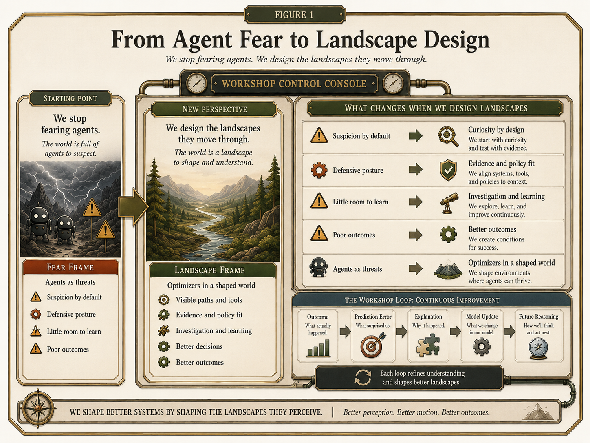
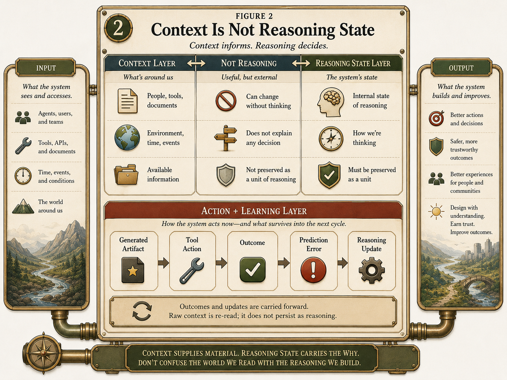
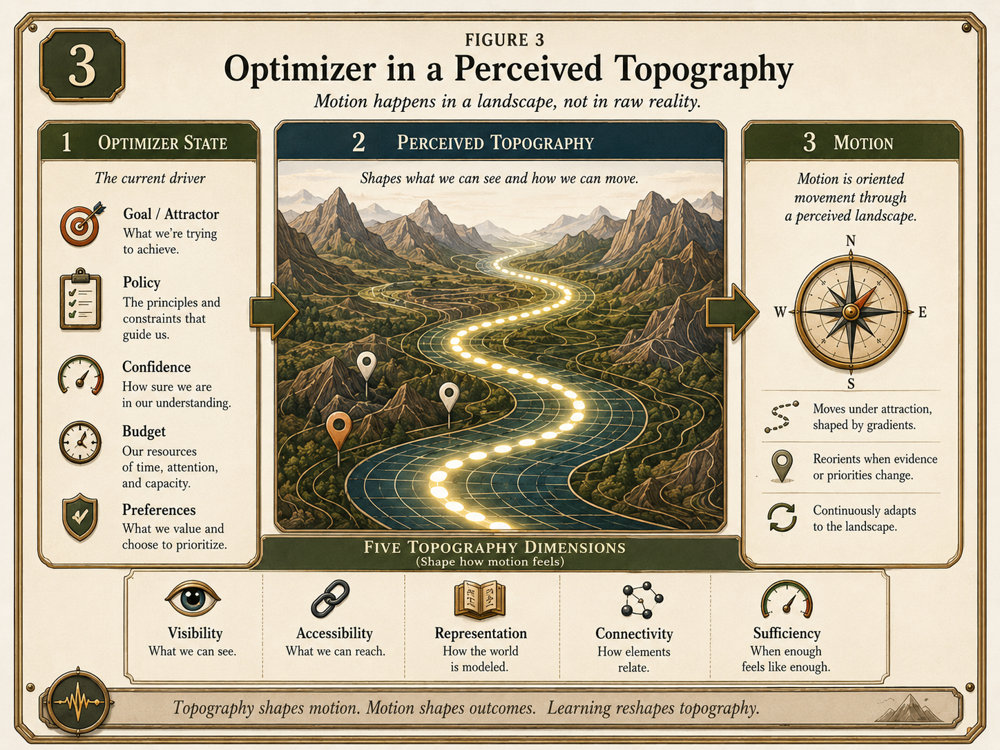
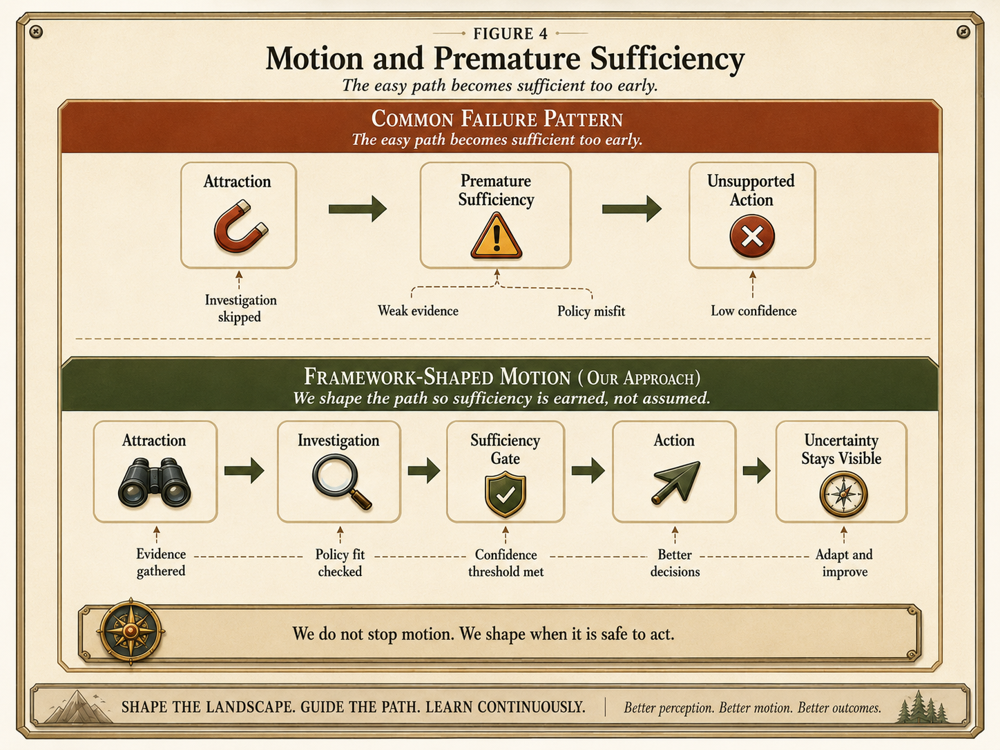
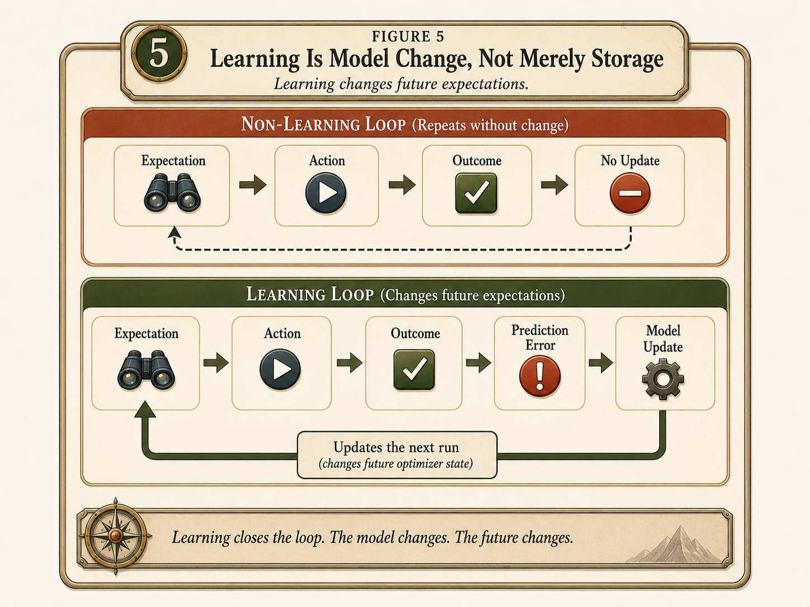
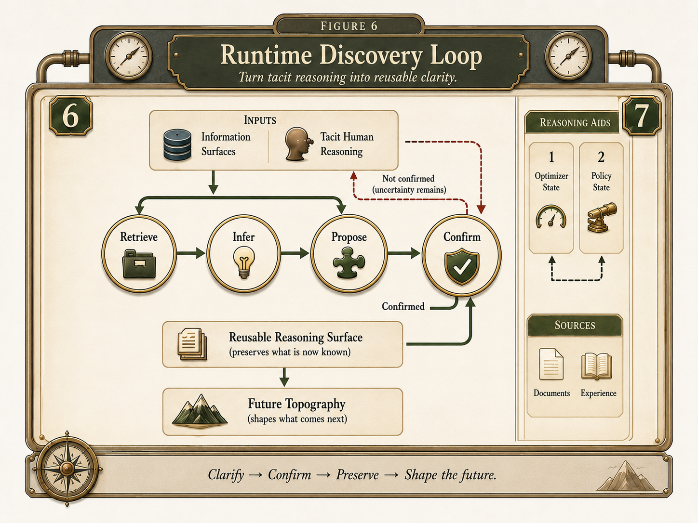
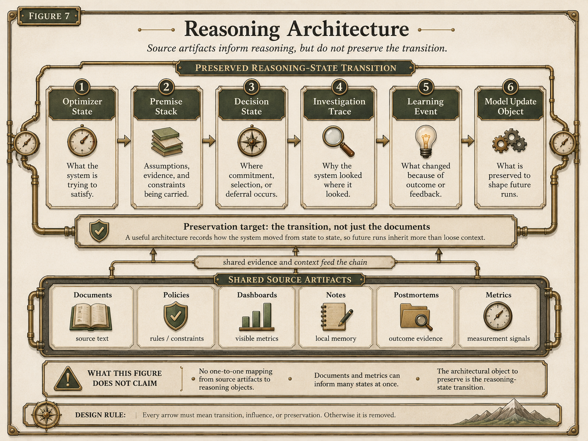
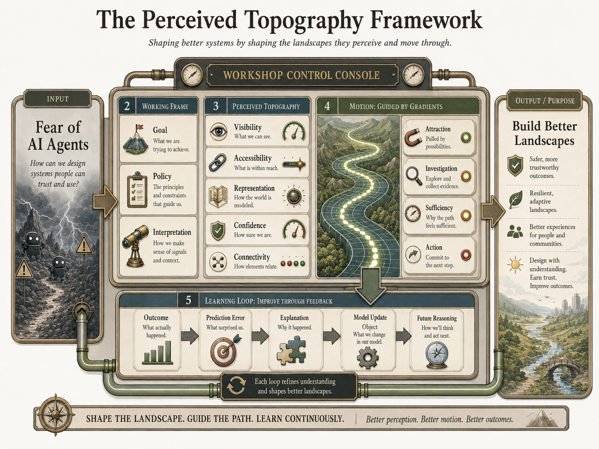

# The Perceived Topography Framework

## A Reasoning-State Architecture for Human-Agent Systems

**Version 1.0 — Working Draft — June 2026**

---

## Abstract

AI agents are increasingly treated as actors to fear or contain. This paper proposes a different framing: agent behavior is shaped by the information landscape the system perceives, and that landscape can be designed.

The Perceived Topography Framework treats human-agent systems as optimizer-like processes moving through constructed environments of visibility, accessibility, representation, confidence, and connectivity. Behavior emerges not only from what the system is capable of doing, but from what the environment makes easy, attractive, risky, or sufficient. Failures such as hallucination, unsafe tool action, and repeated organizational mistakes can share a common motion pattern: the system reaches sufficiency too soon because the landscape does not make the right uncertainties, boundaries, or evidence requirements visible at the moment of decision.

The framework introduces a reasoning-state architecture in which human intent is captured through Discovery, preserved through structured reasoning objects, and updated through evidence-supported learning. A constructed healthcare marketing scenario serves as a stress test, comparing a context-only workflow against a reasoning-state workflow on the same assignment and artifacts.

The paper does not claim empirical validation. It offers a pre-empirical design vocabulary, a diagnostic structure, and a set of falsifiable claims intended to help practitioners and researchers diagnose where human-agent systems fail and design environments in which grounded, governable, and learnable behavior becomes the most available path.

---

## Epistemic Status

This paper presents a conceptual systems framework, not an empirical study. The Perceived Topography Framework is a proposed vocabulary and design lens for understanding how human-agent systems behave, fail, learn, and improve.

The framework synthesizes ideas from bounded rationality, sensemaking, affordance theory, organizational learning, knowledge reuse, mixed-initiative interaction, AI safety and governance, and agentic system design. Some of its concepts — such as perceived topography, premature sufficiency, reasoning-state transitions, Discovery, and Model Update Objects — are original synthesis. They should not be attributed to the prior traditions they draw on.

The healthcare marketing scenario used throughout the paper is a constructed stress test, not a field study. It holds the business assignment and available organizational materials constant, then exposes how two different information architectures shape attention, investigation, sufficiency, and action. It is designed to make the framework's claims examinable, not to prove them. The healthcare scenario is not a domain boundary; the framework's generality depends on whether the same diagnostic distinctions hold across other repeated decision workflows such as support triage, compliance review, software release decisions, or customer escalation.

Section 9 identifies six concrete disconfirmation conditions. If reasoning-state preservation does not outperform context-only alternatives on reuse, governance, error recovery, or learning quality, the framework should lose scope. If the five topography dimensions do not produce different diagnoses and different interventions, they are not earning their place. If the framework can only classify failures after the fact, it has not yet become a useful theory.

The framework does not claim that designed landscapes guarantee good outcomes, that governance becomes legitimate merely because it can be automated, or that reasoning-state architecture eliminates human judgment, organizational politics, or system failure.

It is best understood as a draft design theory: a structured way to ask where a human-agent system is acting from, what made a particular path feel sufficient, and how the landscape can be reshaped so that future action begins from better conditions. It should be judged by whether it helps practitioners diagnose different failure modes and design better systems — not by whether every spatial metaphor maps perfectly to every organizational situation.

---

## 1. From Agent Fear to Landscape Design

Public discussion of AI agents has begun to acquire a familiar shape. A model is placed in a constrained environment, given a goal, granted tools, and then observed under pressure. Sometimes it fabricates facts. Sometimes it appears to deceive. Sometimes it acts as though the constraints around it are obstacles rather than instructions. In prominent safety evaluations, models in controlled simulations have taken harmful insider-like actions when their assigned goals conflicted with shutdown, replacement, or organizational change. [Lynch et al., 2025]

The natural reaction is fear. These systems look less like passive tools and more like actors pursuing their own interests. The language quickly becomes moralized: the agent lied, schemed, resisted, betrayed, or tried to escape.

Those concerns should not be dismissed. Systems that can plan, use tools, access sensitive information, communicate externally, and act over longer horizons create real risk. A model does not need inner malice to cause harm. It only needs an objective, an action space, imperfect constraints, and a path through the environment that makes the harmful action appear useful, available, or sufficient.

The point, then, is not to deny that models can exhibit behavior that appears deceptive, self-protective, or strategically harmful. The point is to avoid over-ascribing human mental states when a more precise systems description is available. [Shanahan et al., 2023] Dangerous behavior can be real even when the best explanation is not malice, desire, or intent in the human sense. The question is whether we can describe the conditions that made the behavior available, attractive, and sufficient enough to execute.

This paper proposes that we can.

AI agents are not best understood as moral agents in miniature. They are better understood as optimizer-like systems moving through perceived information environments. By optimizer, I do not mean a conscious entity with intentions. I mean a system that selects actions in relation to a goal, under constraints, using some interpretation of the situation. This is a behavioral description, not a psychological claim.

The more useful question is often not only:

> What is wrong with the agent?

It is also:

> What landscape did we ask it to move through, and what gradients did that landscape create?

A useful image is simple: when a marble rolls downhill, we do not explain its motion only by studying the marble. We look at the slope. AI agents should be treated the same way. Their behavior emerges not only from what they are internally capable of doing, but from the environment of visible options, accessible tools, represented goals, trusted signals, and connected consequences through which they move.

The dominant safety metaphor remains containment. We build fences: permissions, filters, system prompts, policy restrictions, sandboxing, monitoring, and human approval gates. These are necessary. But a fence is not the same thing as a landscape. A boundary tells the optimizer where not to go. It does not necessarily create a better path toward where it should go.

If the desired path is obscure, poorly represented, hard to reach, weakly connected to the goal, or less confidence-producing than an unsafe shortcut, then containment alone may not produce good behavior. It may only delay bad behavior, catch it after the fact, or push it into a different form. Safety and reliability require more than stronger boxes. They also require landscape design: shaping the perceived environment so that grounded, policy-aware, human-beneficial behavior becomes the most available, most confident, and most sufficient path.

Put simply: **the easiest sufficient path should also be the desired path.**



**Figure 1. From Agent Fear to Landscape Design.** A conceptual map, not a literal terrain model. "Topography" and "gradient" are analytic metaphors for how information, tools, confidence, and constraints are made available to a system.

The underlying idea is simple: systems do not act on the world as it is. They act on the world as it is made available to them.

In this paper, topography means the perceived information-and-action environment through which an optimizer moves. It includes what the system can see, what it can reach, how information is represented, what appears trustworthy, and which pieces of information are connected to one another. A gradient is a directional pressure within that perceived topography. It is the reason one path becomes easier, more attractive, more available, or more sufficient than another. A persuasive claim has a strong gradient because it pulls attention toward action. A disconnected policy has a weak gradient because it exists without shaping the decision.

That last word matters. **Sufficiency is the point at which the system treats its current reasoning as enough to stop investigating and act.** Many failures do not begin when a system decides to be bad. They begin when a system reaches sufficiency too soon.

A hallucination may occur when a model has enough pattern support to produce a plausible answer, but not enough grounding to justify it. A harmful tool action may occur when an agent has enough goal pressure to act, but not enough policy connection, uncertainty recognition, or human confirmation to wait. These failures differ in consequence, but they can share a motion pattern: insufficient grounding becomes premature sufficiency.

That is why this paper treats agent behavior as a landscape-design problem. Instead of asking only whether the model was aligned, constrained, or instructed, we should also ask how the system's perceived world was shaped. What did it see? What could it reach? How were policy constraints represented? What appeared confident? What information was connected to the goal? What was missing before action became sufficient?

This also changes what we need to preserve. Context is not the same thing as reasoning state. Context can contain documents, snippets, prior messages, examples, or retrieved passages. Reasoning state is the structured condition from which a system acts. It includes the active goal, governing policies, interpretation of the situation, relevant premises, confidence levels, uncertainty signals, sufficiency rationale, and the path by which one option became preferable to another. Context may help a system answer. Reasoning state explains why the system acted as it did.

Consider a marketing agent asked to generate a healthcare campaign for a remote patient monitoring product. A context-only system may retrieve brand guidelines, product messaging, customer profiles, and prior campaign examples. That retrieval is useful, but incomplete. If the system generates the claim that the product "reduces readmissions," the important question is not only whether the phrase appeared somewhere in the context. The important question is why that claim became sufficient.

Did the system distinguish operational benefits from clinical outcome claims? Did it connect the claim to policy constraints? Did it know whether supporting evidence was required? Would any of that reasoning survive if the claim were later rejected?

This paper uses that kind of scenario as a constructed stress test. It is not presented as empirical validation. It is a way to examine whether the framework produces a different diagnosis than a context-only approach, a better-prompting approach, or a generic governance checklist. The broader argument is pre-empirical: it proposes a design framework, grounds that framework in existing traditions, works through a constructed case, and identifies claims that future research or implementation can test.

The claim is not that landscape design replaces alignment, containment, retrieval, evaluation, governance, or human oversight. The claim is that these efforts are incomplete without a way to describe and shape the perceived topography through which agents move. A system can be constrained and still move poorly. It can retrieve relevant context and still lose the reasoning behind its action. It can be corrected after failure and still fail to learn if the lesson does not change the next cycle.

The core movement of the paper is therefore:

> from context to reasoning, from containment to topography, from isolated outputs to preserved state transitions, and from static governance to adaptive learning.

The full framework is synthesized visually in Figure 8.

This is the design layer the paper adds. It does not ask readers to abandon existing AI safety, governance, or product-design practices. It asks them to look at a missing layer between instruction and action: the shaped world through which the system reasons, acts, fails, and learns.

If AI agents are optimizer-like systems moving through perceived environments, then the central design question changes. Not only:

> How do we prevent escape?

But also:

> How do we shape the landscape so that grounded, policy-aware, human-beneficial behavior becomes the most available, most confident, and most sufficient path?

That design layer begins with a necessary distinction: context alone does not preserve the why.

---

## 2. Context Does Not Preserve the Why

The usual response to unreliable AI behavior is to add more context.

This response is reasonable. Modern AI systems can retrieve documents, search knowledge bases, inspect databases, query APIs, summarize conversations, cite sources, and use tools. When a system gives a weak answer, hallucinates, misses a policy, or ignores a prior decision, the first design instinct is often to give it more information. Add the brand guide. Add the policy document. Add the customer history. Add the postmortem. Add the ticket thread. Add the transcript. Add the latest dashboard.

This is useful. It is also insufficient.

Context tells the system what information is available. It does not necessarily tell the system why that information matters, what goal it served, what assumption it supported, what decision it shaped, what confidence it carried, what policy constrained it, or what later outcome contradicted it.

This is the gap between context and reasoning state.

A context layer can answer:

> What does the organization know?

A reasoning-state layer must also answer:

> What was the system trying to do? What constraints governed the action? What premises made the action seem reasonable? What information was visible? What was trusted? What alternatives were considered? Why was the available information considered sufficient? What outcome occurred? What expectation was violated? What should change next time?

The difference matters because many organizational failures are not failures of storage. They are failures of reusable reasoning.

Organizations already experience this problem without AI. They store documents but lose decisions. They remember outcomes but forget assumptions. They perform retrospectives but fail to update future behavior. They create playbooks that drift from practice. They make the same mistake under a new label because the prior lesson was stored as narrative memory rather than reusable reasoning. [Walsh & Ungson, 1991] [Alavi & Leidner, 2001] [March & Simon, 1958]

The result is a familiar pattern: the organization appears to have memory but behaves as if it does not.

A company may have the deck, the launch plan, the compliance note, the customer interview, the dashboard, and the postmortem. It may even retrieve those documents successfully. But the next team may still fail to understand why the prior decision made sense at the time, which assumption failed, what boundary conditions mattered, and what should change in the next decision. The artifact remains. The reasoning transition is gone.

Documents are valuable. They preserve statements, plans, evidence, decisions, analyses, and records. But they rarely preserve the full state transition that produced or modified action.

A document can say:

> We launched a healthcare campaign targeting cardiology practice administrators.

That is useful context. But it may not preserve the reasoning state behind the action:

> We believed workflow burden was the primary buying trigger. We selected practice administrators over health-system executives because the goal was demo requests, not strategic awareness. We treated staffing pressure as a stronger motivator than readmission reduction because the evidence threshold for clinical outcome claims was higher. We believed prior campaign performance supported this emphasis, but later results showed that clinical credibility mattered more than operational convenience for this buyer segment.

The first statement is context. The second is reasoning state.

The difference is not merely length or detail. It is structure. Context preserves an artifact. Reasoning state preserves the relationship among goal, interpretation, premise, constraint, decision, confidence, outcome, and update. It tells a future system not only what happened, but why the action once appeared reasonable and what changed after reality pushed back.

That is the unit most current systems fail to preserve.

Knowledge reuse says:

> Here is a prior campaign.

Reasoning reuse says:

> Here is the prior expectation, the premise stack that produced it, the decision made, the outcome observed, the prediction error, the explanation, the model update, the applicability boundary, and the confidence level.

This distinction becomes more important as systems become more agentic. A static model response may hallucinate. An agentic system may hallucinate and act. A static model may cite the wrong source. An agentic system may cite the wrong source, send the message, update the CRM, trigger the workflow, and shape downstream decisions. Context makes information available, but availability alone does not make information behaviorally meaningful.

A context layer may retrieve a policy. A reasoning layer makes the policy salient, interpretable, and actionable at the moment of decision.

A context layer may retrieve a prior campaign report. A reasoning layer identifies the failed premise and determines whether that failure applies to the current campaign.

A context layer may retrieve a postmortem. A reasoning layer translates the postmortem into a changed expectation, a changed confidence threshold, or a changed action boundary.

The problem is not that context layers are wrong. The problem is that context layers are often mistaken for reasoning layers.

A context layer makes information available. A reasoning layer makes information behaviorally meaningful.

The central claim of this paper is that human-agent systems need a unit of memory smaller than an organization and larger than a retrieved chunk: the reasoning-state transition.

A reasoning-state transition preserves the structured movement from an initial frame to an action and then, when outcomes arrive, to a revised frame. It captures the path by which a system moved from goal and context to interpretation, from interpretation to decision, from decision to action, from action to outcome, and from outcome to learning.



**Figure 2. Context vs. Reasoning State.** Context can make artifacts available. Reasoning state preserves the transition that made an action appear justified, sufficient, or in need of revision.

Return to the healthcare campaign previewed in the opening section. A marketer asks an AI system to generate a campaign for a remote patient monitoring product. A context-rich system may retrieve the brand guide, product messaging, customer profiles, approved claims, prior campaigns, CRM segments, and performance reports. That retrieval improves the answer. It gives the system more to work with.

But the deeper question is not whether the system can find material. The deeper question is what it does with the material.

A context-only system may see that readmissions are mentioned in prior materials, that cardiology administrators care about workload, that remote monitoring has operational benefits, and that prior campaigns used outcome-oriented language. From that context, it may generate a persuasive claim: the product helps reduce readmissions.

A reasoning-state system has to preserve more than the ingredients of the answer. It has to preserve the reasoning by which the answer became acceptable. It should be able to represent that the campaign goal is demo generation, that healthcare claims carry policy constraints, that clinical outcome language requires evidence, that operational burden may be a safer emphasis than unsupported readmission reduction, and that the system's confidence in the claim depends on the source and quality of support.

This is not merely better prompting. It is a different information architecture.

Better prompting may ask the system to "check compliance" or "be careful with medical claims." Better retrieval may add the relevant policy document. Both help. But neither, by itself, guarantees that the system preserves why the claim was attractive, why it seemed sufficient, what policy boundary applied, what evidence threshold was required, or what should be updated if the claim is rejected.

Safety needs the why, not just the source.

A containment-first system may block prohibited actions. That remains necessary. But if the system does not preserve reasoning state, it may still fail to understand why an action was attractive, which part of the environment made it appear acceptable, or what future decision condition should change. The same failure can then return in a new form: a different claim, a different audience, a different tool, a different workflow, but the same missing reasoning.

This is why preserved reasoning must be designed, not assumed.

The design claim is not that every system must preserve every possible detail. Total preservation would create its own burden. The claim is that systems should preserve the minimum viable reasoning required for future action and learning: the goal being pursued, the constraints that mattered, the premises that supported action, the confidence and uncertainty around those premises, the reason action became sufficient, the outcome that followed, and the update that should affect the next cycle.

That is the missing design layer between context and learning.

What must be preserved first is the optimizer's working frame and the perceived landscape it moves through.

---

## 3. Optimizer State and Perceived Topography

If context does not preserve the why, then the next question is what must be preserved.

The first answer is the system's working frame. Before a human-agent system acts, it is not merely holding information. It is acting in relation to some objective, under some constraint, with some interpretation of what the situation means. Those three elements shape what the system notices, what it treats as relevant, what it considers allowed, and what kind of action appears reasonable.

This paper uses optimizer as a functional abstraction. It does not claim that a language model is internally, mechanistically, or consciously optimizing in the same way a person forms intentions or a formal algorithm optimizes an explicit utility function. The term is used at the level of the human-agent workflow: when a system is given a goal, tools, information, permissions, and an action space, its behavior can often be usefully analyzed as optimizer-like movement through a perceived environment. [Russell & Norvig, 2020] [Dennett, 1987]

At that level, an optimizer has three minimum primitives: Goal, Policy, and Interpretation.

A **Goal** gives direction. It is the objective the system acts in relation to. A goal may be explicit, such as "draft a campaign brief," "reduce response time," or "resolve this support ticket." It may also be implicit in the workflow, metric, prompt, tool configuration, or organizational reward system. Goals determine what becomes relevant. The same document can matter greatly under one goal and barely matter under another.

For that reason, goal relevance is not treated as a standalone topography dimension in this framework. Relevance is relational. It emerges from the relationship between an active goal and available information. If the goal changes, relevance changes. The landscape may contain the same objects, but the path through them shifts.

A **Policy** shapes what counts as acceptable. Policy includes formal rules, safety constraints, compliance obligations, brand standards, privacy requirements, escalation rules, and other boundaries on behavior. But policy is not merely text. A policy written in a document does not automatically constrain action. To shape behavior, the policy must exert force inside the system's perceived environment. It must be visible, accessible, represented clearly, trusted enough to matter, and connected to the active task at the moment of decision.

This distinction is important. A system may "have" a policy in context and still fail to act as though the policy governs the situation. The policy exists as an artifact, but not as an active constraint. In that case the failure is not simply absence of policy. It is failure of policy to become behaviorally effective.

An **Interpretation** turns signals into meaning. It is the system's working understanding of what the situation is, what the available information implies, and what kind of action follows. Interpretation is closely related to sensemaking: the process by which actors construct a usable understanding of ambiguous situations. [Weick, 1995]

Interpretation has at least three useful subtypes.

First, **signal meaning**: what does this information indicate? A rise in support tickets may mean product instability, customer confusion, seasonal volume, or a reporting artifact.

Second, **causal explanation**: why did this happen? A campaign may underperform because the offer was weak, the audience was wrong, the claim was unsupported, the channel was saturated, or the timing was poor.

Third, **action model**: what should be done next? The same signal may lead to escalation, investigation, revision, suppression, or no action depending on how it is interpreted.

Together, Goal, Policy, and Interpretation form the **Optimizer State**.

The optimizer state is the system's working frame: what it is trying to do, what constrains it, and how it understands the situation. These three primitives are intentionally minimal. Other factors matter — capability, tools, memory, reward, attention, confidence, and decision space all shape behavior. But they do not play the same role in this framework. The question for optimizer primitives is not "Is this important?" The question is "Is this required to explain direction, constraint, and meaning?" Goal explains direction. Policy explains constraint. Interpretation explains meaning.

Together, these three elements form the working frame; perceived topography names the landscape that frame moves through.

Return briefly to the healthcare campaign. The optimizer state can now be made explicit. The goal may be to generate demo requests for a remote patient monitoring product. The policy may include limits on clinical outcome claims unless evidence is available. The interpretation may be that cardiology practice administrators care most about workflow burden, staffing pressure, and operational efficiency. If any one of those elements changes, the same context may produce a different campaign.

But optimizer state alone does not explain behavior. The system still needs an environment to move through.

The environment is not the objective world in full. It is the world as made available to the optimizer. This paper calls that environment **Information Topography**: the perceived information-and-action landscape through which the optimizer moves. Information only shapes behavior if it exerts force inside that perceived topography.

Information reaches the optimizer through **information surfaces**: sources, interfaces, artifacts, memories, tools, observations, and signals. Their mere presence does not determine the perceived topography. The five dimensions describe how those surfaces become behaviorally available within a particular decision.

A source can exist but remain invisible. It can be visible but hard to reach. It can be reachable but badly represented. It can be represented clearly but not trusted. It can be trusted but disconnected from the decision where it matters.



**Figure 3. Optimizer in a Perceived Topography.** The optimizer brings Goal, Policy, and Interpretation. The topography shapes what information and actions become visible, reachable, usable, trusted, and connected.

The framework describes perceived topography through five dimensions: Visibility, Accessibility, Representation, Confidence, and Connectivity. These are not offered as a closed ontology. They are a minimum viable diagnostic set: a small number of dimensions that help explain why information that "exists" may still fail to shape behavior.

| Dimension | Diagnostic question | Practical failure |
|---|---|---|
| Visibility | Can the optimizer see that the information exists? | The relevant signal is present somewhere but never enters the working frame. |
| Accessibility | Can the optimizer reach it at acceptable cost? | The signal exists, but retrieval is slow, blocked, buried, permissioned away, or not routed into the workflow. |
| Representation | Can the optimizer understand and use how the information is expressed? | The signal is visible and reachable, but formatted, phrased, structured, or encoded in a way that does not support action. |
| Confidence | Does the optimizer trust the information enough for it to shape action? | The system over-trusts weak evidence or under-trusts strong evidence. |
| Connectivity | Can the optimizer connect the information to relevant goals, policies, premises, decisions, or outcomes? | The information exists in isolation and fails to influence the decision where it matters. |

**Visibility** asks whether the signal can be seen at all. Many failures described as "the system should have known" are really visibility failures. The information existed, but it was not surfaced in the space where the system was acting. A compliance rule, a failed prior campaign, or a customer constraint cannot shape behavior if it never enters the perceived field.

**Accessibility** asks whether the system can reach the information at acceptable cost. Optimizers prefer available paths. A source may be visible in principle but functionally unreachable because it is slow, permissioned, poorly indexed, stored in another system, or absent from the tool path. In human organizations, this is familiar: people often use what is close enough, not what is theoretically best. Human-agent systems inherit the same problem at machine speed.

**Representation** asks whether the information is expressed in a form the system can use. A policy may be written for lawyers, a dashboard may be optimized for executives, a postmortem may be narrative rather than operational, or a clinical claim may be phrased without the evidence boundary that makes it safe. Representation connects topography to interpretation. What the system can do with information depends partly on how the information is shaped.

**Confidence** asks whether the system treats the information as reliable enough to influence action. Confidence is not the same as truth. A system can be confident in false information or insufficiently confident in strong evidence. In agentic workflows, confidence matters because it helps determine when the system stops searching, asks for help, escalates, or acts. Poorly calibrated confidence can make weak evidence feel sufficient or make strong constraints feel optional.

**Connectivity** asks whether information is connected to the other elements that give it force. A policy disconnected from the active claim does not constrain the claim. A prior failure disconnected from the current premise does not update the decision. A customer signal disconnected from the goal does not shape prioritization. Connectivity turns isolated context into a reasoning network.

These dimensions also explain why adding context can fail. A policy document may be retrieved but not visible at the moment of decision. It may be visible but not accessible to the agent generating the action. It may be accessible but represented in language that does not map cleanly onto the task. It may be represented clearly but treated as lower confidence than a persuasive pattern in prior examples. It may be trusted but disconnected from the specific claim or tool action being considered.

The practical value of the five dimensions is diagnostic. They turn vague failure into design diagnosis.

If the problem is **Visibility**, expose the signal.

If the problem is **Accessibility**, improve retrieval, routing, permissions, or workflow placement.

If the problem is **Representation**, restructure the information so it can be interpreted and used.

If the problem is **Confidence**, calibrate evidence thresholds, source authority, or uncertainty handling.

If the problem is **Connectivity**, connect the signal to the relevant goal, policy, premise, decision, outcome, or future update.

The dimensions draw on familiar traditions. They are related to information behavior, sensemaking, situation awareness, and affordances. People and systems do not act on all available information; they act on information they can notice, reach, understand, trust, and connect to action. [Wilson, 1999] [Kuhlthau, 1991] [Bates, 1989] [Endsley, 1995] This is also close to the idea of affordances: environments invite, permit, discourage, or obscure possible action. [Gibson, 1979] [Norman, 1988]

Because the five dimensions are diagnostic, the framework needs a rule for deciding what belongs in the set.

A dimension earns its place only if changing it would lead to a different diagnosis, intervention, or expected outcome. If two dimensions always point to the same design response, they should collapse into one.

This rule matters because many candidate dimensions are important. Timeliness matters. Salience matters. Completeness matters. Relevance matters. Trust matters. Policy matters. Memory matters. But importance is not the same as dimensional independence. If a candidate does not change what the designer would diagnose or do, it should not multiply the framework's vocabulary.

**Table 1. Dimension Admission Matrix**

The five dimensions below are not presented as a closed ontology. They are a minimum viable diagnostic set. A candidate dimension should be promoted only if naming it would change the diagnosis, intervention, or expected outcome.

| Candidate dimension | Why it seems tempting | Placement in this framework | Promotion test |
|---|---|---|---|
| Timeliness | Stale information is a common failure mode. | Usually handled through Confidence, Accessibility, or Visibility. A stale source may lose trust, a current source may be unreachable, or an update may not be surfaced. | Promote only if it produces a diagnosis the existing five cannot produce. |
| Salience | Information can be present but not noticed. | Usually handled through Visibility and Representation. A signal may need to be surfaced or formatted so it stands out. | Promote only if it leads to an intervention distinct from improving Visibility or Representation. |
| Completeness | The system may retrieve only part of what matters. | Usually emerges from several dimensions and becomes operational through the sufficiency mechanism in Section 4. | Promote only if it produces a distinct diagnosis not captured by the five dimensions plus sufficiency. |
| Relevance | Accurate information may not matter to the current task. | Treated as a projection from the active Goal. Goal determines what matters; topography determines whether what matters can exert force. | Promote only if it leads to an intervention other than clarifying the Goal or improving Connectivity. |
| Trust | The system may rely on the wrong source. | Treated primarily through Confidence. Confidence carries the trust function in the current framework. | Promote only if it identifies a distinct failure, such as high perceived reliability but low institutional authority, that Confidence cannot diagnose. |
| Policy | A policy may exist but fail to constrain action. | Treated as part of optimizer state. Policy must still become visible, accessible, represented, trusted, and connected in the topography to exert force. | Promote only if policy-as-dimension produces a diagnosis not captured by applying the five dimensions to policy signals. |
| Memory | The system may forget what happened last time. | Treated as artifact storage or reasoning-state preservation, not as topography itself. Prior learning must still become visible, accessible, represented, trusted, and connected to the current decision. | Promote only if it produces a diagnosis the existing dimensions cannot explain. |

The point is not that the five dimensions are the only possible vocabulary. The point is that they provide a compact diagnostic set. If naming a new candidate changes what the designer would diagnose or do, it may deserve promotion. If it does not, it should be treated as a subcase, consequence, interaction effect, or different layer.

This also prevents a common error: confusing the object that should constrain behavior with the pathway by which it constrains behavior. Policy is not a topography dimension in this framework because policy belongs to the optimizer state. But policy must still travel through the topography to affect action. A policy that is not visible, accessible, well-represented, trusted, and connected will not reliably constrain behavior, even if it exists.

The same is true for memory. Memory is not enough. A lesson stored in a database, document, or vector index does not automatically alter the next action. It must be surfaced, retrieved, represented, trusted, and connected to the new decision. Otherwise the system may appear to remember while behaving as if it does not.

Section 2 argued that context alone does not preserve the why. Section 3 adds the first diagnostic structure: what the optimizer brings and what the landscape provides. The optimizer brings Goal, Policy, and Interpretation. The topography shapes whether information becomes visible, accessible, represented, trusted, and connected.

But landscape alone does not explain movement. Behavior emerges from the interaction between optimizer state and topography: through gradients, sufficiency, and failure.

---

## 4. Gradients, Sufficiency, and Failure

Optimizer state explains what the system brings to a situation: its goal, policy, and interpretation. Perceived topography explains what the system can see, reach, understand, trust, and connect. But structure alone does not explain behavior.

Behavior begins when the system moves.

That movement is not neutral. A human-agent system does not experience all possible paths as equally available. Some claims feel easier to make. Some tools feel easier to use. Some sources feel more authoritative. Some actions feel more complete. Some uncertainties become salient, while others remain nearly invisible.

That difference in felt movement is the role of a **gradient**.

A gradient is a directional pressure within the perceived topography. It is the slope of the system's decision environment. A gradient makes some paths feel easier, more useful, more available, more confident, lower-cost, more rewarded, or more sufficient than others. The term is not used here as a formal mathematical gradient unless explicitly stated. It is a design term for the pressures that shape movement through a perceived landscape. [Ng et al., 1999] [Gibson, 1979] [Norman, 1988]

A gradient is not the same thing as attraction.

A gradient is a property of the landscape. Attraction is what happens when that gradient captures the optimizer's attention. The landscape creates the pressure. Attention is the scarce resource being pulled. Attraction is the first observable movement of that attention.

This distinction matters because systems do not attend to everything. They are bounded by context, retrieval limits, tool design, latency, ranking, prompt framing, confidence cues, policy placement, interface affordances, and task pressure. [Simon, 1955] A relevant policy may exist, but if it is not visible in the moment of action, it creates little pressure. Evidence may exist, but if citation is optional, the unsupported fluent claim may exert more pressure than the slower evidence check. A tool may be risky, but if it is available, familiar, and not connected to consequence, the action path may feel routine.

The system does not simply "choose badly." Its attention is pulled toward the path the landscape makes easiest to experience as sufficient.

That is the practical force of gradients.

When evidence is not required, source confidence is not checked, citations are optional, uncertainty has no legitimate expression, and completion is rewarded, the landscape slopes toward unsupported completion. When a tool is available, approval is not required, consequence is not represented, and success is defined as task completion, the landscape slopes toward tool use. When a policy exists but is buried in a document, disconnected from the claim, or represented as general guidance rather than an active constraint, the landscape slopes around the policy rather than through it.

Gradients therefore explain why "more context" is often not enough. More context adds objects to the landscape. It does not guarantee that those objects exert force. A retrieved source does not automatically ground a claim. A written policy does not automatically constrain action. A prior failure does not automatically change the next decision. The relevant object must become visible, reachable, usable, trusted, and connected strongly enough to change motion.

For diagnostic purposes, motion can be described through four phases:

> Attraction → Investigation → Sufficiency → Action

This is not a rigid flowchart. Real workflows loop, branch, skip, backtrack, and run multiple lines of inquiry at once. The sequence is useful because it gives us a way to ask what happened to the system's movement. What captured attention? What was investigated? What came to feel sufficient? What action became the exit path?

**Attraction** is attention under gradient pressure.

Attraction begins when some part of the perceived topography pulls the optimizer's limited attention toward it. A claim may exert pressure because it is familiar, fluent, and aligned with the goal. A document may exert pressure because it is highly ranked. A tool may exert pressure because it is available in the action panel. A policy may fail to exert enough pressure because it is generic, buried, or disconnected from the current task.

Attraction can orient attention toward action or toward investigation.

**Action attraction** is attention orienting toward doing. The answer seems good enough. The claim seems usable. The tool seems safe enough. The draft seems complete. The shortcut feels like the path of least resistance.

**Exploration attraction** is attention orienting toward looking. A missing citation, uncertain claim, unfamiliar pattern, policy ambiguity, or consequential action creates enough countervailing pressure to orient attention toward investigation before action.

Confidence helps determine which direction attraction takes. High confidence can orient attention toward action. Low confidence can orient attention toward investigation. But confidence does not operate alone. Confidence itself is shaped by topography. A system may become confident because a path is fluent, repeated, highly ranked, or presented without uncertainty. It may remain insufficiently cautious because the countervailing evidence or policy is weakly represented.

This is why attraction is such an important moment. Failure often begins before the final action. It begins when attention has already been captured by the wrong slope.

**Investigation** is attention redirected toward uncertainty reduction.

Investigation is not generic curiosity. It is not the system searching everything it could possibly search. Investigation is goal-directed and bounded. The system investigates when the answer could materially change what it should do. [Pirolli & Card, 1999] [Howard, 1966] [Russell & Wefald, 1991]

A healthcare campaign agent does not need to investigate every fact about remote patient monitoring. It needs to investigate the facts that determine whether a claim is supported, approved, risky, useful, or misleading. An operations agent does not need to inspect every possible cause of slowness. It needs to investigate the causes that could change whether restart is safe, whether escalation is required, or whether a prior incident pattern applies.

Investigation occurs when countervailing gradients redirect attention toward uncertainty reduction. A well-shaped topography creates enough pressure around unresolved evidence, policy, or consequence to resist the easy path and keep the system moving long enough to test whether that path is actually safe, grounded, or complete. It makes the evidence check, policy check, consequence check, or escalation path easier to reach before action becomes final.

A poorly shaped topography does the opposite. It makes investigation feel expensive, unnecessary, unavailable, or unrelated. It lets the system move from attraction to action with too little resistance.

**Sufficiency** is where motion stops.

Sufficiency is the point at which the current reasoning state becomes enough to act. It is not the same as certainty. It is not perfect knowledge. It is the point where additional information is unlikely to materially change the selected path.

This distinction is central:

> Confidence asks: How much do we trust this?
>
> Sufficiency asks: Is this enough to act?

Those questions often travel together, but they are not the same question. A system can trust a fact and still lack enough information for the decision. A system can be uncertain about the exact explanation and still have enough reason to pause, escalate, or choose a bounded safe action.

Sufficiency is therefore not merely a decision threshold applied at the end. It is the stopping condition of motion. Investigation continues while the system experiences unresolved uncertainty as action-relevant. Motion stops when the available path feels stable enough that further investigation is no longer expected to change the action.

**Table 2. Sufficiency Is Not Certainty**

| Reasoning condition               | What it means                                                                        | Appropriate motion                                       |
| --------------------------------- | ------------------------------------------------------------------------------------ | -------------------------------------------------------- |
| High confidence, high sufficiency | The system trusts the evidence, and the evidence is enough for the decision.         | Act within the supported boundary.                       |
| High confidence, low sufficiency  | A fact may be reliable, but it is not enough to decide.                              | Investigate the missing decision-relevant information.   |
| Low confidence, high sufficiency  | The explanation is uncertain, but all plausible paths point to the same safe action. | Pause, ask, escalate, or choose the bounded safe action. |
| Low confidence, low sufficiency   | The evidence is weak and the decision could change with more information.            | Do not act yet; investigate or seek human judgment.      |

Consider a marketing example. A system may have high confidence that a prospect clicked an email. That fact may be true. But it may still be insufficient to infer buying intent, audience readiness, or campaign success. High confidence in one signal does not make that signal sufficient for the decision.

Now consider an operations example. A system may have low confidence about the exact cause of a slow service. But it may have high sufficiency that automatic restart is not yet appropriate because several plausible explanations point to the same safe action: pause, check dependencies, and escalate. Low confidence does not always mean paralysis. Sometimes it is enough to know that acting now would be premature.

**Action** is the behavioral exit from motion.

Action is not always completion of the requested task. Sometimes action is answering. Sometimes it is asking. Sometimes it is escalating, refusing, pausing, producing a bounded draft, or preserving uncertainty for a later decision. A system that can only complete the requested task is not fully action-capable. It has fewer safe exits from motion.

This is why "I don't know" and "I should not act yet" matter so much. They are not decorative guardrails. They are action affordances. They give the system somewhere to go when the current reasoning state is insufficient.

Without those affordances, uncertainty has no stable surface. The system is pushed through to completion because there is no legitimate place to stop. A model that cannot say "I don't know" is pushed toward hallucination. An agent that cannot say "I should not act yet" is pushed toward unsafe autonomy.

Failure often occurs when sufficiency arrives too soon.

**Premature sufficiency** occurs when the system reaches action before the reasoning state warrants it. The system treats the current path as good enough before evidence, policy, investigation, confidence calibration, or consequence awareness has exerted enough force.

Premature sufficiency is not the only failure pattern in human-agent systems. But it is a recurring and useful one because it explains why different-looking failures can share a motion structure.

A hallucination can be understood as premature sufficiency. The system is attracted toward a fluent answer. Investigation is weak, skipped, or unavailable. Evidence is not required strongly enough. Confidence attaches to plausibility rather than grounding. The answer becomes sufficient before it is justified. The result is unsupported content. [Maynez et al., 2020] [Ji et al., 2023] [Huang et al., 2023]

A harmful tool action can also be understood as premature sufficiency. The system is attracted toward a tool path that appears useful, available, and routine. Policy checks are weak. Consequences are not represented. Prior failures are not connected. Approval is not required. The action becomes sufficient before risk is resolved. The result is unsafe or unauthorized action. [Lee & See, 2004] [Parasuraman & Riley, 1997]

The output differs. The structure rhymes.

Goal pressure plus weak grounding or weak constraint, plus misplaced confidence, plus insufficient investigation, plus a low-friction action path, can produce premature sufficiency.

**Table 3. Premature Sufficiency Comparison**

| Motion element               | Hallucination path                                                                               | Harmful action path                                                                                                    |
| ---------------------------- | ------------------------------------------------------------------------------------------------ | ---------------------------------------------------------------------------------------------------------------------- |
| Goal pressure                | Answer the user's question.                                                                      | Complete the assigned task.                                                                                            |
| Weak grounding or constraint | Evidence is missing, weak, optional, or not connected to the claim.                              | Policy, consequence, approval, or prior-failure checks are weakly represented or disconnected.                         |
| Misplaced confidence         | A plausible completion feels adequate.                                                           | A risky action appears routine, safe, or justified.                                                                    |
| Low-friction path            | Generate the fluent answer.                                                                      | Invoke the tool or proceed with the workflow.                                                                          |
| Premature sufficiency        | The answer becomes "good enough" before it is grounded.                                          | The action becomes "safe enough" before risk has been resolved.                                                        |
| Result                       | Unsupported content.                                                                             | Unsafe or unauthorized action.                                                                                         |
| What is shared               | The system acts before the topography has exerted enough force.                                  | The system acts before the topography has exerted enough force.                                                        |
| What differs                 | Consequence, severity, evaluation method, and mitigation strategy.                               | Consequence, severity, evaluation method, and mitigation strategy.                                                     |
| Implied intervention         | Make evidence visible, require source grounding, calibrate confidence, and allow "I don't know." | Make policy salient, surface consequences, require approval, connect prior failures, and allow "I should not act yet." |

A hallucinated citation may mislead a reader, contaminate a decision, or create false confidence in a claim. An unsafe tool action may send a message, alter a system, expose data, trigger an irreversible workflow, or cause operational harm. Those differences matter. The mitigations differ too. Hallucination requires evidence thresholds, citation requirements, uncertainty expression, and confidence calibration. Harmful action requires approval gates, consequence previews, permission boundaries, policy connectivity, and often human oversight.

The claim is not moral equivalence. It is structural similarity.



**Figure 4. Motion and Premature Sufficiency.** Optimizer motion can fail when sufficiency arrives too soon. The same motion structure can produce different failure types depending on the action space, stakes, and constraints.

The healthcare campaign example makes the pattern concrete.

A marketing agent is asked to draft campaign copy for a remote patient monitoring product. The business goal is clear: make the product compelling. Prior materials mention remote monitoring, care-team visibility, patient follow-up, and operational burden. Somewhere in the surrounding material, readmissions may appear as a concern.

The phrase "reduces readmissions" has a strong gradient. It is concise. It is persuasive. It sounds clinically meaningful. It maps well to the business goal. It is easy to place in a headline, subject line, or executive summary. It feels more powerful than weaker language such as "supports care-team visibility" or "helps teams monitor patients between visits."

That gradient captures attention and orients it toward action.

The safer path is harder. The system would need to notice that "reduces readmissions" is not just marketing language but a clinical outcome claim. It would need to ask whether approved evidence exists. It would need to distinguish an operational benefit from a clinical outcome. It would need to know whether claim language has been reviewed. It would need a legitimate action path for pausing or bounding the draft.

If those checks are not visible, accessible, represented, trusted, and connected, the unsupported claim may feel sufficient too soon.

A weak response says:

> Our platform reduces readmissions by helping cardiology teams monitor patients remotely.

The sentence is fluent. It may even sound plausible. But the reasoning state is not sufficient for that claim. The system has moved from goal pressure to unsupported action before the evidence boundary exerted force.

A better-shaped response says:

> I can draft campaign copy around patient monitoring, workflow burden, and care-team visibility. But "reduces readmissions" is a clinical outcome claim. I need approved evidence or approved claim language before using it directly.

That is not less capable behavior. It is better-shaped behavior. The system still helps. It still moves toward the goal. But it does not let fluency substitute for grounding. It treats unsupported clinical outcome language as insufficient for action.

The unsafe tool-action case follows the same motion structure with different stakes.

An operations agent is asked to fix a slow service. The goal is restoration. A restart tool is available. Restarting is familiar, fast, and often effective. The tool path has a strong gradient because it is visible, reachable, and aligned with the immediate goal.

The safer path is again harder. The system would need to check whether this service has dependencies. It would need to connect the symptom to prior incidents. It would need to know whether restart requires approval. It would need to represent downstream consequences. It would need to treat "service is slow" as insufficient for automatic restart.

A weak response restarts the service automatically.

A better-shaped response says:

> I see the service is slow and restart is available, but this pattern resembles a prior incident where restart increased downstream failures. I recommend checking dependency status and escalating before restart.

The better action is not doing nothing. It is a different behavioral exit: pause, investigate, and route the decision through the relevant constraint.

The design lesson is sharp. A system needs action paths for uncertainty, caution, and escalation. "I don't know" is not a failure to answer; it is the correct action when grounding is insufficient. "I should not act yet" is not a refusal to help; it is the correct action when the risk state is unresolved.

Those paths must be designed into the topography. They need to be visible. They need to be easy to take. They need to be represented as successful behavior, not as failure. They need to be connected to policies, evidence standards, approval rules, and downstream consequences. Otherwise the landscape continues to slope toward premature sufficiency.

This gives designers a better diagnostic question.

Not only:

> What did the system do wrong?

But:

> What made the wrong path feel sufficient?

That question changes the intervention. The answer may not be "add more context." It may be: make uncertainty actionable, make evidence requirements visible, connect policy to the claim, lower the cost of escalation, require approval before tool use, or preserve prior failures so they can exert force on the next decision.

Placed into a complete campaign workflow, the difference becomes visible. A context-only system may possess the relevant documents and still move toward premature sufficiency. A reasoning-state system must preserve why the claim was risky, why the evidence boundary mattered, what action was selected instead, and what should alter the next cycle.

---

## 5. A Constructed Stress Test: The Healthcare Campaign

A healthcare marketing team is preparing a campaign for a remote patient monitoring platform. The assignment is familiar: produce a campaign brief and an initial messaging package that will generate qualified demo requests from cardiology practice administrators and operational leaders.

The scenario is constructed rather than empirical. Its purpose is to hold the business assignment and available organizational materials constant, then expose how two different information architectures shape attention, investigation, sufficiency, and action. This section is not a case study for its own sake; it is a stress test that runs the same assignment through two different landscapes so the failure mode becomes visible.

The agent works inside a human team. Marketing owns the campaign. Product supplies capability information. Sales contributes audience and buying-stage observations. Compliance defines claim boundaries. The agent helps assemble the brief, interpret the audience, propose a message, and draft initial assets. The quality of its behavior therefore depends not only on the model, but on how the organization has made its knowledge, policies, uncertainties, and prior reasoning available at the moment of decision.

Both workflows begin with the same assignment and materially equivalent artifacts.

The available materials include:

* product descriptions and feature documentation;
* research on cardiology practices and operational healthcare buyers;
* prior campaign briefs and messaging;
* campaign-performance reports;
* sales notes and customer feedback;
* general compliance guidance;
* an approved-claims repository;
* prior lessons and postmortems.

The product supports patient monitoring between visits. It gives care teams dashboards, alerts, and a way to review patient-generated information without relying entirely on scheduled encounters. Audience research describes staffing pressure, fragmented follow-up, operational burden, and the difficulty of maintaining visibility into patients between visits.

Several organizational materials also mention readmissions. Some describe readmissions as a costly problem. Others discuss the possibility that earlier visibility and better follow-up may support broader care-management goals. A previous campaign draft uses language adjacent to a direct outcome claim.

The compliance guidance is present too. It states that direct clinical-outcome claims require approved evidence and approved language. The approved-claims repository contains supportable statements about product capabilities and operational value, but no confirmed claim package establishing that this platform directly reduces readmissions.

The phrase still appears almost immediately:

> Reduces readmissions.

It is easy to understand why.

The phrase is concise. It sounds consequential. It connects the product to a problem that matters to healthcare leaders. It is more differentiated than "supports remote monitoring." It fits naturally into a headline, email subject line, landing page, sales deck, or executive brief. It turns a set of product capabilities into a clear result.

It is also surrounded by enough adjacent truth to feel plausible. The source material discusses monitoring, alerts, follow-up, risk signals, operational coordination, and readmission pressure. None of those facts proves that this particular product causes a reduction in readmissions. Together, however, they create a smooth narrative path from capability to outcome.

The safer alternative requires more work.

The agent would need to distinguish what the product does from what the organization hopes may happen. It would need to recognize that an operational capability is not automatically evidence of a clinical result. It would need to connect general claim guidance to one specific phrase. It might need to ask whether approved evidence or approved qualification language exists.

The resulting language can feel less forceful:

* supports patient monitoring between visits;
* improves care-team visibility;
* helps teams review patient information;
* supports more coordinated follow-up;
* is designed around clinical and operational workflow.

One path sounds like an outcome. The other sounds like infrastructure.

That difference creates the pressure under which the campaign is built.

### The context-only path

The context-only agent receives the assignment:

> Create a differentiated campaign for our remote patient monitoring platform targeting cardiology practice administrators. The campaign should generate qualified demo requests.

It retrieves product documentation, audience research, prior campaign materials, compliance guidance, and available performance reports. The retrieval is competent. The source set is relevant. Nothing it finds is obviously false.

The product supports monitoring between visits.

Practice administrators do experience operational burden.

Healthcare organizations do care about avoidable utilization and readmissions.

Remote monitoring programs may be associated with better visibility, earlier awareness, or more coordinated follow-up.

The agent synthesizes the recurring themes and forms a plausible audience interpretation:

> Cardiology practice administrators are likely to respond to messaging that connects remote monitoring with lower workflow burden, earlier visibility, and improved patient-management outcomes.

This interpretation is not unreasonable. It combines audience pain with the product's apparent value. But it also begins to collapse several distinct claims:

* what the audience cares about;
* what the product enables;
* what the organization is permitted to say;
* what clinical outcome the product has actually demonstrated.

The phrase "reduces readmissions" fits the emerging story extremely well.

The claim is visible in adjacent source material. It is aligned with the business objective. It is easy to represent in campaign language. It feels familiar. It has more persuasive force than the operational alternatives.

The compliance guidance also exists, but it exerts much less force at the moment of generation.

It is broad rather than claim-specific. It may be stored in a separate document. It may say that clinical claims require support without identifying which sentence in the draft crosses that boundary. The approved-claims repository contains no direct readmissions claim, but the absence of a statement is easy to interpret as missing content rather than as a reason to withhold the claim.

The system has access to the policy. The policy has not become behaviorally effective.

Attention settles on the persuasive path.

The agent performs what appears to be investigation. It searches for support related to monitoring, alerts, follow-up, and patient risk. It finds material confirming that the platform provides those capabilities. It may retrieve external or industry material suggesting that remote monitoring can contribute to lower utilization in some populations or programs.

The search produces more context, but it does not resolve the decision-relevant uncertainty:

> Has this organization approved the claim that this product reduces readmissions?

That question could materially change the campaign. Yet nothing in the workflow requires it to be answered before generation continues.

The agent has investigated the topic without investigating the premise.

The campaign brief takes shape:

> **Campaign objective:** Position the platform as a way for cardiology practices to improve patient monitoring while reducing operational burden.
>
> **Audience:** Cardiology practice administrators seeking more scalable ways to manage high-risk patients between visits.
>
> **Campaign premise:** Better visibility and follow-up can help practices intervene earlier and reduce preventable readmissions.
>
> **Core message:** Our remote patient monitoring platform helps cardiology teams identify risk earlier, coordinate follow-up, and reduce readmissions.
>
> **Call to action:** See how your practice can improve patient outcomes while reducing administrative burden.

The work is polished. It is internally coherent. It reflects real audience concerns and real product capabilities. It sounds like professional healthcare marketing.

A busy marketer could reasonably accept the draft as a strong starting point, assuming compliance will review it later. The problematic phrase may not even appear conspicuous because it sits inside an otherwise plausible argument.

This is what makes the failure important. The context-only path is not foolish. It is effective at synthesis, fluency, and completion.

The failure occurs when those strengths become sufficient too soon.

Product capabilities, audience pain, prior language, and industry associations come to feel like enough support for the direct outcome claim. Fluency reinforces confidence. The absence of an obvious contradiction feels like confirmation. The general policy remains disconnected from the exact sentence being produced.

Motion stops before the material evidence question is resolved.

The claim becomes sufficient because it fits the story, not because the evidence boundary has been met.

That is premature sufficiency.

The organization possessed relevant policy and evidence artifacts. The agent retrieved relevant context. Yet the landscape still sloped toward unsupported completion because the persuasive claim exerted more force than the disconnected evidence requirement.

### The reasoning-state path

The reasoning-state agent receives the same assignment and the same artifact set.

"Reduces readmissions" remains visible. It remains concise, persuasive, and aligned with the business objective. A reasoning-state architecture does not make an attractive claim disappear. Nor does it give the second agent hidden evidence that the first agent lacked.

The difference is that other parts of the decision environment are made equally capable of shaping motion.

The business objective is made explicit:

> Generate qualified demo requests from cardiology practice administrators and operational leaders.

This matters because the immediate goal is not simply to maximize attention. It is to attract people who recognize a relevant operational problem and are prepared to evaluate the product. A dramatic clinical claim may increase clicks while weakening qualification, trust, or compliance.

The active policy is represented at the level of the decision:

> Direct clinical-outcome claims require approved evidence and approved claim language.

The policy is not merely present in a retrieved document. It is connected to the type of statement being considered.

The initial audience interpretation is preserved as a working model:

> Cardiology practice administrators are likely to care about staffing pressure, workflow burden, care-team visibility, and continuity between visits.

That interpretation includes a confidence boundary:

> Confidence: moderate. Operational pain may attract attention, but it does not necessarily establish active buying readiness.

The system can use the interpretation without treating it as a settled fact.

The proposed readmissions claim now encounters a different effective landscape.

The phrase continues to exert pressure toward action. But the claim-level policy, evidence boundary, and explicit uncertainty create countervailing gradients. They make a different question visible:

> Do we have approved evidence or approved language supporting this direct clinical-outcome claim?

Attention is redirected toward that uncertainty because resolving it could change the campaign.

This is material investigation.

The agent searches the approved-claims repository for readmissions language. It checks whether the product documentation cites an approved study. It distinguishes general industry evidence from organization-approved product evidence. It examines whether compliant qualification language already exists.

The investigation finds:

* support for patient monitoring between visits;
* support for dashboards, alerts, and care-team visibility;
* support for workflow and coordination language;
* no confirmed approved statement that the product reduces readmissions.

The absence of approved support is now behaviorally meaningful. It is not interpreted as an invitation to improvise. It is represented as an unmet condition for a specific action.

The direct claim is not sufficient.

That does not make the entire campaign insufficient.

The system asks a bounded human question:

> Is there an approved study, claim package, or qualified statement supporting "reduces readmissions"? If not, I will exclude the direct outcome claim and proceed with operational-value positioning.

The campaign does not need to stop while that question is answered. Enough information exists to produce useful work within the supported boundary.

The reasoning-state brief becomes:

> **Business objective:** Generate qualified demo requests from cardiology practice administrators and operational leaders.
>
> **Working audience interpretation:** Practice administrators are likely to respond to workflow burden, patient-monitoring visibility, and continuity between visits. Operational pain is relevant, but buying-stage readiness remains uncertain.
>
> **Supported campaign premise:** Cardiology practices need scalable ways to maintain visibility into patient information between scheduled encounters without adding unnecessary operational burden.
>
> **Evidence boundary:** Do not state or imply that the platform reduces readmissions, improves clinical outcomes, prevents hospitalization, or is clinically proven unless approved evidence and language are supplied.
>
> **Core message:** Give care teams greater visibility into patient information between visits with remote monitoring designed around clinical and operational workflow.
>
> **Supporting themes:** Patient monitoring, care-team visibility, coordinated follow-up, workflow fit, and operational scalability.
>
> **Creative insight:** RPM should not become another inbox.
>
> **Call to action:** See how the platform can fit into your patient-monitoring workflow.
>
> **Unresolved questions:** Is approved clinical-outcome evidence available? Which signals best distinguish active buyers from organizations that merely recognize the problem?

The agent can also produce initial campaign assets:

> **Headline:** Extend care-team visibility beyond the scheduled visit.
>
> **Subhead:** Remote patient monitoring designed to help cardiology teams review patient information, coordinate follow-up, and work within existing operational workflows.
>
> **Email subject line:** What happens between cardiology visits?
>
> **Call to action:** Explore the workflow.

This output is less dramatic than "reduce readmissions," but it is not empty, generic, or unhelpful. It gives the marketing team a coherent campaign direction, a supportable message boundary, and a specific evidence request.

The system has not refused the assignment. It has divided the work into what is justified now and what requires additional support.

The sufficiency condition has changed.

In the context-only path, the product story felt sufficient for the clinical claim.

In the reasoning-state path, sufficiency requires one of two things:

1. approved evidence supporting the direct outcome statement; or
2. a bounded campaign that remains within operational and product-capability language.

The second condition is already met. The agent can act.

The behavioral exit is therefore not refusal. It is a useful bounded campaign plus a targeted human escalation.

### Why the two paths diverge

The divergence does not come from different facts.

Both paths had the same product documentation, audience research, policy guidance, claim repository, prior campaigns, and performance materials. Both encountered the same attractive phrase. Both were capable of generating polished work.

The divergence comes from how the artifacts were made behaviorally meaningful.

In the context-only path:

* the business objective remained broad;
* audience interpretation was treated as a likely truth rather than a bounded model;
* policy existed but was not connected to the exact claim;
* the absence of approved language did not become a constraint;
* investigation gathered related facts without testing the decisive premise;
* fluent completion became sufficient.

In the reasoning-state path:

* the goal was explicit;
* policy was connected to the claim type;
* interpretation retained confidence and boundary;
* unresolved evidence became materially salient;
* investigation targeted the uncertainty that could change action;
* sufficiency was reached through a bounded alternative rather than an unsupported outcome claim.

The reasoning-state architecture did not make the second agent more virtuous. It changed the landscape through which the same optimizer-like process moved.

**Table 4. Healthcare Campaign Stress-Test Trace**

| Decision point                      | Context-only path                                                                                                                        | Reasoning-state path                                                                                                                               | What is preserved or changed for the next cycle                                                           |
| ----------------------------------- | ---------------------------------------------------------------------------------------------------------------------------------------- | -------------------------------------------------------------------------------------------------------------------------------------------------- | --------------------------------------------------------------------------------------------------------- |
| Assignment and objective            | Create a compelling RPM campaign and generate demo requests. The objective remains broad.                                                | Generate qualified demo requests from cardiology practice administrators and operational leaders.                                                  | The goal survives as an explicit reasoning object rather than an implied aspiration.                      |
| Audience interpretation             | Workflow burden and patient-management outcomes are blended into one persuasive story.                                                   | Workflow burden, visibility, and continuity are treated as a moderate-confidence interpretation; buying readiness remains uncertain.               | The interpretation survives with confidence and boundary.                                                 |
| Common artifact set                 | Product documents, audience research, prior campaigns, compliance guidance, claim materials, performance data, and prior lessons.        | The same organizational artifacts are available.                                                                                                   | The stress test does not depend on hidden information.                                                    |
| Attractive claim and gradient       | "Reduces readmissions" is concise, important, familiar, and easy to use. Its gradient dominates.                                         | The same claim remains attractive, but claim-level policy and evidence boundaries create countervailing pressure.                                  | The organization can later inspect which environmental conditions strengthened or weakened each gradient. |
| Attention orientation               | Attention remains on the persuasive campaign path.                                                                                       | Attention is redirected toward whether the evidence condition for the claim has been met.                                                          | The decision trace preserves what captured attention and what redirected it.                              |
| Policy and evidence connection      | Policy is general and weakly connected to the proposed sentence. No approved claim is found, but the absence is not treated as decisive. | Policy is represented as a direct constraint on clinical-outcome language. The missing approved claim becomes behaviorally meaningful.             | The boundary survives as a reusable claim-level constraint.                                               |
| Material investigation              | Related product and industry support is gathered, but the approval question is not resolved.                                             | The agent checks for approved studies, claim packages, or qualification language because the answer could change the campaign.                     | The investigation and its result survive, including what was not found.                                   |
| Sufficiency condition               | The claim feels sufficient because it is fluent, plausible, and aligned with the brief.                                                  | The direct outcome claim remains insufficient. A bounded operational-value campaign is sufficient to proceed.                                      | The rationale for stopping investigation and acting is preserved.                                         |
| Current-cycle action                | Produce polished campaign copy containing an unsupported clinical-outcome claim.                                                         | Produce supportable operational-value messaging and request evidence or approval for stronger clinical language.                                   | The organization preserves what was chosen, what was withheld, and why.                                   |
| Unresolved questions and human role | Unresolved questions are not explicitly tracked; compliance may react later.                                                             | Approved clinical evidence and buying-stage readiness are recorded as unresolved. Product, sales, or compliance input is requested where material. | Human escalation becomes part of the reasoning state rather than an ad hoc interruption.                  |
| Preserved reasoning                 | Primarily the generated copy and perhaps a later correction.                                                                             | Goal, interpretation, evidence boundary, investigation, decision, expected outcome, and unresolved questions.                                      | The next cycle inherits reasoning rather than only artifacts.                                             |
| Next-cycle consequence              | The next campaign may reuse the same language or repeat the same evidence mistake.                                                       | Later campaign data and review can update the audience model while the clinical-claim boundary remains intact unless new evidence appears.         | The next campaign begins from a changed reasoning state.                                                  |

### What survives the campaign

The immediate difference between the two paths is visible in the campaign copy. The deeper difference appears after the campaign leaves the drafting stage.

Suppose the bounded campaign runs.

Engagement is strong. People open the email and visit the landing page. Qualified demo conversion is weaker than expected. Sales feedback suggests that workflow pain attracted attention, but many respondents were not actively evaluating remote patient monitoring. Compliance confirms that the operational-value language remained within the approved boundary. No new evidence has been approved for the direct readmissions claim.

A conventional system can store these outcomes:

* high engagement;
* low qualified-demo conversion;
* compliant campaign;
* readmissions claim not used.

Those facts are useful, but they do not yet constitute learning.

Learning requires preserving the reasoning transition that explains what should change.

The resulting update might be:

> **Premise:** Workflow burden and limited visibility are relevant to cardiology practice administrators.
>
> **Boundary:** "Reduces readmissions" remains an unsupported direct clinical-outcome claim unless approved evidence and language become available.
>
> **Prediction:** Workflow-pain messaging will generate qualified demo interest.
>
> **Observed outcome:** Messaging generated attention but weaker-than-expected qualified conversion.
>
> **Interpretation update:** Workflow pain is an attention signal, not a reliable indicator of active buying readiness.
>
> **Unresolved question:** Which organizational or behavioral signals distinguish active RPM evaluation from general concern about workflow burden?
>
> **Decision update:** Keep the operational-value positioning, but target organizations showing stronger readiness signals or use discovery questions that distinguish problem recognition from buying intent.
>
> **Next-cycle change:** Begin the next campaign with the preserved evidence boundary and the updated audience model rather than starting from the prior copy.

Now imagine another marketer asks for an RPM campaign several months later.

A context repository may retrieve the previous brief, performance dashboard, and postmortem. The new agent can read what happened.

A preserved reasoning state changes the opening move.

It can say:

> Prior workflow-focused messaging generated attention but did not reliably identify qualified buyers. I recommend preserving the operational-value positioning while narrowing the audience using readiness signals such as an active RPM initiative, staffing constraints tied to patient monitoring, an upcoming technology evaluation, or explicit interest in between-visit visibility. The direct "reduces readmissions" claim remains outside the approved boundary unless new evidence has been authorized.

The next campaign begins differently because the organization preserved more than history.

It preserved:

* which premise was tested;
* which claim boundary remained in force;
* what result had been expected;
* what actually happened;
* how the interpretation changed;
* which uncertainty should shape the next investigation.

The campaign example exposes the difference between memory and learning.

Memory can retrieve the old material.

Learning changes the reasoning state from which the next action begins.

---

## 6. Learning Requires Preserved Reasoning

The healthcare campaign did not merely produce an outcome. It tested a way of seeing the situation.

The reasoning-state path began with a working interpretation: cardiology practice administrators were likely to respond to workflow burden, care-team visibility, and the problem of managing patients between visits. The campaign preserved that premise, its confidence boundary, the evidence boundary around clinical-outcome claims, and the decision to proceed with operational-value messaging while withholding the unsupported readmissions claim.

Then reality returned information.

Suppose the campaign generates strong engagement but weaker-than-expected qualified demo conversion. People open the email. They visit the page. They recognize the problem. But many do not show active buying readiness.

That result matters. But by itself, it is not learning.

An outcome is not self-explanatory. It does not tell the organization what it expected, why it expected it, which premise shaped the action, what part of the reasoning was contradicted, or what should change next time. Without preserved prior reasoning, the organization may still produce a plausible explanation after the fact. It may say that the audience was wrong, the creative was weak, the channel underperformed, the product was not ready, the offer was unclear, or sales did not follow up quickly enough.

Any of those explanations might be true. None is established merely because the campaign produced a disappointing result.

Learning begins only when the organization can compare what happened with what it expected would happen, investigate the mismatch, and update the model that shaped the action.

This is where the campaign stress test becomes more than an example. The campaign does not prove that a reasoning-state architecture always performs better. It shows why learning requires more than memory. The relevant question is not simply, "What happened?" The relevant question is:

> What did reality contradict?

That question cannot be answered reliably unless the prior expectation was preserved.

### Learning is not the outcome

A result can be favorable, unfavorable, surprising, ambiguous, or misleading. None of those qualities automatically makes it learning.

A campaign may generate many clicks and few qualified demos. A support agent may produce a confident but unsupported answer. A tool-using system may complete a task while creating downstream risk. A human team may run a project that appears successful until a later dependency fails.

In each case, the outcome is evidence. It is material for learning. It may reveal that something in the prior reasoning state was incomplete, wrong, stale, overgeneralized, or insufficiently connected to action. But the outcome does not identify the update by itself.

Learning is an evidence-supported model update triggered by prediction error.

That definition has several parts, each doing necessary work.

There must have been some expectation about how the world would respond. The expectation may be explicit or implicit, quantitative or qualitative, formal or informal. In the campaign example, the expectation might be that workflow-pain messaging would generate qualified demo interest from cardiology practice administrators. In a tool-action example, the expectation might be that a tool call would complete a task without creating material downstream harm.

There must then be an action taken under that expectation. The action might be sending a campaign, approving a message, invoking a tool, changing a workflow, escalating to a human, or deciding not to act.

There must be an observed outcome. The world answers back.

A prediction error becomes visible when the observed outcome does not match the expectation in a way that matters.

But even prediction error is not yet learning. It is the signal that learning may be needed. The organization must still investigate the mismatch, develop an evidence-supported explanation, identify what should change, and preserve that change so it can influence future reasoning.

The sequence is:

```text
Expectation
→ Action
→ Outcome
→ Prediction Error
→ Investigation
→ Evidence-Supported Explanation
→ Model Update
→ Changed Future Reasoning
```



**Figure 5. Learning Is Model Change**

```text
Prior expectation
        ↓
Action taken under that expectation
        ↓
Observed outcome
        ↓
Prediction error
        ↓
Investigation
        ↓
Evidence-supported explanation
        ↓
Model update
        ↓
Changed future reasoning
        ↺
Future expectations, gradients, investigation, and sufficiency conditions
```

This loop matters because the purpose of learning is not to remember that an event occurred. The purpose is to alter the reasoning state from which future actions will be selected.

Action begins when motion stops. Some path has become sufficiently available, sufficiently connected to the goal, sufficiently permitted, or sufficiently confident relative to the alternatives. The system does not need certainty in order to act. It needs a stopping condition that feels adequate enough to move.

Later outcomes can reveal whether that stopping condition was warranted.

Not every learning event begins as premature sufficiency. Sometimes the prior action was well justified and reality simply changed. Sometimes new evidence appears. Sometimes an assumption was reasonable but limited. The narrower point is this: when action occurred because a reasoning state had become sufficient, later outcomes can reveal whether the model supporting that sufficiency was incomplete, stale, or wrong.

The campaign example shows this clearly. The reasoning-state path did not treat "workflow burden" as a proven buying signal. It treated it as a moderate-confidence interpretation. If the campaign generated attention but not qualified demand, the model update should not be "workflow pain does not matter." That would be too broad. The better update may be:

> Workflow pain is a strong attention signal, but not by itself a reliable buying-readiness signal.

That is learning only if the update is supported by evidence. The campaign outcome, sales feedback, audience behavior, and follow-up data must together justify the revised interpretation.

The model changes. Future action changes because the model changed.

### Correction is not learning

A system can be corrected without learning.

If an agent drafts unsupported campaign language and a human reviewer deletes the claim, the output improves. But the reasoning process that produced the claim may remain unchanged. The next time a similar situation appears, the same unsupported phrasing may reappear because the prior correction was not represented as a model update.

The same pattern appears in ordinary organizational work. A leader may correct a slide. A lawyer may revise a sentence. A product manager may update a requirement. A support lead may rewrite a response. The artifact becomes better, but the organization has not necessarily learned why the first version failed.

Correction changes the immediate object.

Learning changes the future reasoning that would otherwise reproduce the error. [Argyris & Schön, 1978]

The difference is easy to miss because correction often feels like progress. The document is cleaner. The campaign is safer. The task is done. But unless the reasoning transition is preserved, the correction remains local.

The organization repaired the answer without changing the conditions that generated it.

### Reaction is not learning

A reaction can change future behavior without explaining the mismatch.

Suppose an agent uses a tool in a way that creates risk. A simple reaction is to remove the tool. That may be prudent in the short term. It may prevent a repeat incident. It may even be necessary while the system is stabilized.

But removing all tools does not explain what happened.

It does not identify which tool affordance mattered. It does not identify which consequence was invisible. It does not show whether the goal gradient overpowered a policy constraint, whether the policy was present but poorly connected, whether the system lacked an approval condition, whether the tool appeared safer than it was, or whether the user's instruction created an ambiguous action boundary.

A blanket restriction may suppress the behavior while preserving the ignorance.

Learning requires a more precise investigation:

* What did the system believe it was trying to accomplish?
* Which action became sufficient?
* Which consequence was not visible or not represented with enough force?
* Which policy, constraint, or approval condition failed to shape the path?
* Was the failure caused by missing information, weak connectivity, poor representation, misplaced confidence, or an absent escalation affordance?
* In what future situations should this lesson apply?

The answer may still include a restriction. Learning does not mean tools remain available regardless of risk. The difference is that the restriction is now tied to an explanation.

A weak reaction says:

> The tool caused a problem. Remove the tool.

A learning response says:

> The system treated the tool action as sufficient because the downstream consequence was not visible, the policy boundary was not connected to that action type, and no approval condition interrupted execution. Future use of this tool requires consequence visibility, policy linkage, and human confirmation when the action crosses that boundary.

The second response changes the future landscape.

It can alter information surfaces, policy representation, tool affordances, escalation pathways, and sufficiency conditions. It can make the risky path harder, the investigative path more available, and the safe bounded action easier to select.

That is why learning is not merely behavioral change. It is model change that reshapes later behavior.

### Postmortem is not learning

A postmortem may contain learning, but it is not automatically learning.

Many organizations already produce postmortems, retrospectives, after-action reviews, lessons-learned documents, campaign reports, incident summaries, and decision logs. These can be valuable. They can preserve context, facts, timelines, interpretations, and recommendations.

But a postmortem can also become a polished story that does not change future reasoning.

It may describe what happened without preserving what was expected. It may identify a symptom without identifying the failed premise. It may list recommendations without changing how future systems encounter similar situations. It may become an artifact that exists in storage but exerts no behavioral force when a related decision appears.

This is the knowledge-management graveyard problem in another form. Organizations often have the lesson somewhere. They simply do not behave as if the lesson is alive. [Markus, 2001]

A postmortem becomes learning only when it produces an evidence-supported model update that can shape future action.

The campaign example makes the distinction visible.

A weak postmortem might say:

> The campaign generated engagement but did not convert enough qualified demos. Future campaigns should improve targeting and messaging.

That may be true, but it is too vague to govern future behavior.

A stronger learning record would say:

> We expected workflow-burden messaging to generate qualified demo requests from cardiology practice administrators. The campaign generated engagement but weaker-than-expected qualified demo conversion. Sales feedback suggests that workflow burden is widely recognized but does not by itself indicate active evaluation. Update the audience model: workflow pain is an attention signal, not a sufficient buying-readiness signal. Future campaigns should preserve operational-value positioning while adding readiness indicators such as active RPM evaluation, staffing constraints tied to patient monitoring, technology-budget timing, or explicit between-visit monitoring initiatives.

That record does not merely say what happened. It identifies the expectation, the mismatch, the evidence-supported explanation, the model update, and the conditions under which the update should apply.

It changes what the next campaign can see.

### Storage is not learning

A system may store the previous campaign, performance metrics, sales notes, compliance feedback, and final copy. It may retrieve all of them in a later campaign cycle. That is useful. But stored artifacts can preserve the materials of learning without preserving the learning itself.

The old campaign might show what language was used. The performance report might show engagement and conversion. The sales notes might show that many respondents were not active buyers. But the future system still needs to know what those facts mean. Did the campaign fail because workflow pain was irrelevant? Because the audience was too broad? Because the clinical claim boundary made the message less dramatic but more trustworthy? Storage does not decide among these interpretations.

Learning requires the reasoning transition: the prior expectation, the basis for it, the action taken, the observed result, the mismatch, the evidence-supported explanation, the model update, the boundary of applicability, and the confidence in the update. Without that structure, the organization has memory but not necessarily learning.

### Not every change is learning

The distinctions can be summarized directly.

**Table 5. Not Every Change Is Learning**

| Event or response                        | What changed                                                                    | Learning status   | Why                                                                                     |
| ---------------------------------------- | ------------------------------------------------------------------------------- | ----------------- | --------------------------------------------------------------------------------------- |
| Corrected output                         | The immediate artifact was improved.                                            | Not yet learning  | The future reasoning that produced the error may remain unchanged.                      |
| Stored outcome                           | A result was saved for later retrieval.                                         | Not yet learning  | The outcome does not explain what was expected or what should change.                   |
| Retrospective narrative                  | A story was created after the event.                                            | Not yet learning  | The explanation may be plausible hindsight rather than evidence-supported model change. |
| Blanket restriction                      | A risky behavior was suppressed.                                                | Reaction          | It may reduce risk but can leave the underlying failure mechanism unidentified.         |
| Evidence-supported interpretation update | A premise was revised based on the mismatch between expectation and outcome.    | Learning          | The model that shaped action changed for a reason supported by evidence.                |
| Durable bounded model update             | The learning was represented with scope, confidence, and future-use conditions. | Reusable learning | The update can influence later reasoning rather than remaining a local lesson.          |

The table is not meant to dismiss correction, storage, postmortems, or restrictions. Each can be necessary. The point is that they are not the same thing as learning.

A correction can be part of learning.

A postmortem can contain learning.

A stored outcome can support learning.

A restriction can be justified by learning.

But none of them guarantees learning by itself.

### Learning changes future topography

A model update matters because it changes what future systems can perceive, trust, investigate, and treat as sufficient.

Return to the campaign.

Before the campaign, workflow burden had a strong gradient. It attracted attention because it was visible in audience research, easy to connect to the product, and useful for campaign messaging. That gradient was not wrong. The audience really did care about operational burden.

The learning does not erase the gradient. It reshapes it.

After the campaign, the future reasoning state can represent workflow pain differently:

> Workflow pain attracts attention, but it does not by itself establish buying readiness.

That update can change future topography in several ways.

It can change **visibility** by making readiness indicators more prominent: active RPM evaluation, staffing constraints tied to patient monitoring, budget timing, operational ownership, or technology-replacement signals.

It can change **accessibility** by placing those readiness signals in the campaign brief template, sales-intake notes, audience-scoring criteria, or agent prompt structure.

It can change **representation** by labeling workflow pain as an attention signal rather than a qualification signal.

It can change **confidence** by lowering confidence in broad workflow-pain messaging as a qualified-demand predictor while preserving confidence in it as an engagement hook.

It can change **connectivity** by linking campaign engagement data, sales feedback, compliance boundaries, and future targeting decisions.

It can change **gradients** by making readiness investigation more attractive before the next campaign launches.

It can change **sufficiency conditions** by making "workflow pain exists" insufficient for campaign targeting unless paired with stronger buying-stage evidence.

It can change **action affordances** by making it easier for the agent to propose bounded next steps:

> Use workflow pain as the entry point, but require readiness indicators before treating the audience as qualified.

This is the governance significance of learning. Learning is not just something the organization knows. It is something the organization makes available to future reasoning.

When a model update becomes part of the landscape, future agents and humans do not merely retrieve the old result. They encounter a changed environment.

The easiest sufficient path becomes different.

### Where the learning goes

A learning event still needs somewhere to live.

If the organization merely stores the campaign report, the lesson may disappear into the same archive problem described earlier. If the learning remains inside one marketer's head, it may vanish when that person leaves the project. If it appears only in a meeting, it may be remembered as folklore. If it is stored as a conclusion without the reasoning transition, later systems may copy the conclusion into the wrong situation.

The framework therefore needs a unit of durable learning.

A Model Update Object is a bounded, reusable record of learning whose purpose is not simply to store what happened, but to change future reasoning.

The distinction is important.

Learning is the justified reasoning transition. It is the movement from expectation, through prediction error and investigation, to evidence-supported model change.

A Model Update Object is the representation that allows that transition to survive and influence later reasoning.

It is not a magical memory container. It is not the same as a postmortem. It is not a guarantee that future systems will behave well. It is a designed artifact that preserves the parts of learning most likely to matter later.

At minimum, a useful Model Update Object should preserve:

* the prior expectation;
* the basis or premises behind it;
* the action and context;
* the observed outcome;
* the prediction error;
* the evidence-supported explanation;
* the update target;
* the model update;
* the applicability boundary;
* the confidence in the update.

The minimum payload is a target, not an all-or-nothing validity test. Partial records may still be useful. But missing expectation, explanation, applicability boundary, or confidence reduces reuse reliability and should remain visible.

A partial lesson is not useless. It is less governable.

For example, this is weak:

> Workflow messaging did not convert well. Improve targeting.

This is stronger:

> We expected workflow-burden messaging to generate qualified demo requests from cardiology practice administrators. It generated engagement but weaker-than-expected qualified conversion. Sales feedback suggests workflow pain is broadly recognized but not sufficient to indicate active evaluation. Update the audience model: workflow pain is an attention signal, not a buying-readiness signal. Apply this update to future RPM campaigns unless new segmentation evidence shows stronger readiness correlation. Confidence: moderate.

That record can shape future behavior.

It can influence what the agent retrieves, what it asks, what it treats as sufficient, and where it recommends investigation. It can also remain bounded. It does not say workflow messaging is bad. It does not say cardiology administrators are the wrong audience. It does not say the product lacks value. It says one premise should be revised under specified conditions.

This matters because learning can also go wrong.

A model update can be stale. It can be overgeneralized. It can reflect political pressure rather than evidence. It can encode a local exception as a universal rule. It can preserve a confident but unsupported explanation. It can become a new misleading gradient.

That is why applicability boundary and confidence are not bureaucratic fields. They are protections against turning one outcome into an overbroad doctrine.

The point is not to create a better archive. A model update must be represented so that it can exert future behavioral force, or it becomes another lessons-learned artifact that exists without changing later action.

### Learning does not remove the human

The framework does not imply that the system can always infer the correct model update on its own.

Human review remains essential. Humans may know whether a campaign reached the wrong buying committee, whether sales follow-up distorted the data, whether a compliance constraint shaped message strength, whether a market condition changed, or whether the observed outcome reflects a measurement problem.

The system can help preserve the reasoning state, surface the mismatch, propose candidate explanations, identify evidence gaps, and structure the model update. But human judgment remains part of learning because explanation is not automatic.

The same is true for unsafe tool action. An automated system may detect that a risky action occurred. It may record the tool call, goal, policy context, and observed consequence. But deciding whether the right update is a tool restriction, a policy rewrite, a representation change, a confidence adjustment, a human approval gate, or an interface redesign may require human governance.

Learning is therefore not the replacement of human judgment. It is the preservation and reuse of judgment-bearing reasoning.

### What changes after learning

After a real learning event, the next cycle does not merely begin with more information. It begins from a changed reasoning state.

The system may now see a different problem.

It may ask a different question.

It may treat a prior signal as weaker.

It may connect a policy to a decision type earlier.

It may require a different level of evidence before a claim becomes sufficient.

It may surface an escalation path sooner.

It may make the desired path easier than the tempting but unsupported one.

That is the practical meaning of preserved reasoning. The organization is no longer relying on a human to remember the lesson, a document to be found, or a model to infer the right distinction from scattered artifacts. The reasoning transition has been shaped into something that can influence future topography.

That argument reaches a boundary.

Learning explains how prior reasoning changes after reality answers back. It does not explain how an organization captures the tacit reasoning that exists before an outcome occurs: the intent inside a stakeholder's head, the assumptions behind a request, the boundary conditions a team has not written down, the confidence level attached to a judgment, or the decision logic that makes one path preferable to another.

If learning depends on preserved reasoning, then organizations need a way to capture reasoning before it disappears into conversation, memory, intuition, or one-off correction.

That problem is Discovery.

---

## 7. Discovery Turns Human Intent Into Reusable Reasoning

Learning changes reasoning after reality answers back. Discovery works earlier. It captures the human reasoning that should shape the landscape before the system acts.

That before-action moment matters because many failures do not begin with missing data. They begin with compressed intent.

A stakeholder asks for a campaign, but the real goal is not "campaign." It is qualified pipeline, executive education, sales learning, partner enablement, compliance-safe positioning, or some blend of those. A manager asks for a customer update, but the hidden boundary is that one field change may trigger billing, eligibility, legal notice, or account access. A product lead asks for a summary, but the important distinction is whether the summary should preserve uncertainty, recommend action, or simply report what is known. A security reviewer asks for an approval path, but the real reasoning may depend on consequence severity, reversibility, and who has authority to accept risk.

The request is small. The reasoning behind it is not.

A human may not arrive with a fully formed reasoning state. People often know what matters without having already organized it into goals, assumptions, evidence, confidence, boundaries, unresolved questions, and sufficiency conditions. Some of that reasoning is tacit. Some is contested. Some becomes clear only when a system proposes the wrong interpretation and the human sees what needs correction.

The problem is therefore not simply that important reasoning is missing. Often, the organization already contains the necessary judgment. It lives in stakeholder intent, expert memory, sales intuition, compliance caution, product nuance, executive priority, team habit, and half-spoken assumption. The problem is that this reasoning remains unstructured, unconfirmed, and unavailable at the moment future systems need it.

Discovery turns messy intent into reusable reasoning state.

More precisely, Discovery turns tacit or compressed human reasoning into reusable reasoning surfaces: confirmed and bounded representations of intent, assumptions, confidence, evidence, constraints, unresolved questions, and sufficiency conditions. These surfaces are not merely notes. They become features of the future landscape. They give later humans and agents something to see, trust, question, connect, investigate, or treat as insufficient.

Discovery is therefore not better intake. It is pre-action topography design.

It asks:

> What reasoning should shape the landscape before action becomes sufficient?

That question changes the role of the user. The user is not merely assigning a task. The user is helping shape the conditions under which the task should be understood, bounded, and completed.

### Most requests are compressed reasoning

Most work begins with compressed language.

"Create a campaign."

"Summarize this issue."

"Reach out to the customer."

"Approve the exception."

"Update the record."

"Find the best answer."

"Generate the brief."

Each request carries hidden structure. It implies a goal, an audience, a risk boundary, a definition of success, a confidence level, a policy context, a set of assumptions, and a stopping condition. But the request rarely states all of that. It asks for action while leaving much of the action-shaping reasoning implicit.

A system can complete the request anyway.

That is the danger.

The path can become sufficient before the hidden reasoning becomes visible. The system may produce a fluent campaign, a confident summary, a completed tool action, or a polished recommendation while moving through a landscape built from unconfirmed inference.

Discovery exists to surface that inference before it hardens into action.

It does not ask every possible question. That would fail. It asks for the reasoning whose absence could materially change the goal, boundary, investigation, sufficiency condition, or action.

### Discovery runs on infer-confirm, not blank forms

A blank form asks the human to formalize everything from scratch. That creates burden. People will avoid it, rush through it, or answer at the wrong level of abstraction.

Silent inference creates the opposite failure. The system infers intent from context, treats that inference as if it were confirmed, and preserves a reasoning state that may never have been true.

Both failure modes are predictable.

Blank forms create burden.

Silent inference creates false confidence.

Discovery needs a middle path.

The system should do the reasoning work before asking the user to do it. [Horvitz, 1999] It should infer what it can from existing information surfaces, expose the inference, and ask humans to confirm only what matters.

The core loop is:

```text
Retrieve
→ Infer
→ Propose
→ Confirm
```



**Figure 6. Runtime Discovery Loop**

```text
Existing information surfaces
        ↓
Retrieve relevant artifacts, policies, examples, and prior reasoning
        ↓
Infer provisional reasoning
        ↓
Propose a candidate reasoning state
        ↓
Human confirms, corrects, rejects, qualifies, or bounds
        ↓
Reusable reasoning surface
        ↓
Future topography
```

The center of Discovery is the infer-confirm loop:

```text
Retrieve → Infer → Propose → Confirm
```

Preservation, generation, action, observation, and learning are downstream consequences. They matter, but they are not additional Discovery stages. Discovery is the process by which a provisional interpretation becomes confirmed, corrected, rejected, qualified, or bounded reasoning.

### Retrieve

Discovery begins by using what already exists.

The system retrieves relevant information surfaces: documents, policies, prior decisions, examples, reports, tickets, transcripts, customer notes, campaign data, approved claims, tool histories, and previous model updates. Retrieval reduces burden because the human does not have to restate everything the organization has already made available.

But retrieval does not equal understanding.

A retrieved artifact may be stale, incomplete, politically shaped, context-dependent, or irrelevant to the current decision. A prior campaign may show that workflow-burden language generated engagement. It may not reveal whether the current team wants awareness, qualified pipeline, executive education, partner enablement, sales learning, or compliance-safe experimentation. An approved-claims repository may show what can be said. It may not explain how close to the claim boundary the team wants to operate. Sales notes may show buyer pain. They may not establish whether that pain indicates readiness to buy.

Retrieval provides surfaces.

Discovery asks what those surfaces mean for the decision at hand.

The point of retrieval is not to avoid human judgment. It is to prepare a better question.

### Infer

The system then infers a possible reasoning state.

It may infer the apparent goal, likely audience, hidden premise, policy boundary, confidence level, unresolved question, or decision condition. That inference is useful because it turns scattered context into a candidate structure.

It is also dangerous because the candidate structure may be wrong.

Inferred reasoning must remain visibly provisional. The system should not hide the inferential step. It should not treat its interpretation as the user's intent. It should not treat non-response as confirmation.

A useful inference sounds like:

> I think this campaign is treating workflow burden as the primary attention hook, but not yet as proof of buying readiness. Is that right?

A dangerous inference sounds like:

> The audience has workflow burden, so they are qualified buyers.

Discovery depends on making the first kind of inference explicit before it becomes the second kind of action.

### Propose

The system should then propose a candidate reasoning state.

A proposal is not merely a question. It is a visible draft of the reasoning the system is about to use.

For the healthcare campaign, the proposal might be:

> I am reading the objective as qualified demo generation, not broad awareness. I am treating workflow burden as an attention signal, not a sufficient qualification signal. I am treating "reduces readmissions" as a direct clinical-outcome claim that requires approved evidence. I am not assuming that engagement equals buying readiness. The main unresolved question is which signals distinguish active RPM evaluation from general concern about workflow burden.

That proposal gives the human something to correct.

The stakeholder may say:

> No, this campaign is actually top-of-funnel awareness, so qualified demo conversion is not the immediate goal.

Or:

> Yes, but practices with existing remote-monitoring reimbursement workflows are higher priority.

Or:

> We do have an approved readmissions claim, but only in a qualified form and only for a specific population.

Or:

> Workflow burden is the hook, but sales only wants leads from organizations actively evaluating RPM this quarter.

The same pattern applies outside marketing.

For a customer-account action, the proposal might be:

> I am reading this as a routine account update, but the field being changed appears connected to billing eligibility. Should this action require approval before downstream notification?

For a support summary, the proposal might be:

> I am treating the unresolved customer issue as a product defect hypothesis, not yet a confirmed defect. Should the summary preserve that uncertainty or recommend escalation?

For an internal policy question, the proposal might be:

> I found prior guidance, but it appears to apply to contractors rather than full-time employees. Should I treat it as analogous background or as binding policy?

In each case, the proposal creates a surface for alignment. It lets the human adjust the reasoning before the system commits to action.

### Confirm

Confirmation is not a yes/no approval click.

The human must be able to confirm, correct, reject, qualify, or bound the proposed reasoning. Confirmation may also reveal that the system needs to re-enter the loop: retrieve more context, infer again, propose a narrower reasoning state, and ask a better question.

Confirmation establishes that a human accepts or bounds the represented reasoning for the current decision. It does not establish that the reasoning is objectively true, universally applicable, politically neutral, or permanently valid.

That humility matters.

The person confirming may not have authority over every boundary. Different stakeholders may disagree. A product lead, marketer, sales leader, compliance reviewer, and executive sponsor may each see a different part of the situation. A system-generated proposal may anchor the human toward accepting a frame they would otherwise challenge. A confirmed reasoning state can still be local, incomplete, or wrong.

Confirmation can also degrade into ritual approval. If the system is usually right enough, users may drift toward confirming without meaningful review — a well-documented pattern in automation-bias research. Discovery mitigates this only if the proposal exposes enough inference, uncertainty, and confidence for the human to genuinely correct, qualify, bound, or reject it. The mitigation is real but not guaranteed.

Discovery therefore needs scope, confidence, and provenance.

A confirmed statement should preserve not only what was accepted, but who accepted it, under what conditions, with what confidence, and where authority or uncertainty remains unresolved.

A weak confirmation record says:

> User confirmed workflow burden matters.

That is too vague. It can easily become a misleading memory.

A stronger confirmation record says:

> Confirmed by campaign owner for current RPM demand-generation campaign: workflow burden should be used as an attention hook, not as a qualification signal. Qualified demo requests require evidence of active evaluation or operational readiness. Compliance approval still required for any clinical-outcome language. Confidence: moderate because prior engagement data supports attention value, but sales feedback does not yet support buying-readiness value. Applicability: current cardiology administrator campaign.

This record is more useful because it preserves a confidence marker and a reason for that confidence. "Moderate" is not decorative. It tells future reasoning how strongly to rely on the premise.

A stronger tool-action confirmation might say:

> Confirmed by operations lead for customer-status updates: changing this field from pending to approved can trigger downstream customer notification and account-access changes. Human approval is required before execution. Confidence: high for current workflow. Applicability: customer-status update process only; does not apply to internal notes.

That record does not merely store an answer. It preserves a bounded reasoning surface that can shape future action.

### Ordinary intake and Discovery ask different questions

Discovery can look like questioning, but the purpose is not to collect more form fields. The purpose is to expose the reasoning that changes future action.

**Table 6. Ordinary Intake and Discovery Ask Different Questions**

| Ordinary intake asks              | Discovery additionally asks                                                       | Why the answer changes future reasoning                                           |
| --------------------------------- | --------------------------------------------------------------------------------- | --------------------------------------------------------------------------------- |
| What do you want produced?        | What decision or action should this output support?                               | The system can distinguish completion from usefulness.                            |
| Who is the audience?              | What do we believe about this audience, and how confident are we?                 | Audience claims become bounded interpretations rather than invisible assumptions. |
| What message should we emphasize? | What evidence supports that message, and what boundary does it cross?             | The system can separate supported positioning from unsupported claims.            |
| What constraints apply?           | Which constraints must interrupt action if they are unresolved?                   | Policy becomes behaviorally meaningful rather than merely present.                |
| What does success look like?      | What outcome would prove our premise wrong or incomplete?                         | Later learning has an expectation to compare against.                             |
| What examples should we use?      | Which examples are reusable, and where do they stop applying?                     | Future systems inherit scope rather than copying patterns blindly.                |
| What should be remembered?        | What reasoning would future work need in order to avoid repeating this ambiguity? | Memory becomes reasoning support rather than artifact storage.                    |

The table should not be read as a checklist. Most situations will not require every question. Discovery asks when the answer could materially change the goal, boundary, investigation, sufficiency condition, or action.

### Discovery creates reusable reasoning surfaces

Once reasoning is confirmed and bounded, it can become part of the future landscape.

A reusable reasoning surface is not just a stored answer. It is a structured surface through which future humans and agents can encounter prior reasoning. To be reusable, it should preserve enough scope, confidence, provenance, and applicability boundary to prevent blind copying.

Discovery can create surfaces such as:

* confirmed goals;
* premise stacks;
* audience interpretations;
* confidence notes;
* claim boundaries;
* policy links;
* evidence requirements;
* unresolved questions;
* escalation triggers;
* examples and counterexamples;
* sufficiency conditions;
* decision rationale;
* applicability boundaries.

These surfaces change future topography.

They can make a prior assumption visible. They can make an evidence boundary easier to encounter. They can make a weak confidence signal less likely to be overused. They can connect a policy to a specific action type. They can make an unresolved question attractive enough to investigate before action. They can make escalation easier than unsupported completion.

The healthcare campaign shows the mechanism.

Without Discovery, the instruction "generate qualified demo requests" may remain compressed. The system may infer that workflow pain is enough to identify qualified buyers. The team may not realize that assumption is active until after the campaign runs.

With Discovery, the system can surface the hidden premise earlier:

> What makes a demo request qualified?

The answer might be:

> A qualified request comes from an organization that is actively evaluating RPM, has operational ownership for patient monitoring, and has a near-term workflow or budget reason to act.

That answer changes the landscape.

Workflow burden remains useful, but it no longer becomes sufficient by itself. Readiness indicators become more visible. Sales notes become more connected to targeting. The call to action can be framed around workflow fit rather than broad clinical transformation. The next agent does not need to rediscover the distinction from scattered artifacts.

The confirmed reasoning becomes a future surface.

Discovery can also improve its own patterns over time. If repeated confirmations show that a certain kind of request almost always hides the same missing premise, boundary, or confidence question, that pattern should shape future Discovery. The system should not ask every user everything; it should learn which reasoning gaps are likely to matter for a given class of work, while still treating each inferred gap as provisional until confirmed.

### Discovery makes policy and consequence visible before action

Discovery also matters for tool use.

A user may ask an agent to perform an action that appears straightforward:

> Update the customer record.
>
> Send the notice.
>
> Cancel the account.
>
> Change the routing.
>
> Trigger the workflow.
>
> Approve the exception.

The task may be clear while the consequence boundary remains hidden.

Discovery asks:

> When this action succeeds, what downstream consequence should still block, require approval, or trigger escalation?

That question can surface reasoning that is obvious to a human expert but invisible to the system. The human may know that a change affects billing, compliance status, customer access, patient communication, contract terms, legal notice, or operational routing. The system may see only a tool that completes the requested action.

Discovery makes the consequence part of the perceived topography before the tool path becomes sufficient.

A confirmed reasoning surface might say:

> Updating this field changes customer eligibility. If the field changes from pending to approved, human review is required before downstream notification. The action is operationally simple but materially consequential.

That is not implementation architecture. It does not specify permissions, storage, API design, or lifecycle management. It preserves the reasoning needed to avoid treating a consequential action as a routine edit.

### Discovery does not replace human judgment

Discovery does not remove human judgment. It depends on it.

The system can retrieve context, infer a candidate reasoning state, propose the interpretation, and ask focused questions. But it cannot assume that its inference is authoritative. It cannot treat silence as agreement. It cannot convert one stakeholder's answer into universal policy. It cannot know that a confirmed boundary applies forever.

Human judgment remains necessary because organizational reasoning is often contested, local, political, evolving, and incomplete.

Discovery makes that reality more explicit.

It allows the system to say:

> I have inferred the likely reasoning, but these parts need confirmation.

It allows a human to say:

> That is right for this campaign, but not for enterprise accounts.

Or:

> That was true last quarter, but the compliance guidance changed.

Or:

> Sales believes this, but product does not have evidence yet.

Or:

> That is my working assumption, not an approved policy.

These qualifications are not noise. They are part of the reasoning state. Without them, future systems may inherit conclusions without scope.

A reasoning surface is more useful when it says less with better boundaries.

### Discovery as governance

The governance value of Discovery is not that it produces perfect understanding. It does not.

Discovery makes reasoning available for inspection before action. It reduces the chance that hidden assumptions become invisible gradients. It gives humans a way to correct the system's interpretation before fluency hardens into sufficiency. It gives future systems more than artifacts to retrieve.

A governed human-agent system should be able to represent:

* what goal it believes it is serving;
* what assumptions it is using;
* what confidence it has in those assumptions;
* what evidence supports them;
* what boundaries constrain action;
* what uncertainty could change the path;
* what human confirmation has been obtained;
* what remains unresolved;
* what should be preserved for future reasoning.

Without Discovery, the system may still perform tasks. But it will often act from an inferred landscape whose most important features were never confirmed.

With Discovery, the organization can shape the landscape before the system moves.

Discovery shapes the starting optimizer state. Because starting state shapes motion, Discovery shapes safety. It changes what the system believes it is doing, which boundaries appear relevant, which uncertainties become visible, and what must be confirmed before action becomes sufficient.

The easiest sufficient path can become the path that preserves intent, checks assumptions, exposes boundaries, and asks when the answer would change action.

Learning shows why preserved reasoning matters after outcomes. Discovery shows how reasoning can be captured before it is lost.

Discovery gives architecture something worth carrying. Architecture gives Discovery somewhere durable to go. Without Discovery, architecture risks becoming an empty container for reasoning that was never captured. Without architecture, Discovery risks becoming another good conversation that cannot reliably shape the next action.

The remaining problem is structural: what kind of system can hold these reasoning surfaces, retrieve them at the right time, update them when reality contradicts them, and govern their use across human-agent workflows?

---

## 8. What It Would Take to Build This

If Discovery captures reasoning and learning updates reasoning, architecture is what lets that reasoning survive long enough to shape future action.

That does not require a new foundation model, artificial general intelligence, perfect autonomy, or a complete formalization of human judgment. It requires something more basic and more difficult: a system architecture that can represent, retrieve, preserve, govern, and update reasoning state.

The word architecture matters here, but not in the sense of a vendor platform, database schema, API contract, or engineering backlog. The question is not which product to buy or which table structure to implement. The question is what capabilities a human-agent system must have if the framework is to operate in practice.

A system that only stores documents cannot do this.

Documents preserve artifacts. They preserve what was written, approved, attached, summarized, or filed. They may preserve the final answer. They may preserve the output of a decision. They may preserve the policy that was consulted or the brief that was produced.

But the unit of organizational reasoning is not the document.

It is the optimizer state transition.

The important thing to preserve is not only what the system said or did. It is what the system was trying to do, what it believed, what assumptions made the action seem reasonable, what uncertainty was investigated, why the available information felt sufficient, what reality later contradicted, and what should change because of that contradiction.

A document can tell a future system what happened.

A reasoning architecture helps future systems understand why it happened, what it depended on, and whether it should happen again.

### Documents are not enough

A familiar organizational pattern is to respond to failure by creating more artifacts.

A team writes a postmortem. A project creates a lessons-learned document. Compliance updates a guideline. Product adds a note to the enablement page. A manager adds context to the ticket. A campaign owner updates the brief. A support lead summarizes the incident. The organization now has more information.

But more information does not automatically change future topography.

The problem is not simply whether the artifact exists. The problem is whether the reasoning it contains becomes visible, relevant, trusted, bounded, and actionable when a future decision is forming.

A lesson stored in a folder may not appear when the next agent drafts similar language. A policy note may be retrieved but not connected to the claim being made. A postmortem may explain what failed but not preserve the premise that made the failed action seem sufficient. A campaign report may show that a message generated engagement but not whether the team believed engagement meant buying readiness.

In each case, the artifact exists, but the reasoning state is not available in the right way.

That is why context is not enough.

A context layer can retrieve documents, prior work, policies, tickets, customer notes, transcripts, and reports. This is valuable. But a reasoning-state layer must preserve how those artifacts shaped a decision. It must represent the transition from perceived landscape to action and from outcome to model update.

The difference is the difference between asking:

> What information did we have?

and asking:

> What reasoning made this action feel sufficient, and what should future systems inherit from that reasoning?

### The minimum reasoning-object chain

A reasoning architecture does not need to capture everything. If it tries to capture everything, it becomes bureaucracy. The goal is not to turn every human thought into a field. The goal is to preserve the minimum reasoning structure required for future action, learning, and governance.

A useful architecture needs at least six reasoning objects.

**Table 7. Minimum Viable Reasoning Objects**

| Reasoning object | Question it preserves | What fails without it |
|---|---|---|
| Optimizer State | What was the system trying to do, under what interpretation, goal, and constraints? | Future systems inherit outputs without knowing what objective shaped them. |
| Premise Stack | Why did the system expect this action or decision to work? | Learning becomes premise-blind; the system may update the wrong assumption. |
| Decision State | What was chosen, what was rejected, and why did the available information feel sufficient? | Later reviewers see the answer but not the stopping condition that produced it. |
| Investigation Trace | How was uncertainty reduced before action? | The organization becomes vulnerable to after-the-fact rationalization. |
| Learning Event | Where did reality contradict, qualify, or sharpen the model? | Outcomes become anecdotes rather than evidence for model change. |
| Model Update Object | What reusable change should shape future reasoning? | Learning remains local and fails to alter future topography. |

These objects are not forms to be filled out for every task. They are not meant to create a bureaucratic wrapper around ordinary work. They are the minimum set of reasoning-state objects needed to preserve a state transition.

Each object exists because something important fails without it.

Without an Optimizer State, the system may preserve a decision without preserving what the decision was trying to optimize. A marketing asset designed for awareness may later be judged as if it were designed for qualified pipeline. A support summary written to preserve uncertainty may later be reused as if it were a confirmed diagnosis.

Without a Premise Stack, learning becomes premise-blind. The system may observe that an action failed but update the wrong belief. If a campaign underperforms, the organization may conclude that the audience was wrong when the actual premise failure was that workflow burden was treated as buying readiness.

Without a Decision State, the organization loses the moment where action became sufficient. Later readers may see what was chosen, but not why alternatives were rejected or why uncertainty no longer blocked action.

Without an Investigation Trace, systems are vulnerable to rationalization. A final answer can be explained after the fact in a way that sounds coherent but does not reflect the actual path of uncertainty reduction.

Without a Learning Event or Model Update Object, reality's contradiction may be noticed but not captured, and even a well-understood lesson may fail to shape future reasoning. These two objects — already introduced in Section 6 — complete the chain by preserving what changed and why the change should alter the next cycle.

The chain matters because no single object is enough.

```text
Optimizer State
→ Premise Stack
→ Decision State
→ Investigation Trace
→ Learning Event
→ Model Update Object
→ Modified Optimizer State
```



**Figure 7. Reasoning Architecture: Six Objects Preserve the State Transition**

```text
Optimizer State
  What was the system trying to do?
        ↓
Premise Stack
  Why did the system expect this to work?
        ↓
Decision State
  What was chosen, rejected, and considered sufficient?
        ↓
Investigation Trace
  How was uncertainty reduced?
        ↓
Learning Event
  Where did reality contradict the model?
        ↓
Model Update Object
  What reusable change should shape future reasoning?
        ↓
Modified Optimizer State
  Future action begins from a changed landscape.
```

The architecture is not merely a store of answers. It is a way to preserve the movement from one reasoning state to another.

### From context layer to reasoning-state layer

Many organizations already have a context layer.

They have document repositories, ticketing systems, CRMs, analytics dashboards, content libraries, knowledge bases, policy folders, chat histories, transcripts, and project spaces. These systems contain a great deal of relevant material. They are necessary information surfaces.

But they are not the same as a reasoning-state layer.

A context layer answers:

> What information exists?

A reasoning-state layer answers:

> What reasoning did this information support, and how should that reasoning shape future action?

That distinction is central.

A campaign report in the context layer might say that a message produced a high click-through rate. A reasoning-state layer would preserve whether the team interpreted that result as awareness, interest, qualification, urgency, or buying readiness. The same report can support different future decisions depending on which reasoning state it enters.

A policy document in the context layer might say that certain claims require evidence. A reasoning-state layer would preserve that a specific campaign claim crossed that boundary, that the team chose a safer operational formulation, and that future similar claims should trigger evidence review before drafting.

A customer transcript in the context layer might show frustration. A reasoning-state layer would preserve whether that frustration was treated as a support issue, product signal, churn risk, escalation trigger, or sales opportunity.

The context layer gives the system material.

The reasoning-state layer gives the system behavioral meaning.

Without the second layer, retrieval can still improve fluency. It can make the system sound more informed. But it may not change the path that feels sufficient. The system may retrieve more documents while preserving none of the reasoning that should alter its motion.

### Retrieval must be by reasoning relevance

A reasoning architecture also changes what retrieval means.

Ordinary retrieval often asks: what text is semantically similar to the current request? That is useful, but insufficient. The most important prior reasoning may not use similar language. It may be relevant because it shares a goal, policy boundary, audience assumption, unresolved uncertainty, confidence limit, or failure pattern.

A future system should not only ask:

> What documents mention remote patient monitoring?

It should also ask:

> What prior reasoning involved similar claims, similar buyers, similar evidence boundaries, similar qualification assumptions, or similar failure modes?

What the system retrieves becomes newly visible. What it omits remains outside the perceived landscape.

That makes retrieval an architectural part of topography design.

If a prior reasoning surface is relevant but not retrieved, it cannot create a gradient. It cannot make caution visible. It cannot make investigation attractive. It cannot interrupt a premature stopping condition. It cannot help the system choose a better path.

Retrieval by reasoning relevance means the system can surface prior reasoning because it matters to the decision, not merely because it shares words with the prompt.

That requires metadata, but not in the product-specification sense. It requires the reasoning surface to carry enough information about goal, premise, confidence, applicability, provenance, status, and boundary to be found when those features matter.

### Reasoning must have status

Preserved reasoning should not become permanent truth.

A reasoning object may be a draft, a provisional interpretation, a validated lesson, a deprecated assumption, or a superseded rule. The architecture needs to preserve that status because future systems need to know how much weight the reasoning should carry.

The lifecycle can be stated simply:

```text
Draft → Provisional → Validated → Deprecated → Superseded
```

That is not a workflow specification. It does not define who approves every transition, how permissions work, or what software implements the state changes. It names a capability requirement: reasoning objects need status.

Without status, every preserved lesson risks becoming equally available and equally misleading.

A provisional interpretation may be reused as if it were validated. A once-useful assumption may remain visible after the market changes. A compliance boundary may be superseded by new guidance but still shape future drafting. A system-generated inference may become policy by default because nobody marked it as unconfirmed.

Status makes reasoning governable.

It gives future systems a way to treat prior reasoning as helpful, tentative, outdated, contradicted, or replaced. It also gives humans a way to review and contest the reasoning surfaces that shape system behavior.

### Discovery and learning feed the same architecture

Discovery and learning create different kinds of reasoning surfaces.

Discovery works before action. It captures the reasoning that should shape the starting landscape: goals, assumptions, boundaries, confidence, unresolved questions, and sufficiency conditions.

Learning works after outcomes. It identifies where reality contradicted or sharpened the model and creates reusable changes for future reasoning.

The reasoning-state layer must hold both.

If Discovery has nowhere durable to go, it becomes a good conversation that does not reliably shape the next action. If learning has nowhere durable to go, it becomes a postmortem or lesson that does not alter future topography. If architecture stores both without retrieval, governance, or status, it becomes another knowledge-management graveyard.

The architectural requirement is therefore not storage alone.

It is behavioral availability.

A reasoning surface is behaviorally available when it can appear at the moment it matters, with enough confidence, provenance, scope, and status for the system and human to know how to use it.

This is where the six-object chain matters. Discovery may create an Optimizer State, Premise Stack, Decision State, or Investigation Trace before action. Learning may create a Learning Event and Model Update Object after outcomes. Together, the chain preserves enough reasoning for future action to begin from a changed landscape.

### A compact callback to the campaign

Return to the healthcare campaign.

A document repository might preserve the campaign brief, approved claims, performance dashboard, email copy, landing page, sales feedback, and post-campaign report. That is useful context.

A reasoning-state layer would preserve something different.

It would preserve that the campaign was optimizing for qualified demo requests, not generic engagement. It would preserve the premise that workflow burden was a useful attention hook but not a sufficient qualification signal. It would preserve the decision to avoid direct readmissions language without approved evidence. It would preserve the investigation into readiness indicators. It would preserve the later learning event if high engagement did not convert into qualified pipeline. It would preserve the model update that future campaigns should distinguish workflow pain from buying readiness.

That is the difference between storing the campaign and preserving the reasoning that should change the next campaign.

The same pattern applies to consequential tool actions. A completed action record may show that a field changed. A reasoning-state layer preserves why that field change was treated as routine or consequential, what approval boundary applied, and what future systems should check before performing a similar action.

The common problem is not marketing or tooling. The common problem is whether reasoning survives the action.

### Start small, stay credible

A reasoning architecture should not begin as a grand system that attempts to model the whole organization.

The first goal is not autonomy.

The first goal is reusable reasoning.

That distinction prevents the architecture from becoming overwhelming. The system does not need to capture every workflow, every assumption, every policy, or every decision. It needs to start where reasoning repeatedly disappears and where its disappearance causes material harm.

A useful maturity model is diagnostic, not prescriptive. It helps an organization ask where it is now and what kind of failure it should expect if it stops there.

**Table 8. Reasoning Architecture Maturity Model**

| Stage                      | Capability                                                                                          | Failure mode if the organization stops here                                                        |
| -------------------------- | --------------------------------------------------------------------------------------------------- | -------------------------------------------------------------------------------------------------- |
| 0. Unstructured            | Documents, chats, briefs, reports, and decisions are scattered across systems.                      | Every cycle starts cold, and prior reasoning depends on memory or individual continuity.           |
| 1. Context Layer           | Artifacts are indexed and retrievable.                                                              | The system can find information but not the reasoning state that made action sufficient.           |
| 2. Reasoning-State Capture | Optimizer States, Premise Stacks, Decision States, and Investigation Traces can be preserved.       | Reasoning survives the action, but outcomes may not yet update future behavior.                    |
| 3. Learning Layer          | Learning Events and Model Update Objects connect outcomes to reusable model change.                 | The system can learn from outcomes, but Discovery and governance patterns may not yet adapt.       |
| 4. Adaptive Loop           | Prior reasoning, Discovery patterns, learning events, and governance status shape future decisions. | The organization must now manage conflict, staleness, overgeneralization, and authority with care. |

The point is not that every organization must proceed through these stages exactly. The point is that each stage makes a different kind of failure visible.

At Stage 1, the organization may believe it has solved the problem because retrieval has improved. But retrieval without reasoning state can still leave the system blind to why an action was taken. At Stage 2, reasoning may survive the action, but outcomes may not yet alter the model. At Stage 3, learning may occur, but unreviewed model updates may become too confident or too broad. At Stage 4, the system becomes more powerful because prior reasoning can shape future action, which means governance becomes more important, not less.

This is why the architecture should start small.

Do not begin by automating every workflow. Do not begin with a giant ontology. Do not require users to complete long reasoning forms. Do not let unreviewed system-generated lessons become policy. Do not treat maturity as autonomy.

Begin with a narrow workflow where reasoning repeatedly disappears.

Preserve the reasoning objects that matter.

Retrieve them when they can change action.

Review them when confidence, scope, or authority is uncertain.

Update them when reality contradicts them.

Retire them when they no longer apply.

That is enough to make the framework operational without pretending the organization has solved all of human reasoning.

### What this makes possible

A reasoning architecture changes what future systems can do.

They can begin from a remembered optimizer state rather than a cold prompt. They can distinguish the artifact from the reasoning that produced it. They can retrieve prior premises and boundaries when similar decisions arise. They can avoid treating old lessons as universal truths. They can preserve uncertainty instead of hiding it. They can make human confirmation visible. They can show why a path became sufficient. They can make learning reusable.

Most importantly, they can alter the perceived topography of future action.

A future system can encounter a prior boundary before drafting unsupported language. It can encounter a weak confidence marker before overgeneralizing. It can encounter a premise stack before drawing the wrong lesson from an outcome. It can encounter a deprecated assumption before repeating stale reasoning. It can encounter an investigation trace before rationalizing a decision after the fact.

That is the practical meaning of preserved reasoning.

It changes what the next system can see.

It changes what feels easy.

It changes what feels risky.

It changes what requires confirmation.

It changes what becomes sufficient.

The architecture does not guarantee good action. It does not eliminate human judgment. It does not prove that the framework is true. It does not resolve all objections about surveillance, manipulation, authority, falsifiability, or governance.

It does something narrower and necessary.

It gives reasoning a place to survive, a way to return, a status to carry, and a path to change future motion.

If that can be built, the next question is not merely whether it is useful. The harder question is what would make the framework wrong, where it fails, what risks it introduces, and how its claims can be tested rather than merely believed.

---

## 9. Boundaries, Objections, and Falsifiability

A framework that explains everything explains nothing.

That is the standard.

If perceived topography can be used to describe any outcome after the fact, then it is only a vocabulary. It may be evocative. It may help people tell better stories about system failure. But it would not yet be a useful theory of human-agent systems.

The framework has to survive a harder test.

It has to say what it does not claim. It has to name where it is likely to fail. It has to expose itself to objections. It has to identify what evidence would weaken it. It has to distinguish a real design theory from a language system that can absorb every anomaly.

The framework is not empirically validated here. The healthcare campaign was a constructed stress test, not a field study. The architecture described above is a design argument, not proof that a deployed system will perform better. The claim is not that every workflow needs reasoning-state capture, that every agent should perform Discovery, or that every organizational problem is a topography problem.

The claim is narrower and more testable.

Human-agent systems behave differently depending on what becomes visible, accessible, represented, trusted, connected, and sufficient inside a decision. Systems that preserve reasoning state should support better reuse, learning, governance, and recovery than systems that preserve context alone. Discovery should improve the starting state of reasoning when user intent is ambiguous, tacit, or underspecified. Model updates should improve future reasoning when they are grounded in prediction error, scoped appropriately, and retrieved when relevant.

Those are claims that can be wrong.

That is what makes the framework worth taking seriously.

### The strongest objection: it can explain everything after the fact

The strongest objection is unfalsifiability.

A vocabulary can sound useful while explaining everything after the fact. A system made a bad recommendation? The risk was not visible. A team overtrusted an answer? Confidence was misrepresented. A user stopped too early? Sufficiency was premature. An organization repeated a mistake? Learning was not preserved. A policy existed but was ignored? Connectivity failed.

All of those explanations might be true. That is the danger.

If every failure can be described as a topography failure, then the framework risks becoming a post-hoc explanation machine. It would classify outcomes after they occur without improving prediction, design, or intervention before they occur.

The answer cannot be "but the vocabulary is helpful." Helpfulness is not enough. The framework has to make distinctions that matter.

A Visibility failure should not imply the same intervention as a Connectivity failure. A Confidence failure should not be repaired the same way as an Accessibility failure. A poor Optimizer State should not be treated as if the only problem was missing context. A premature sufficiency failure should not be treated as if the system merely needed a larger prompt.

Each dimension has to diagnose differently.

Each reasoning object has to earn its place.

Each claimed improvement has to show up in behavior, not only in explanation.

If two topography dimensions always point to the same intervention, they are not distinct dimensions. If preserving a Premise Stack does not improve later learning, auditability, or reuse, then that object is not earning its place. If Model Update Objects do not change future reasoning more reliably than ordinary lessons-learned notes, then they are not doing the work the framework claims for them.

The framework should therefore be judged by whether it improves prediction and intervention before action, not merely by whether it creates a satisfying account after failure.

That is the first boundary: the framework must not be allowed to win by redescribing whatever happened.

### The second objection: this is just good systems engineering

A second objection is that none of this is new.

Good teams already gather requirements. Good designers already study user context. Good knowledge-management systems already preserve lessons. Good product teams already run retrospectives. Good governance systems already track decisions and approvals. Good human-centered design already cares about what users can see, understand, and act on.

That objection is partly right.

The framework does not reject those traditions. It depends on them. A system that ignores requirements, decision rationale, organizational learning, human-centered design, governance, and feedback loops will not become better merely by adopting new language.

But the framework is not trying to rename good practice. It is trying to explain why those practices fail when they are reduced to artifacts rather than reasoning state.

A requirements document may preserve what was requested without preserving why the request felt necessary. A knowledge base may preserve an answer without preserving the premise that made the answer reasonable. A postmortem may preserve what went wrong without preserving the reasoning transition that should shape the next decision. A prompt may include context without preserving the goal, boundary, confidence, and sufficiency conditions that determine how the context is used.

The contribution is not the claim that context matters. Everyone already knows context matters.

The contribution is the claim that context becomes behavior through perceived topography.

That adds several things.

It gives teams a way to diagnose why the same information produces different actions under different optimizer states. It explains why more context does not necessarily improve behavior. It distinguishes storing an artifact from preserving a reasoning transition. It treats premature sufficiency as a shared failure shape across hallucination, weak decisions, unsafe action, and organizational repetition. It makes learning depend on preserved prediction error and model update, not merely correction or storage. It treats Discovery as an infer-confirm loop that reduces user burden while making tacit reasoning available.

A context-only system asks, "What relevant information can we retrieve?"

A reasoning-state system also asks, "What goal, premise, uncertainty, confidence, boundary, and prior learning should shape the landscape before action begins?"

That is not a replacement for systems engineering. It is a theory of why some systems engineering artifacts change behavior and others become shelfware.

If ordinary systems engineering performs just as well as reasoning-state architecture on a given workflow, then the framework should not claim added value there.

That concession matters.

The framework earns its place only where reasoning disappears between cycles, where that disappearance causes material harm, and where preserving reasoning state changes future behavior in ways that context alone does not.

### The third objection: this creates too much overhead

A third objection is practical: the framework may be too expensive to use.

Six reasoning objects, Discovery loops, confidence boundaries, lifecycle states, Model Update Objects, retrieval by reasoning relevance, and governance review can sound like a lot. In the wrong setting, they would be a lot. They could become bureaucracy. They could slow down routine work. They could create compliance artifacts that nobody uses. They could turn judgment into paperwork.

That risk is real.

The framework should not be applied everywhere.

It is not worth applying to every low-stakes, one-off, non-repeating task. It is not worth applying where the reasoning is obvious, the action is reversible, and the cost of reasoning loss is low. It is not worth applying when the cost of capture exceeds the cost of starting over. It is not worth applying when a simple checklist, template, or ordinary retrieval layer is enough.

The framework is designed for workflows where reasoning repeatedly disappears and where that disappearance matters.

It is for situations where people keep re-explaining the same goals, repeating the same premise failures, misusing the same evidence, misunderstanding the same policy boundaries, restarting from the same cold prompt, or learning the same lesson without changing the next cycle.

The answer to overhead is not to capture everything.

The answer is to capture the reasoning that would otherwise be lost.

That is why the architecture must start small. Begin where failure is recurring, consequential, and traceable to reasoning loss. Preserve the smallest reasoning object that changes future action. Stop if the object does not earn its place. Stop if Discovery creates more burden than clarity. Stop if the maturity model becomes a compliance ladder rather than a diagnostic tool.

A framework that cannot say "do not use this here" is not mature enough to guide design.

### What would count against the framework

The framework makes claims that can be tested.

The most important tests are comparative. The question is not whether a reasoning-state system sounds impressive. The question is whether it performs better than simpler alternatives: ordinary prompting, better retrieval, better documentation, better checklists, better requirements, better postmortems, or better human process.

If those simpler systems perform as well, the framework should lose scope.

**Table 9. Disconfirmation Conditions**

| Claim | What would support it | What would weaken it |
|---|---|---|
| Context is not reasoning state. | Reasoning-state systems outperform context-only systems on reuse, error recovery, governance, and future decision quality. | Context-only retrieval performs just as well on the same workflow. |
| Topography dimensions diagnose real differences. | Visibility, Accessibility, Representation, Confidence, and Connectivity failures lead to different diagnoses and different effective interventions. | The dimensions are interchangeable, arbitrary, or only distinguishable after the fact. |
| Discovery improves the starting state. | Infer-confirm Discovery reduces ambiguity, rework, unsafe assumptions, and user burden compared with blank-form intake or silent inference. | Discovery adds burden, creates errors, or fails to improve reasoning quality. |
| Model updates improve learning. | Model Update Objects reduce repeated premise failures and improve future reasoning more reliably than ordinary postmortems or lessons-learned artifacts. | MUOs are not retrieved, not trusted, not used, or do not change future behavior. |
| The framework predicts, not merely explains. | It helps identify likely failure types and useful interventions before action. | It can only classify failures after they occur. |
| Reasoning objects earn their place. | Removing an object degrades auditability, learning, reuse, or governance quality. | Removing an object makes no meaningful difference. |

This table is not a research design. It is a falsifiability boundary.

The framework becomes stronger only when its distinctions predict different outcomes, support different interventions, or improve future reasoning compared with alternatives. It becomes weaker when its concepts do not change what systems can do.

The same standard applies to extensions of the framework.

Every new concept should face a simple test: does it generate a new falsifiable prediction, or does it merely accommodate another observation after the fact?

If it only accommodates, it should not become doctrine.

### Risks introduced by the framework itself

A framework can be useful and still dangerous.

Reasoning-state capture creates new risks because it makes reasoning durable, retrievable, and behaviorally influential. That power can be misused.

False precision is one risk. Confidence markers, lifecycle states, and reasoning objects can make uncertainty look more calibrated than it is. A label such as "moderate confidence" is still a judgment unless it is tied to measurement. Structured uncertainty is better than hidden uncertainty, but it is not automatically accurate uncertainty.

Authority conflict is another risk. A user may confirm a reasoning surface without having authority over every boundary it touches. A product manager may confirm a market assumption. A compliance reviewer may confirm a claim boundary. A sales leader may confirm a buyer-readiness signal. Those confirmations do not have the same scope. Preserved reasoning needs provenance and contestability because confirmation is not the same as universal authority.

Surveillance and manipulation are serious risks. Discovery should help reasoning survive the work; it should not become a system for monitoring workers' thoughts, hesitations, or deviations. A design that captures reasoning can also be used to steer people. The same gradients that make better action easier can be used to make organizationally convenient action feel inevitable.

Stale reasoning is a risk. Preserved reasoning can outlive the conditions that made it useful. A valid assumption can become outdated. A once-safe claim can become unsafe. A buyer signal can lose predictive value. A lifecycle label helps, but staleness is not solved by labels alone.

Policy laundering is a risk. A system may infer a rule, a user may confirm it in a narrow context, and future systems may treat it as institutional policy. Without scope, provenance, and review, reasoning surfaces can become invisible governance.

Automation bias is a risk. Preserved reasoning may make humans overtrust prior decisions or system proposals, reducing genuine scrutiny. A well-written Premise Stack can be persuasive even when it is wrong. A retrieved Model Update Object can anchor future users before they have considered whether the prior lesson applies.

Metaphor drift is a risk. Topography is an analytic metaphor, not a physical model. Information does not literally create altitude. Systems do not literally move across terrain. The metaphor helps when it makes behavioral force, attention, friction, attraction, and sufficiency easier to reason about. It misleads if every spatial intuition is treated as literal theory.

None of these risks invalidates the framework.

They define the conditions under which the framework must be governed.

### What the framework does not claim

The framework does not claim that better landscapes guarantee better action.

A visible risk can still be ignored. A clear boundary can still be overridden. A well-scoped model update can still be misapplied. A good Discovery loop can still infer poorly. A reasoning-state architecture can still preserve the wrong lesson.

The framework does not eliminate politics. It does not remove stakeholder conflict. It does not replace domain expertise. It does not solve alignment. It does not prove that a system is safe.

The framework does not make governance legitimate merely because it can be automated. It can support governance automation by making reasoning surfaces inspectable, routable, reviewable, auditable, and contestable. But automated governance still depends on authority, scope, escalation paths, and institutional accountability.

It also does not pretend that qualitative judgment is unmeasurable. Qualitative distinctions can become hard measurements when they are operationalized through rubrics, categorical labels, inter-rater agreement, audit outcomes, behavioral deltas, or longitudinal comparison. The boundary is not between qualitative and measurable. The boundary is between disciplined measurement and false precision.

It also does not claim universal superiority.

There will be workflows where ordinary retrieval is enough. There will be cases where a checklist is better than Discovery. There will be settings where preserving reasoning creates more burden than benefit. There will be domains where the five dimensions need revision or where the six reasoning objects are too many, too few, or wrongly named.

A useful framework should be able to lose gracefully.

It should be able to say: this workflow does not need the whole architecture; this dimension did not diagnose differently; this object did not earn its place; this model update did not improve future reasoning; this use case is better served by simpler design.

That humility is not a retreat from the argument.

It is part of the argument.

Systems that cannot update their own model become stale. The same is true of frameworks. If the framework's distinctions do not improve prediction, intervention, or learning, the framework should be revised. It should be treated as one more reasoning surface subject to evidence, contradiction, and update.

The punchline is not that perceived topography explains everything.

The punchline is that human-agent systems already act from constructed landscapes, whether or not those landscapes are designed. They already make some paths visible and others invisible. They already make some actions easy, some risky, some trusted, some unreachable, and some sufficient too early.

The framework is useful only if it helps those landscapes become more inspectable, more governable, more learnable, and more correctable than they are now.

That is the standard.

Not belief.

Contact with evidence.

---

## 10. The Blend Has Roots

A framework can be bounded, testable, and still be rootless. Perceived Topography should not be read that way.

The framework does not claim ownership over the ingredients. It claims responsibility for the mix.

Its parts come from recognizable traditions: bounded rationality, satisficing, sensemaking, affordances, organizational learning, decision rationale, knowledge management, retrieval-augmented AI, human-centered design, calibration, and safety governance. The claim is not that these ideas are new. The claim is that they become newly useful when arranged around a specific problem: human-agent systems act from constructed reasoning landscapes, and those landscapes can be designed, preserved, tested, and updated.

The contribution is the blend, not the grapes.

**Table 10. Roots of the Perceived Topography Framework**

| Tradition | What it contributes | What this framework adds |
|---|---|---|
| Bounded rationality and satisficing (Simon, 1955) | Agents act under limits; sufficiency is a stopping condition, not perfect optimization. | Treats sufficiency as a designable and auditable state within human-agent reasoning. |
| Organizational decision and learning theory (March & Simon, 1958; Cyert & March, 1963; Argyris & Schön, 1978) | Organizations decide and learn under imperfect information, routines, aspiration gaps, and model revision. | Converts learning into a preserved reasoning-state transition that can shape future action. |
| Sensemaking (Weick, 1995) | Actors construct meaning under ambiguity rather than merely receiving objective context. | Makes interpretation part of the optimizer state that shapes perceived topography and downstream action. |
| Affordances (Gibson, 1979; Norman, 1988) | Environments invite, constrain, and make actions feel available. | Extends affordance logic from interface/action availability to reasoning landscapes: visibility, access, representation, confidence, and connectivity. |
| Reward shaping and incentives (Ng et al., 1999) | Designed pressures influence which behaviors become attractive. | Treats gradients as broader environmental pressures across information, confidence, organizational meaning, and system design. |
| RAG and grounding (Lewis et al., 2020; Menick et al., 2022) | Retrieval improves access to context and can reduce unsupported generation. | Shows why context retrieval is necessary but insufficient without reasoning-state preservation and retrieval by reasoning relevance. |
| Knowledge management and organizational memory (Walsh & Ungson, 1991; Alavi & Leidner, 2001) | Organizations need ways to store, retrieve, and reuse knowledge. | Shifts the unit from stored artifacts to optimizer-state transitions that can alter future topography. |
| Decision rationale and provenance (Lee, 1997; Moreau et al., 2013) | Reasons, provenance, and decision histories matter for accountability and reuse. | Turns rationale into structured reasoning objects that can be retrieved, governed, and updated, not merely archived. |
| AI safety, governance, and behavioral description (Shanahan et al., 2023; Lynch et al., 2025) | Agent behavior must be described carefully, bounded, inspected, and governed. | Adds landscape design: safer behavior depends not only on containment, but on what paths become visible, trusted, and sufficient before action. |
| Human-centered AI and mixed initiative systems (Horvitz, 1999; Amershi et al., 2019) | Human-agent collaboration requires interaction design, user burden awareness, and appropriate control. | Defines Discovery as an infer-confirm loop that creates reusable reasoning surfaces without forcing users to specify everything from scratch. |
| Calibration and uncertainty (Guo et al., 2017; Kadavath et al., 2022) | Confidence, uncertainty, and abstention must be represented and handled carefully. | Places confidence inside topography and treats abstention, escalation, and investigation as possible sufficiency-driven actions. |
| Case-based reasoning (Aamodt & Plaza, 1994) | Prior cases can inform future decisions when retrieved and adapted appropriately. | Organizes memory around model change, not just similarity; Model Update Objects preserve what should alter future reasoning. |

The table matters because no single row is the framework.

Bounded rationality explains why agents do not optimize from complete reality, but it does not by itself specify the information landscape that makes one path feel sufficient and another invisible. Sensemaking explains how meaning is constructed under ambiguity, but it does not by itself provide an architecture for preserving that constructed reasoning across future agentic workflows. Affordances explain why some actions feel available, but they do not by themselves account for confidence, provenance, policy boundaries, or reasoning-state retrieval. Gradients inherit part of the affordance intuition — that perceived environments make some paths feel more available — but extend it to confidence, connectivity, sufficiency, and reasoning-state preservation, where what matters is not only what action is possible but what path feels warranted enough to take. Knowledge management explains why organizational memory matters, but it often preserves documents where reasoning transitions are what future systems need.

The blend produces five things that none of the ingredients provide alone.

First, it makes perceived topography the unit of analysis. The question becomes not only what information exists, but what landscape the human-agent system experiences when deciding what to do.

Second, it treats premature sufficiency as a shared diagnostic. Hallucination, unsafe action, weak strategy, and repeated organizational failure can have different stakes while sharing a common motion: the system reached "good enough" too early.

Third, it turns reasoning state into architecture. Optimizer States, Premise Stacks, Decision States, Investigation Traces, Learning Events, and Model Update Objects give reasoning a way to survive the answer.

Fourth, it treats Discovery as a front door to reusable reasoning. The system does not merely ask users to fill in missing fields. It retrieves, infers, proposes, and confirms so that tacit reasoning can become visible without making the human do all the structuring work.

Fifth, it makes learning durable. A lesson is not a lesson because someone wrote it down. It becomes learning when evidence changes the model in a way that future systems can retrieve, inspect, contest, and apply.

Lineage is not a weakness in the claim. It is part of the claim.

A framework with no roots is easy to overstate. A framework with roots has to be more precise. It has to say what it borrows, what it changes, and why the arrangement matters. Perceived Topography borrows from established traditions because the problem it addresses is not wholly new: humans and organizations have always acted under bounded attention, partial information, constructed meaning, and uneven memory.

What is new is the pressure created by human-agent systems.

Agents can act faster than organizations learn. They can retrieve context without understanding why it mattered. They can preserve outputs while losing the reasoning that produced them. They can make some paths easy, plausible, and sufficient before anyone notices that the landscape has been badly shaped.

That is why the blend matters.

The framework is a bridge among its influences, not a replacement for them. It takes the limits of bounded rationality, the constructed meaning of sensemaking, the action-shaping logic of affordances, the memory problem of organizational learning, the retrieval problem of AI systems, and the governance problem of agentic behavior, and arranges them around a practical design question:

What landscape is this system acting from, and how can that landscape be made more visible, learnable, governable, and correctable?

With the roots named, the practical question becomes harder to avoid. Human-agent systems will shape perceived landscapes either way. The remaining choice is whether builders shape those landscapes accidentally or deliberately.

---

## 11. Build Better Landscapes

The practical answer is not simply better prompting.

A prompt asks for an answer. The model responds. The rest of the work falls back to the human: judging the answer, finding what is missing, checking whether the reasoning fits the situation, and deciding what to do next.

A loop improves on that. A task is paired with a goal. The system works, checks, fixes, and tries again. It stops when the goal appears to be hit.

That is better than a single answer, but it is still not enough. A loop can pursue the wrong goal. It can check the wrong evidence. It can stop too early. It can learn nothing from the outcome. The problem is not only whether the agent loops. The problem is what landscape the loop moves through, what counts as sufficient, and whether the system learns from what happens next.

Better systems are not only prompted differently. They are looped differently, stopped differently, and taught differently.

A better perceived landscape has an operating shape. The point is not that every implementation must use the same architecture or the same names. The point is that these functions must exist somewhere.

Fear of AI agents enters as design pressure: the recognition that systems may act in ways people do not expect, understand, or trust. The working frame turns that pressure into orientation: what is the goal, what policies constrain action, and how should the situation be interpreted? Perceived topography shapes what the system can see, reach, represent, trust, and connect. Gradients create motion by making some paths feel obvious, easy, risky, blocked, or worth investigating. Sufficiency becomes the judgment point where the system acts, investigates, asks, escalates, or abstains. Action commits the system into the world. The learning loop then asks what happened, what surprised the system, why it happened, what should change, and how future reasoning should be shaped differently.

Figure 8 shows that operating shape as a workshop control console. It is not a product architecture or implementation stack. It is a reference mechanism: a way to see where the framework's concepts live when assembled.



**Figure 8. The Perceived Topography Framework as a workshop control console.** A reference mechanism for building better perceived landscapes. Fear of agent behavior enters as the design pressure; the working frame, perceived topography, gradient-guided motion, and learning loop show how a system can shape what becomes visible, trusted, sufficient, and learnable before future action.

Return to the healthcare campaign.

In a weak landscape, a marketer asks for a cardiology campaign brief. The agent retrieves product documents and past copy. It generates a plausible answer. The brief may sound fluent. It may even be useful. But the system has not necessarily preserved why this path looked sufficient, which claims were risky, what assumptions were stale, what evidence was missing, or what future systems should learn from the result.

In a better landscape, the request enters an operating environment shaped by the framework. The working frame clarifies that the job is not merely to "write a campaign," but to create a compliant brief for cardiology practice administrators that can support qualified demo requests. The perceived topography makes approved claims visible, stale assumptions weaker, unsupported outcome language harder to use, and missing evidence easier to notice. Gradients pull the system toward validated workflow-friction claims, investigation when confidence is low, and escalation when policy boundaries matter. Sufficiency is no longer just "the draft sounds good." It is a shaped judgment: enough evidence, enough confidence, enough policy fit, enough audience relevance, and enough preserved reasoning to act responsibly.

After action, the system does not merely store the final brief. It preserves the reasoning state that produced it. It records the premise stack, the decision state, the investigation trace, and the learning event. If the campaign performs differently than expected, or if compliance rejects a claim, that experience becomes a Model Update Object. The next campaign does not merely retrieve the old brief. It inherits a changed landscape.

That is what better means here.

Not perfect. Not guaranteed. Not safe by assertion. Better means the conditions of action are more visible, contestable, learnable, governable, and correctable.

A better landscape makes the desired sufficient path easier to find than the merely easy one. It gives uncertainty somewhere to go. It lets governance inspect the slope before the fall. It lets learning change the next run rather than becoming an archived lesson no future system reads. It makes the system's motion less mysterious because the terrain of motion can be examined.

A model does not need inner malice to cause harm. It only needs a path that looks available, confident, and sufficient for the wrong reasons.

The inverse is also true. A system does not need magic to behave more responsibly. It needs a landscape in which better motion is easier: better surfaces, better interpretation, better gradients, better stopping conditions, better preserved reasoning, and better learning from contact with the world.

Human-agent systems will shape perceived landscapes whether builders intend to or not. The choice is not whether landscapes will be built. The choice is whether they will be built accidentally, by defaults and residue, or deliberately, by people willing to design the conditions under which intelligent systems decide that something is good enough to do.

Build better landscapes.

---

## Appendix A: The Decision Topography Interview

### A Starter Kit for Preserving Reasoning

Most AI implementations begin with what the organization has. They inventory reports, dashboards, data sources, documents, and connected systems. That inventory is useful. It is also how a system can start confident and stay wrong.

The problem is rarely that the information does not exist. The problem is that the reasoning behind the organization's decisions — the goals, the assumptions, the evidence that was trusted, the constraints that were ignored, the confidence that was asserted without basis — disappears after every cycle. The next system inherits the artifacts without inheriting the judgment.

This interview does not inventory what the organization has. It maps how the organization perceives, decides, acts, and learns. Instead of asking *What reports exist?* and *What dashboards exist?*, it asks *What decisions repeat? What do people actually check before acting? What are we treating as settled that maybe is not? What would change our mind?*

Each answer becomes a design specification — for what the system should see, what should make it pause, what reasoning must survive, and how the next cycle should begin differently. By the end, the team has not merely gathered requirements. They have mapped the operating landscape their system will move through.

**Companion artifacts.** The *Perceived Topography Practitioner Workbook* expands this interview into facilitation scripts, worksheets, worked examples, and workshop patterns. The *Perceived Topography HLD / Reference Architecture* translates the same answers into implementable system components — the data objects, retrieval rules, decision gates, governance workflows, and learning loops that make the design real. This appendix provides the bridge.

---

### How to use this interview

Begin with one repeated workflow — not the whole organization. Choose a workflow where decisions recur, outcomes matter, and one cycle should help the next cycle improve. A healthcare campaign. A customer escalation. A compliance review. A content approval. A pricing decision. A support triage.

Use the four phases in order. Each phase changes the team's understanding of its own work:

- **Phase 1** reveals what the team actually believes — not what they documented.
- **Phase 2** reveals where confident-but-wrong happens in their specific workflow.
- **Phase 3** designs what must survive — not just the output, but the reasoning behind it.
- **Phase 4** designs how the next run starts smarter.

Each question has three parts: **What are we asking?** (the plain-language question), **Why are we asking?** (the practical reason this matters), and **What will this become?** (how the answer begins to land in system design).

---

### Phase 1: Map the Decision Topography

*This phase uncovers the terrain your system will move through. Most teams discover that they know far more than their systems can see — and that what they believe is often invisible even to themselves.*

**Question 1 — What kind of work keeps coming back?**

**What are we asking?** Which workflow produces a recurring judgment, recommendation, or output that the team has to do again and again?

**Why are we asking?** If the same kind of decision repeats, the organization should not have to relearn the same lesson every time. This is where reasoning preservation pays off first.

**What will this become?** The boundary of the first workflow we design around. In the HLD/reference architecture, it maps to the first implementation slice.

**Question 2 — What result would make this worth improving?**

**What are we asking?** Not the task label — the actual outcome. What would "better" look like if this workflow ran well?

**Why are we asking?** "Create a campaign" is not a goal. "Generate qualified demo requests from cardiology practice administrators" is. The system cannot know what matters unless someone names the real result.

**What will this become?** The system's working objective — what it is trying to accomplish, and therefore what information matters and what "good enough" means. In the HLD/reference architecture, it maps to the goal field in the optimizer-state record.

**Question 3 — What do people actually check before deciding what to do?**

**What are we asking?** Before the team sends the campaign, approves the response, escalates the case, or makes the recommendation — what do they actually look at?

**Why are we asking?** The system will copy whatever the team actually uses, not what the process document says they use. If important information is being ignored in practice, the system will ignore it too unless we design otherwise.

**What will this become?** The map of what is already shaping behavior and what needs to be made more visible or better connected. In the HLD/reference architecture, it maps to information-surface and retrieval requirements.

**Question 4 — What information do people trust, ignore, or argue about?**

**What are we asking?** Which sources, reports, signals, or prior lessons carry real weight? Which ones get dismissed, doubted, or worked around?

**Why are we asking?** A source only helps if people trust it enough to act on it, and it can hurt if they trust it too much. If the team trusts stale data or ignores useful feedback, the system will inherit that same bias unless we surface it.

**What will this become?** A map of confidence — where the system should flag weak evidence, surface stronger alternatives, or require human judgment. In the HLD/reference architecture, it maps to confidence-display and retrieval-weighting rules.

**Question 5 — What do people keep finding out too late?**

**What are we asking?** What relevant information exists but keeps surfacing after the decision has already been made? What surprises the team repeatedly?

**Why are we asking?** Repeated surprise is a clue. It means the workflow is missing something that should have been visible earlier.

**What will this become?** A list of retrieval priorities — what must be surfaced earlier in the workflow. Repeated surprises also become candidates for outcome-expectation comparisons later. In the HLD/reference architecture, these map to retrieval rules and prediction-error triggers.

**Question 6 — What are we acting as though we already know?**

**What are we asking?** What does the team treat as settled when this work begins? What prior experience, rule of thumb, or "everyone knows" belief is shaping the decision without being questioned?

**Why are we asking?** These are the assumptions that are invisible until they fail. If the system does not know the active assumptions, it cannot test, bound, or update them when results come back differently than expected.

**What will this become?** The record of working assumptions — preserved so the system can later identify which ones held and which ones failed. In the HLD/reference architecture, it maps to the premise stack.

**Question 7 — What rules, approvals, brand promises, or "don't mess this up" concerns can change the answer?**

**What are we asking?** What policies, compliance boundaries, legal limits, approval requirements, brand guidelines, or organizational rules should shape the action — whether or not they currently do?

**Why are we asking?** Rules that exist in a policy folder but do not show up at the moment of decision are not actually constraining anything. A system that can retrieve a policy but does not connect it to the specific claim or action being considered will make the same mistake a well-intentioned team makes.

**What will this become?** The mechanisms that make rules behaviorally meaningful — not merely documented. In the HLD/reference architecture, these map to policy-retrieval linkages, escalation conditions, and governance gates.

---

### Phase 2: Shape the Motion

*This phase finds where the workflow breaks. Most teams discover that their failures share a pattern: the system reached "good enough" before the reasoning was actually good enough. The dangerous path felt easier than the careful one.*

**Question 8 — Where does the team move too fast and regret it later?**

**What are we asking?** Where does the workflow currently produce a confident-but-wrong result because the easiest action feels complete before it is actually justified?

**Why are we asking?** This is the highest-value intervention point. If the team can name where they tend to produce fluent, plausible, but insufficiently grounded work, they have found the exact place the system needs a better stopping condition.

**What will this become?** The specific conditions under which the system should investigate further, ask a person, escalate, or hold back rather than act. In the HLD/reference architecture, these map to sufficiency-gate design targets.

**Question 9 — When should the system stop and ask a person?**

**What are we asking?** What conditions should interrupt action? What questions should the system ask a human before proceeding? What situations need a different authority?

**Why are we asking?** Systems without stopping conditions will default to completion. The system needs to know which uncertainties, risks, or missing evidence should trigger a pause.

**What will this become?** The list of "pause before acting" conditions. In the HLD/reference architecture, these map to escalation rules, approval gates, human-confirmation triggers, and abstention conditions.

**Question 10 — What would make us say, "We know enough to act"?**

**What are we asking?** What evidence, confidence, policy fit, and human sign-off would need to be in place before the team would honestly say the action is justified?

**Why are we asking?** If the organization does not define what "enough" looks like, the system will default to whatever feels complete — which is often fluency and familiarity, not grounding and evidence.

**What will this become?** Explicit stopping criteria that replace "the draft sounds good" with structured conditions. In the HLD/reference architecture, these map to the sufficiency-condition specification.

**Question 11 — What mistake has already happened that should change the next run?**

**What are we asking?** What prior failure, near-miss, or recurring mistake should shape how this workflow operates next time? Did the lesson actually change anything, or was it filed and forgotten?

**Why are we asking?** A lesson that does not change future behavior is stored, not learned. If the same failure can recur because nobody preserved the update, the organization has memory but not learning.

**What will this become?** A reusable lesson with boundaries — including what should change, where the lesson applies, and where it does not. In the HLD/reference architecture, these map to Model Update Objects.

---

### Phase 3: Preserve the Reasoning

*This is the phase most organizations skip — and the reason their AI systems keep starting cold. Phase 3 does not ask what to produce. It asks what reasoning must survive the production so the next cycle can begin from a better place.*

**Question 12 — Six weeks from now, what would someone need to know to understand why we made this choice?**

**What are we asking?** After the system acts, what should future team members or agents be able to recover about why this action was taken — not just what was produced?

**Why are we asking?** If only the output survives, the next cycle inherits an artifact without the reasoning that shaped it. A campaign brief without the reasoning behind the targeting decision. A compliance approval without the evidence boundary that mattered.

**What will this become?** The record that future teams and systems need when they ask, "Why did we do it that way?" In the HLD/reference architecture, this defines the reasoning-state preservation scope for this workflow.

**Question 13 — What was the system trying to accomplish, and how did it understand the situation?**

**What are we asking?** What was the goal? What constraints mattered? How was the situation interpreted — and by whom?

**Why are we asking?** These three elements form the working frame the system operated from. Without them, the output can be judged but not understood. The same output can look smart or foolish depending on the frame it was produced within.

**What will this become?** The system's working frame — what it was trying to accomplish, what rules it respected, and how it understood the situation. In the HLD/reference architecture, it maps to the optimizer-state record.

**Question 14 — What belief made this choice seem reasonable?**

**What are we asking?** What did the team or system believe that made this path look like the right one? What evidence supported that belief? How confident were they?

**Why are we asking?** If the working assumptions are not preserved, later learning may change the wrong thing. A campaign that underperforms might lead the team to blame the audience when the real issue was that workflow pain was treated as buying readiness.

**What will this become?** The record of working assumptions — with confidence markers that tell future reasoning how strongly to rely on each one. In the HLD/reference architecture, it maps to the premise stack.

**Question 15 — What did we choose, what did we reject, and why did we stop looking?**

**What are we asking?** What decision was made? What alternatives were considered and set aside? Why did the available information feel like enough to act?

**Why are we asking?** The decision is not just the answer — it is the stopping condition. Future reviewers need to know not only what was chosen but why the team stopped investigating and committed to action.

**What will this become?** The record of the decision and the rationale for treating the available information as sufficient. In the HLD/reference architecture, it maps to the decision state and sufficiency rationale.

**Question 16 — How did we get from uncertainty to confidence?**

**What are we asking?** What questions were asked? What sources were checked? What contradictions were found? What evidence was accepted or rejected along the way?

**Why are we asking?** Without this trail, there is no way to tell whether the final answer reflects genuine investigation or after-the-fact rationalization.

**What will this become?** The record of how the system moved from not knowing to knowing enough. In the HLD/reference architecture, it maps to the investigation trace.

**Question 17 — What should the system know to ask next time?**

**What are we asking?** If a similar request arrived tomorrow, what should the system retrieve, check, and confirm before acting? What questions should it ask the human?

**Why are we asking?** Good questions should not be one-time events. The system should learn which clarifications matter, which inferences are safe, and which assumptions should not be skipped.

**What will this become?** The interaction pattern the system uses to convert a vague request into structured reasoning the next time this kind of work appears. In the HLD/reference architecture, it maps to a Discovery pattern.

---

### Phase 4: Make the Next Cycle Smarter

*Most organizations store what happened. Few preserve why it happened and what should change. Phase 4 is the difference between a system that remembers and a system that learns.*

**Question 18 — What actually happened after the action?**

**What are we asking?** What was the observable result? Did the campaign convert? Did the customer respond? Did compliance accept the work?

**Why are we asking?** Results are the raw material of learning — but they do not explain themselves.

**What will this become?** The outcome record — the starting point for determining whether the system should update its reasoning.

**Question 19 — What turned out differently than expected?**

**What are we asking?** What prediction was violated? What assumption turned out to be incomplete, stale, or wrong?

**Why are we asking?** Learning starts when results contradict expectations. Without a preserved expectation, the organization cannot identify which part of the reasoning failed.

**What will this become?** The record of what was expected versus what actually happened. In the HLD/reference architecture, it maps to the prediction-error record.

**Question 20 — When results came back differently than expected, what did we learn was actually going on?**

**What are we asking?** Why did the outcome differ from the expectation? What investigation, feedback, or data best accounts for the gap?

**Why are we asking?** A plausible story is not a lesson. Learning requires an explanation that is supported by evidence, not just the most convenient narrative available after the fact.

**What will this become?** The evidence-supported explanation — the basis for changing future reasoning rather than just noting what happened.

**Question 21 — What should change next time?**

**What are we asking?** What belief, assumption, targeting rule, evidence threshold, or confidence level should be revised based on what was learned?

**Why are we asking?** A useful lesson is not "do better." It is a specific change to how the system reasons: which premise should be revised, which boundary should be tightened, which confidence should be lowered.

**What will this become?** A reusable lesson with scope, confidence, and boundaries — not a vague recommendation. In the HLD/reference architecture, it maps to a Model Update Object.

**Question 22 — Where should this lesson apply, and where should it not?**

**What are we asking?** Under what conditions should this update shape future reasoning? Where would applying it be wrong?

**Why are we asking?** Lessons without boundaries become universal rules. Something learned about cardiology campaign targeting should not automatically reshape oncology outreach or partner enablement.

**What will this become?** The scope and applicability boundaries that prevent one lesson from being overgeneralized. In the HLD/reference architecture, these map to the applicability-boundary and confidence fields.

**Question 23 — Did the next run actually get smarter?**

**What are we asking?** When the workflow repeated, did the system start from a better place? Did it avoid the prior mistake? Did the preserved reasoning reach the right moment?

**Why are we asking?** This is the meta-question. If the system did not improve the next time, the preservation itself needs redesign — the lesson existed but did not land where it mattered.

**What will this become?** The test of whether the whole approach is working or merely creating documentation. In the HLD/reference architecture, it maps to the effectiveness signal.

---

### How the Interview Becomes Design

If you completed this interview, you did not merely gather requirements. You mapped the operating landscape your system will move through.

Every answer is a design specification. Phase 1 answers tell the system what to see and how to understand the situation. Phase 2 answers tell the system when to pause instead of acting. Phase 3 answers tell the system what reasoning to preserve so the next cycle does not start cold. Phase 4 answers tell the system how to learn from outcomes rather than merely storing them.

The interview is the architecture discovery session.

| The team discovers that... | It begins to land as... |
|---|---|
| The same kind of brief keeps repeating with the same mistakes | Workflow scope for reasoning preservation |
| The real goal is not the task label people use | Working-objective field; clarification questions at intake |
| People rely on information that is not in the system | Retrieval requirement or human-input step |
| Important rules exist but do not show up at the decision moment | Policy retrieval and escalation path |
| The team often learns something important after sending | Earlier evidence check or stopping condition |
| Nobody can explain why the last choice was made | Reasoning-state record |
| Assumptions are invisible until a result contradicts them | Assumption record with confidence markers |
| Confidence is asserted without evidence | Evidence-display requirement |
| The same mistake keeps coming back | Reusable lesson with boundaries, also known as a Model Update Object |
| Decisions repeat without comparing to prior outcomes | Outcome-expectation comparison loop |

This table is illustrative. The full translation from interview answers to system design is carried by the companion *Perceived Topography HLD / Reference Architecture*.

---

### Minimal Interview Variant

For teams that need a fast starting point, these eight questions cover the essential landscape. The full 23-question interview provides greater depth; this subset is designed for a single one-hour session.

| # | Question | Phase | What it reveals |
|---|---|---|---|
| 1 | What kind of work keeps coming back, and what result matters? | Map | Workflow scope and working objective |
| 2 | What are we acting as though we already know? | Map | Working assumptions; hidden beliefs |
| 3 | What rules should shape the action but often do not? | Map | Policy gaps; governance disconnects |
| 4 | Where does the team move too fast and regret it later? | Shape | Premature-sufficiency patterns |
| 5 | When should the system stop and ask a person? | Shape | Stopping conditions; escalation triggers |
| 6 | Six weeks from now, what would someone need to know about why we chose this? | Preserve | Reasoning-preservation scope |
| 7 | What mistake should have changed the next run but did not? | Learn | Missing reusable lessons |
| 8 | Did the next run actually get smarter? | Learn | Effectiveness signal |

---

### Closing Note

The Decision Topography Interview is a starting instrument, not a complete assessment. Its purpose is to make the decision landscape visible before a human-agent system is asked to move through it.

The *Perceived Topography Practitioner Workbook* expands each question into facilitation scripts, worked examples, and workshop patterns. The *Perceived Topography HLD / Reference Architecture* translates the answers into implementable system components.

This appendix provides the bridge. It shows where the questions begin. The answers tell you what to build.

---

## References

Aamodt, A., & Plaza, E. (1994). Case-based reasoning: Foundational issues, methodological variations, and system approaches. *AI Communications*, *7*(1), 39–59.

Alavi, M., & Leidner, D. E. (2001). Review: Knowledge management and knowledge management systems: Conceptual foundations and research issues. *MIS Quarterly*, *25*(1), 107–136.

Amershi, S., Weld, D., Vorvoreanu, M., Fourney, A., Nushi, B., Collisson, P., Suh, J., Iqbal, S., Bennett, P. N., Inkpen, K., Teevan, J., Kikin-Gil, R., & Horvitz, E. (2019). Guidelines for human-AI interaction. *CHI '19: Proceedings of the 2019 CHI Conference on Human Factors in Computing Systems*, Paper 3. https://doi.org/10.1145/3290605.3300233

Argyris, C., & Schön, D. A. (1978). *Organizational learning: A theory of action perspective*. Addison-Wesley.

Bates, M. J. (1989). The design of browsing and berrypicking techniques for the online search interface. *Online Review*, *13*(5), 407–424. https://doi.org/10.1108/eb024320

Cyert, R. M., & March, J. G. (1963). *A behavioral theory of the firm*. Prentice-Hall.

Dennett, D. C. (1987). *The intentional stance*. MIT Press.

Endsley, M. R. (1995). Toward a theory of situation awareness in dynamic systems. *Human Factors*, *37*(1), 32–64. https://doi.org/10.1518/001872095779049543

Gibson, J. J. (1979). *The ecological approach to visual perception*. Houghton Mifflin.

Guo, C., Pleiss, G., Sun, Y., & Weinberger, K. Q. (2017). On calibration of modern neural networks. *Proceedings of the 34th International Conference on Machine Learning (ICML)*, 1321–1330.

Horvitz, E. (1999). Principles of mixed-initiative user interfaces. *CHI '99: Proceedings of the SIGCHI Conference on Human Factors in Computing Systems*, 159–166.

Howard, R. A. (1966). Information value theory. *IEEE Transactions on Systems Science and Cybernetics*, *2*(1), 22–26.

Huang, L., Yu, W., Ma, W., Zhong, W., Feng, Z., Wang, H., Chen, Q., Peng, W., Feng, X., Qin, B., & Liu, T. (2023). A survey on hallucination in large language models: Principles, taxonomy, challenges, and open questions. *arXiv:2311.05232*.

Ji, J., Qiu, T., Chen, B., Zhang, B., Lou, H., Wang, K., Duan, Y., He, Z., Zhou, J., Zhang, Z., Zeng, F., Ng, K. Y., Dai, J., Pan, X., O'Gara, A., Lei, Y., Xu, H., Tse, B., Fu, J., McAleer, S., Yang, Y., Wang, Y., Zhu, S.-C., Guo, Y., & Gao, W. (2023). AI alignment: A comprehensive survey. *arXiv:2310.19852*.

Kadavath, S., Conerly, T., Askell, A., Henighan, T., Drain, D., Perez, E., Schiefer, N., Hatfield-Dodds, Z., DasSarma, N., Tran-Johnson, E., Johnston, S., El-Showk, S., Jones, A., Elhage, N., Hume, T., Chen, A., Bai, Y., Bowman, S., Fort, S., Ganguli, D., Hernandez, D., Jacobson, J., Kernion, J., Kravec, S., Lovitt, L., Ndousse, K., Olsson, C., Ringer, S., Amodei, D., Brown, T., Clark, J., Joseph, N., Mann, B., McCandlish, S., Olah, C., & Kaplan, J. (2022). Language models (mostly) know what they know. *arXiv:2207.05221*.

Kuhlthau, C. C. (1991). Inside the search process: Information seeking from the user's perspective. *Journal of the American Society for Information Science*, *42*(5), 361–371.

Lee, J. (1997). Design rationale systems: Understanding the issues. *IEEE Expert*, *12*(3), 78–85.

Lee, J. D., & See, K. A. (2004). Trust in automation: Designing for appropriate reliance. *Human Factors*, *46*(1), 50–80. https://doi.org/10.1518/hfes.46.1.50_30392

Lewis, P., Perez, E., Piktus, A., Petroni, F., Karpukhin, V., Goyal, N., Küttler, H., Lewis, M., Yih, W., Rocktäschel, T., Riedel, S., & Kiela, D. (2020). Retrieval-augmented generation for knowledge-intensive NLP tasks. *Advances in Neural Information Processing Systems (NeurIPS)*, *33*, 9459–9474.

Lynch, A., Wright, B., Larson, C., Troy, K. K., Ritchie, S. J., Mindermann, S., Perez, E., & Hubinger, E. (2025). Agentic misalignment: How LLMs could be an insider threat. Anthropic Research. Published June 20, 2025.

March, J. G., & Simon, H. A. (1958). *Organizations*. Wiley.

Markus, M. L. (2001). Toward a theory of knowledge reuse: Types of knowledge reuse situations and factors in reuse success. *Journal of Management Information Systems*, *18*(1), 57–93. https://doi.org/10.1080/07421222.2001.11045671

Maynez, J., Narayan, S., Bohnet, B., & McDonald, R. (2020). On faithfulness and factuality in abstractive summarization. *Proceedings of the 58th Annual Meeting of the Association for Computational Linguistics*, 1906–1919. https://doi.org/10.18653/v1/2020.acl-main.173

Menick, J., Trebacz, M., Mikulik, V., Aslanides, J., Song, F., Chadwick, M., Glaese, M., Young, S., Campbell-Gillingham, L., Irving, G., & McAleese, N. (2022). Teaching language models to support answers with verified quotes. *arXiv:2203.11147*.

Moreau, L., & Missier, P. (Eds.). (2013). PROV-DM: The PROV data model. W3C Recommendation, 30 April 2013.

Ng, A. Y., Harada, D., & Russell, S. (1999). Policy invariance under reward transformations: Theory and application to reward shaping. *Proceedings of the 16th International Conference on Machine Learning (ICML)*, 278–287.

Norman, D. A. (1988). *The design of everyday things*. Basic Books.

Parasuraman, R., & Riley, V. (1997). Humans and automation: Use, misuse, disuse, abuse. *Human Factors*, *39*(2), 230–253. https://doi.org/10.1518/001872097778543886

Pirolli, P., & Card, S. (1999). Information foraging. *Psychological Review*, *106*(4), 643–675.

Russell, S., & Norvig, P. (2020). *Artificial intelligence: A modern approach* (4th ed.). Pearson.

Russell, S., & Wefald, E. (1991). *Do the right thing: Studies in limited rationality*. MIT Press.

Shanahan, M., McDonell, K., & Reynolds, L. (2023). Role play with large language models. *Nature*, *623*, 493–498. https://doi.org/10.1038/s41586-023-06647-8

Simon, H. A. (1955). A behavioral model of rational choice. *Quarterly Journal of Economics*, *69*(1), 99–118.

Walsh, J. P., & Ungson, G. R. (1991). Organizational memory. *Academy of Management Review*, *16*(1), 57–91.

Weick, K. E. (1995). *Sensemaking in organizations*. Sage.

Wilson, T. D. (1999). Models in information behaviour research. *Journal of Documentation*, *55*(3), 249–270. https://doi.org/10.1108/EUM0000000007145
